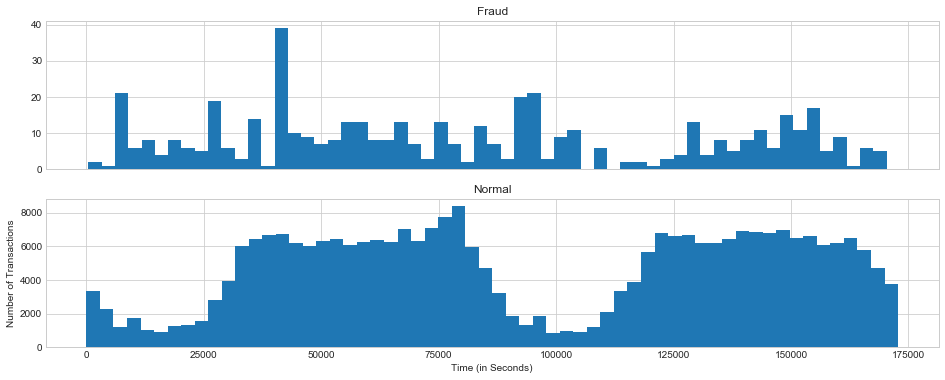
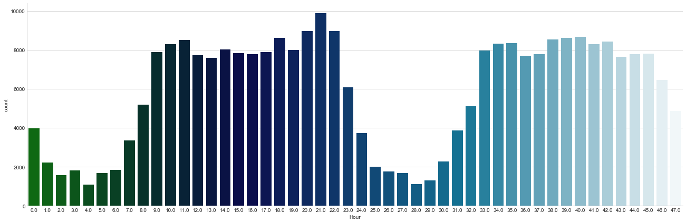
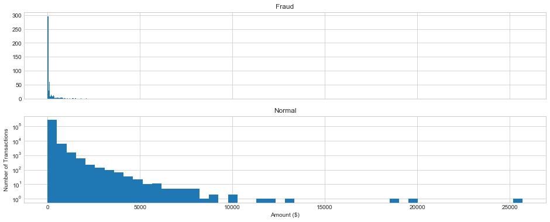
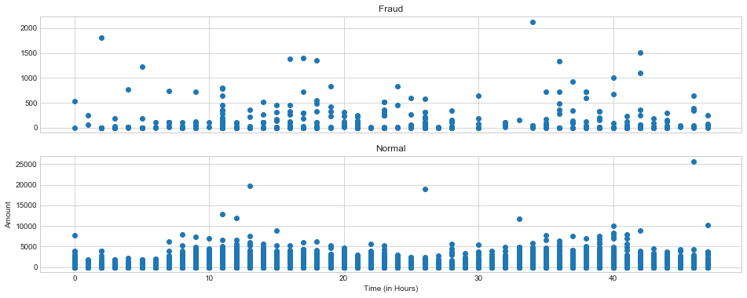
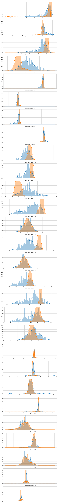
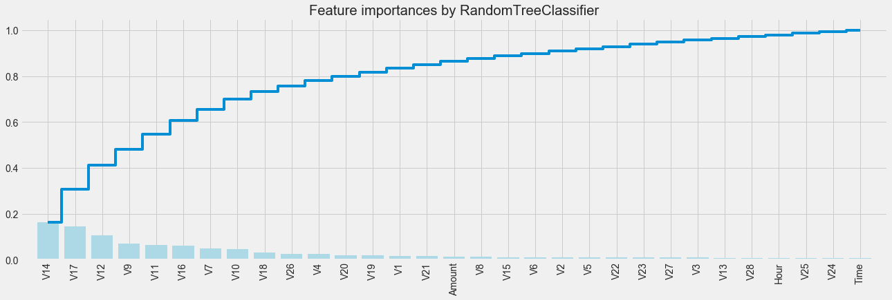
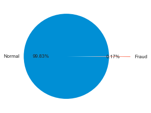
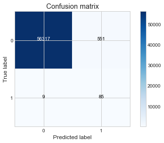

#  欺诈检测/反欺诈
本项目通过利用信用卡的历史交易数据，构建信用卡反欺诈预测模型，提前发现客户信用卡被盗刷的事件。
数据来源Kaggle "Credict Card Fraud": https://www.kaggle.com/mlg-ulb/creditcardfraud

## 一 背景分析和目标确定
### 背景分析

数据集包含欧洲持卡人于2013年9月通过信用卡进行的交易。该数据集提供两天内发生的交易，其中在284,807笔交易中有492起欺诈行为。数据集非常不平衡，负面类别（欺诈）占所有交易的0.172％。

它只包含数值输入变量，这是PCA变换的结果。不幸的是，由于保密问题，我们无法提供有关数据的原始特征和更多背景信息。特征V1，V2，... V28是用PCA获得的主要组件，唯一没有用PCA转换的特征是'Time'和'Amount'。

“时间”：每个事务与第一个事务之间间隔的秒数。
'金额'：交易金额，该特征可以用于依赖于例子的成本敏感性学习。
“Class”：响应变量，在欺诈的情况下其值为1，否则为0。

### 目标确定

构建信用卡反欺诈预测模型，提前发现客户信用卡被盗刷的事件。
——————————————————————————————————————————


```python
import numpy as np
import pandas as pd
import matplotlib.pyplot as plt
import matplotlib.gridspec as gridspec
import seaborn as sns
sns.set_style('whitegrid')
%matplotlib inline

from sklearn.preprocessing import StandardScaler 
from sklearn.ensemble import RandomForestClassifier
from imblearn.over_sampling import SMOTE
from sklearn.model_selection import GridSearchCV
from sklearn.metrics import make_scorer, fbeta_score, recall_score, precision_score,accuracy_score,confusion_matrix
from sklearn.linear_model import LogisticRegression
from sklearn.model_selection import train_test_split
```
## 二 数据探索
### 0 数据加载观察


```python
data = pd.read_csv('creditcard.csv')
data.head()
```


<div>
<style>
    .dataframe thead tr:only-child th {
        text-align: right;
    }

    .dataframe thead th {
        text-align: left;
    }

    .dataframe tbody tr th {
        vertical-align: top;
    }
</style>
<table border="1" class="dataframe">
  <thead>
    <tr style="text-align: right;">
      <th></th>
      <th>Time</th>
      <th>V1</th>
      <th>V2</th>
      <th>V3</th>
      <th>V4</th>
      <th>V5</th>
      <th>V6</th>
      <th>V7</th>
      <th>V8</th>
      <th>V9</th>
      <th>...</th>
      <th>V21</th>
      <th>V22</th>
      <th>V23</th>
      <th>V24</th>
      <th>V25</th>
      <th>V26</th>
      <th>V27</th>
      <th>V28</th>
      <th>Amount</th>
      <th>Class</th>
    </tr>
  </thead>
  <tbody>
    <tr>
      <th>0</th>
      <td>0.0</td>
      <td>-1.359807</td>
      <td>-0.072781</td>
      <td>2.536347</td>
      <td>1.378155</td>
      <td>-0.338321</td>
      <td>0.462388</td>
      <td>0.239599</td>
      <td>0.098698</td>
      <td>0.363787</td>
      <td>...</td>
      <td>-0.018307</td>
      <td>0.277838</td>
      <td>-0.110474</td>
      <td>0.066928</td>
      <td>0.128539</td>
      <td>-0.189115</td>
      <td>0.133558</td>
      <td>-0.021053</td>
      <td>149.62</td>
      <td>0</td>
    </tr>
    <tr>
      <th>1</th>
      <td>0.0</td>
      <td>1.191857</td>
      <td>0.266151</td>
      <td>0.166480</td>
      <td>0.448154</td>
      <td>0.060018</td>
      <td>-0.082361</td>
      <td>-0.078803</td>
      <td>0.085102</td>
      <td>-0.255425</td>
      <td>...</td>
      <td>-0.225775</td>
      <td>-0.638672</td>
      <td>0.101288</td>
      <td>-0.339846</td>
      <td>0.167170</td>
      <td>0.125895</td>
      <td>-0.008983</td>
      <td>0.014724</td>
      <td>2.69</td>
      <td>0</td>
    </tr>
    <tr>
      <th>2</th>
      <td>1.0</td>
      <td>-1.358354</td>
      <td>-1.340163</td>
      <td>1.773209</td>
      <td>0.379780</td>
      <td>-0.503198</td>
      <td>1.800499</td>
      <td>0.791461</td>
      <td>0.247676</td>
      <td>-1.514654</td>
      <td>...</td>
      <td>0.247998</td>
      <td>0.771679</td>
      <td>0.909412</td>
      <td>-0.689281</td>
      <td>-0.327642</td>
      <td>-0.139097</td>
      <td>-0.055353</td>
      <td>-0.059752</td>
      <td>378.66</td>
      <td>0</td>
    </tr>
    <tr>
      <th>3</th>
      <td>1.0</td>
      <td>-0.966272</td>
      <td>-0.185226</td>
      <td>1.792993</td>
      <td>-0.863291</td>
      <td>-0.010309</td>
      <td>1.247203</td>
      <td>0.237609</td>
      <td>0.377436</td>
      <td>-1.387024</td>
      <td>...</td>
      <td>-0.108300</td>
      <td>0.005274</td>
      <td>-0.190321</td>
      <td>-1.175575</td>
      <td>0.647376</td>
      <td>-0.221929</td>
      <td>0.062723</td>
      <td>0.061458</td>
      <td>123.50</td>
      <td>0</td>
    </tr>
    <tr>
      <th>4</th>
      <td>2.0</td>
      <td>-1.158233</td>
      <td>0.877737</td>
      <td>1.548718</td>
      <td>0.403034</td>
      <td>-0.407193</td>
      <td>0.095921</td>
      <td>0.592941</td>
      <td>-0.270533</td>
      <td>0.817739</td>
      <td>...</td>
      <td>-0.009431</td>
      <td>0.798278</td>
      <td>-0.137458</td>
      <td>0.141267</td>
      <td>-0.206010</td>
      <td>0.502292</td>
      <td>0.219422</td>
      <td>0.215153</td>
      <td>69.99</td>
      <td>0</td>
    </tr>
  </tbody>
</table>
<p>5 rows × 31 columns</p>
</div>


```python
data.shape
```


    (284807, 31)


```python
data.info()
```

    <class 'pandas.core.frame.DataFrame'>
    RangeIndex: 284807 entries, 0 to 284806
    Data columns (total 31 columns):
    Time      284807 non-null float64
    V1        284807 non-null float64
    V2        284807 non-null float64
    V3        284807 non-null float64
    V4        284807 non-null float64
    V5        284807 non-null float64
    V6        284807 non-null float64
    V7        284807 non-null float64
    V8        284807 non-null float64
    V9        284807 non-null float64
    V10       284807 non-null float64
    V11       284807 non-null float64
    V12       284807 non-null float64
    V13       284807 non-null float64
    V14       284807 non-null float64
    V15       284807 non-null float64
    V16       284807 non-null float64
    V17       284807 non-null float64
    V18       284807 non-null float64
    V19       284807 non-null float64
    V20       284807 non-null float64
    V21       284807 non-null float64
    V22       284807 non-null float64
    V23       284807 non-null float64
    V24       284807 non-null float64
    V25       284807 non-null float64
    V26       284807 non-null float64
    V27       284807 non-null float64
    V28       284807 non-null float64
    Amount    284807 non-null float64
    Class     284807 non-null int64
    dtypes: float64(30), int64(1)
    memory usage: 67.4 MB


```python
pd.set_option("display.max_columns", len(data.columns))
data.describe()
```


<div>
<style>
    .dataframe thead tr:only-child th {
        text-align: right;
    }

    .dataframe thead th {
        text-align: left;
    }

    .dataframe tbody tr th {
        vertical-align: top;
    }
</style>
<table border="1" class="dataframe">
  <thead>
    <tr style="text-align: right;">
      <th></th>
      <th>Time</th>
      <th>V1</th>
      <th>V2</th>
      <th>V3</th>
      <th>V4</th>
      <th>V5</th>
      <th>V6</th>
      <th>V7</th>
      <th>V8</th>
      <th>V9</th>
      <th>V10</th>
      <th>V11</th>
      <th>V12</th>
      <th>V13</th>
      <th>V14</th>
      <th>V15</th>
      <th>V16</th>
      <th>V17</th>
      <th>V18</th>
      <th>V19</th>
      <th>V20</th>
      <th>V21</th>
      <th>V22</th>
      <th>V23</th>
      <th>V24</th>
      <th>V25</th>
      <th>V26</th>
      <th>V27</th>
      <th>V28</th>
      <th>Amount</th>
      <th>Class</th>
    </tr>
  </thead>
  <tbody>
    <tr>
      <th>count</th>
      <td>284807.000000</td>
      <td>2.848070e+05</td>
      <td>2.848070e+05</td>
      <td>2.848070e+05</td>
      <td>2.848070e+05</td>
      <td>2.848070e+05</td>
      <td>2.848070e+05</td>
      <td>2.848070e+05</td>
      <td>2.848070e+05</td>
      <td>2.848070e+05</td>
      <td>2.848070e+05</td>
      <td>2.848070e+05</td>
      <td>2.848070e+05</td>
      <td>2.848070e+05</td>
      <td>2.848070e+05</td>
      <td>2.848070e+05</td>
      <td>2.848070e+05</td>
      <td>2.848070e+05</td>
      <td>2.848070e+05</td>
      <td>2.848070e+05</td>
      <td>2.848070e+05</td>
      <td>2.848070e+05</td>
      <td>2.848070e+05</td>
      <td>2.848070e+05</td>
      <td>2.848070e+05</td>
      <td>2.848070e+05</td>
      <td>2.848070e+05</td>
      <td>2.848070e+05</td>
      <td>2.848070e+05</td>
      <td>284807.000000</td>
      <td>284807.000000</td>
    </tr>
    <tr>
      <th>mean</th>
      <td>94813.859575</td>
      <td>3.919560e-15</td>
      <td>5.688174e-16</td>
      <td>-8.769071e-15</td>
      <td>2.782312e-15</td>
      <td>-1.552563e-15</td>
      <td>2.010663e-15</td>
      <td>-1.694249e-15</td>
      <td>-1.927028e-16</td>
      <td>-3.137024e-15</td>
      <td>1.768627e-15</td>
      <td>9.170318e-16</td>
      <td>-1.810658e-15</td>
      <td>1.693438e-15</td>
      <td>1.479045e-15</td>
      <td>3.482336e-15</td>
      <td>1.392007e-15</td>
      <td>-7.528491e-16</td>
      <td>4.328772e-16</td>
      <td>9.049732e-16</td>
      <td>5.085503e-16</td>
      <td>1.537294e-16</td>
      <td>7.959909e-16</td>
      <td>5.367590e-16</td>
      <td>4.458112e-15</td>
      <td>1.453003e-15</td>
      <td>1.699104e-15</td>
      <td>-3.660161e-16</td>
      <td>-1.206049e-16</td>
      <td>88.349619</td>
      <td>0.001727</td>
    </tr>
    <tr>
      <th>std</th>
      <td>47488.145955</td>
      <td>1.958696e+00</td>
      <td>1.651309e+00</td>
      <td>1.516255e+00</td>
      <td>1.415869e+00</td>
      <td>1.380247e+00</td>
      <td>1.332271e+00</td>
      <td>1.237094e+00</td>
      <td>1.194353e+00</td>
      <td>1.098632e+00</td>
      <td>1.088850e+00</td>
      <td>1.020713e+00</td>
      <td>9.992014e-01</td>
      <td>9.952742e-01</td>
      <td>9.585956e-01</td>
      <td>9.153160e-01</td>
      <td>8.762529e-01</td>
      <td>8.493371e-01</td>
      <td>8.381762e-01</td>
      <td>8.140405e-01</td>
      <td>7.709250e-01</td>
      <td>7.345240e-01</td>
      <td>7.257016e-01</td>
      <td>6.244603e-01</td>
      <td>6.056471e-01</td>
      <td>5.212781e-01</td>
      <td>4.822270e-01</td>
      <td>4.036325e-01</td>
      <td>3.300833e-01</td>
      <td>250.120109</td>
      <td>0.041527</td>
    </tr>
    <tr>
      <th>min</th>
      <td>0.000000</td>
      <td>-5.640751e+01</td>
      <td>-7.271573e+01</td>
      <td>-4.832559e+01</td>
      <td>-5.683171e+00</td>
      <td>-1.137433e+02</td>
      <td>-2.616051e+01</td>
      <td>-4.355724e+01</td>
      <td>-7.321672e+01</td>
      <td>-1.343407e+01</td>
      <td>-2.458826e+01</td>
      <td>-4.797473e+00</td>
      <td>-1.868371e+01</td>
      <td>-5.791881e+00</td>
      <td>-1.921433e+01</td>
      <td>-4.498945e+00</td>
      <td>-1.412985e+01</td>
      <td>-2.516280e+01</td>
      <td>-9.498746e+00</td>
      <td>-7.213527e+00</td>
      <td>-5.449772e+01</td>
      <td>-3.483038e+01</td>
      <td>-1.093314e+01</td>
      <td>-4.480774e+01</td>
      <td>-2.836627e+00</td>
      <td>-1.029540e+01</td>
      <td>-2.604551e+00</td>
      <td>-2.256568e+01</td>
      <td>-1.543008e+01</td>
      <td>0.000000</td>
      <td>0.000000</td>
    </tr>
    <tr>
      <th>25%</th>
      <td>54201.500000</td>
      <td>-9.203734e-01</td>
      <td>-5.985499e-01</td>
      <td>-8.903648e-01</td>
      <td>-8.486401e-01</td>
      <td>-6.915971e-01</td>
      <td>-7.682956e-01</td>
      <td>-5.540759e-01</td>
      <td>-2.086297e-01</td>
      <td>-6.430976e-01</td>
      <td>-5.354257e-01</td>
      <td>-7.624942e-01</td>
      <td>-4.055715e-01</td>
      <td>-6.485393e-01</td>
      <td>-4.255740e-01</td>
      <td>-5.828843e-01</td>
      <td>-4.680368e-01</td>
      <td>-4.837483e-01</td>
      <td>-4.988498e-01</td>
      <td>-4.562989e-01</td>
      <td>-2.117214e-01</td>
      <td>-2.283949e-01</td>
      <td>-5.423504e-01</td>
      <td>-1.618463e-01</td>
      <td>-3.545861e-01</td>
      <td>-3.171451e-01</td>
      <td>-3.269839e-01</td>
      <td>-7.083953e-02</td>
      <td>-5.295979e-02</td>
      <td>5.600000</td>
      <td>0.000000</td>
    </tr>
    <tr>
      <th>50%</th>
      <td>84692.000000</td>
      <td>1.810880e-02</td>
      <td>6.548556e-02</td>
      <td>1.798463e-01</td>
      <td>-1.984653e-02</td>
      <td>-5.433583e-02</td>
      <td>-2.741871e-01</td>
      <td>4.010308e-02</td>
      <td>2.235804e-02</td>
      <td>-5.142873e-02</td>
      <td>-9.291738e-02</td>
      <td>-3.275735e-02</td>
      <td>1.400326e-01</td>
      <td>-1.356806e-02</td>
      <td>5.060132e-02</td>
      <td>4.807155e-02</td>
      <td>6.641332e-02</td>
      <td>-6.567575e-02</td>
      <td>-3.636312e-03</td>
      <td>3.734823e-03</td>
      <td>-6.248109e-02</td>
      <td>-2.945017e-02</td>
      <td>6.781943e-03</td>
      <td>-1.119293e-02</td>
      <td>4.097606e-02</td>
      <td>1.659350e-02</td>
      <td>-5.213911e-02</td>
      <td>1.342146e-03</td>
      <td>1.124383e-02</td>
      <td>22.000000</td>
      <td>0.000000</td>
    </tr>
    <tr>
      <th>75%</th>
      <td>139320.500000</td>
      <td>1.315642e+00</td>
      <td>8.037239e-01</td>
      <td>1.027196e+00</td>
      <td>7.433413e-01</td>
      <td>6.119264e-01</td>
      <td>3.985649e-01</td>
      <td>5.704361e-01</td>
      <td>3.273459e-01</td>
      <td>5.971390e-01</td>
      <td>4.539234e-01</td>
      <td>7.395934e-01</td>
      <td>6.182380e-01</td>
      <td>6.625050e-01</td>
      <td>4.931498e-01</td>
      <td>6.488208e-01</td>
      <td>5.232963e-01</td>
      <td>3.996750e-01</td>
      <td>5.008067e-01</td>
      <td>4.589494e-01</td>
      <td>1.330408e-01</td>
      <td>1.863772e-01</td>
      <td>5.285536e-01</td>
      <td>1.476421e-01</td>
      <td>4.395266e-01</td>
      <td>3.507156e-01</td>
      <td>2.409522e-01</td>
      <td>9.104512e-02</td>
      <td>7.827995e-02</td>
      <td>77.165000</td>
      <td>0.000000</td>
    </tr>
    <tr>
      <th>max</th>
      <td>172792.000000</td>
      <td>2.454930e+00</td>
      <td>2.205773e+01</td>
      <td>9.382558e+00</td>
      <td>1.687534e+01</td>
      <td>3.480167e+01</td>
      <td>7.330163e+01</td>
      <td>1.205895e+02</td>
      <td>2.000721e+01</td>
      <td>1.559499e+01</td>
      <td>2.374514e+01</td>
      <td>1.201891e+01</td>
      <td>7.848392e+00</td>
      <td>7.126883e+00</td>
      <td>1.052677e+01</td>
      <td>8.877742e+00</td>
      <td>1.731511e+01</td>
      <td>9.253526e+00</td>
      <td>5.041069e+00</td>
      <td>5.591971e+00</td>
      <td>3.942090e+01</td>
      <td>2.720284e+01</td>
      <td>1.050309e+01</td>
      <td>2.252841e+01</td>
      <td>4.584549e+00</td>
      <td>7.519589e+00</td>
      <td>3.517346e+00</td>
      <td>3.161220e+01</td>
      <td>3.384781e+01</td>
      <td>25691.160000</td>
      <td>1.000000</td>
    </tr>
  </tbody>
</table>
</div>


```python
## 判断是否存在缺失值
data.isnull().sum()
```


    Time      0
    V1        0
    V2        0
    V3        0
    V4        0
    V5        0
    V6        0
    V7        0
    V8        0
    V9        0
    V10       0
    V11       0
    V12       0
    V13       0
    V14       0
    V15       0
    V16       0
    V17       0
    V18       0
    V19       0
    V20       0
    V21       0
    V22       0
    V23       0
    V24       0
    V25       0
    V26       0
    V27       0
    V28       0
    Amount    0
    Class     0
    dtype: int64


### 1 信用卡消费时间的频次


```python
f, (ax1, ax2) = plt.subplots(2, 1, sharex=True, figsize=(16, 6))

bins = 60

ax1.hist(data.Time[data.Class == 1], bins = bins)
ax1.set_title('Fraud')

ax2.hist(data.Time[data.Class == 0], bins = bins)
ax2.set_title('Normal')

plt.xlabel('Time (in Seconds)')
plt.ylabel('Number of Transactions')
plt.show()
```





```python
# 为了更清晰的看出每个时间段的消费次数，把时间单位转换成小时（原本的时间单位为秒）
data['Hour'] =data["Time"].apply(lambda x : divmod(x, 3600)[0]) #返回商和余数的元组
```


```python
sns.factorplot(x="Hour", data=data, kind="count",  palette="ocean", size=6, aspect=3)
```


    <seaborn.axisgrid.FacetGrid at 0x109448ef0>





** 分析 **

每天早上9点到晚上11点之间是信用卡消费的高频时间段。
正常交易呈现明显的规律（即9am~11pm）,而被盗刷的信用卡交易则没有这样的规律

### 2 信用卡消费金额的频次


```python
f, (ax1, ax2) = plt.subplots(2, 1, sharex=True, figsize=(16, 6))

bins = 50

ax1.hist(data.Amount[data.Class == 1], bins = bins)
ax1.set_title('Fraud')

ax2.hist(data.Amount[data.Class == 0], bins = bins)
ax2.set_title('Normal')

plt.xlabel('Amount ($)')
plt.ylabel('Number of Transactions')
plt.yscale('log', nonposy='clip')
plt.show()
```





** 分析 **

与正常消费相比，盗刷信用卡的消费金额通常比较小，没有什么大额消费。说明盗刷者为了不引起注意，而选择小额消费。

### 3 盗刷消费/正常消费与时间和金额的关系


```python
f, (ax1, ax2) = plt.subplots(2, 1, sharex=True, figsize=(16,6))

ax1.scatter(data.Hour[data.Class == 1], data.Amount[data.Class == 1])
ax1.set_title('Fraud')

ax2.scatter(data.Hour[data.Class == 0], data.Amount[data.Class == 0])
ax2.set_title('Normal')

plt.xlabel('Time (in Hours)')
plt.ylabel('Amount')
plt.show()
```





** 分析 **

在信用卡被盗刷样本中，离群值多发生在客户使用信用卡消费更低频的时间段。说明在盗刷信用卡中，较大一点金额的的消费往往出现在人们睡觉的时候。

### 4 是否盗刷与各特征变量间的关系


```python
#为了更进一步探索，只选择匿名变量
v_features = data.iloc[:,1:29].columns
```


```python
plt.figure(figsize=(12,28*4))
gs = gridspec.GridSpec(28, 1) # 指定子图将放置的网格的几何位置
for i, cn in enumerate(data[v_features]):
    ax = plt.subplot(gs[i])
    sns.distplot(data[cn][data.Class == 1], bins=50)
    sns.distplot(data[cn][data.Class == 0], bins=50)
    ax.set_xlabel('')
    ax.set_title('histogram of feature: ' + str(cn))
plt.show()
```





从在信用卡盗刷或正常使用情况下个特征变量的分布情况可以看出，变量V8、V13 、V15 、V20 、V23 、V24 、V27 和V28在这两种情况下的分布大致相同，说明这些变量对判断是否为欺诈消费用处不大。

### 5 特征缩放
各特征之间的大小范围一致，才能使用距离度量等算法.

加速梯度下降算法的收敛.


```python
# 对Amount和Hour 进行特征缩放
data_new = data
col = ['Amount','Hour']
sc =StandardScaler() 
data_new[col] =sc.fit_transform(data_new[col])
data_new.head()
```


<div>
<style>
    .dataframe thead tr:only-child th {
        text-align: right;
    }

    .dataframe thead th {
        text-align: left;
    }

    .dataframe tbody tr th {
        vertical-align: top;
    }
</style>
<table border="1" class="dataframe">
  <thead>
    <tr style="text-align: right;">
      <th></th>
      <th>Time</th>
      <th>V1</th>
      <th>V2</th>
      <th>V3</th>
      <th>V4</th>
      <th>V5</th>
      <th>V6</th>
      <th>V7</th>
      <th>V8</th>
      <th>V9</th>
      <th>V10</th>
      <th>V11</th>
      <th>V12</th>
      <th>V13</th>
      <th>V14</th>
      <th>...</th>
      <th>V17</th>
      <th>V18</th>
      <th>V19</th>
      <th>V20</th>
      <th>V21</th>
      <th>V22</th>
      <th>V23</th>
      <th>V24</th>
      <th>V25</th>
      <th>V26</th>
      <th>V27</th>
      <th>V28</th>
      <th>Amount</th>
      <th>Class</th>
      <th>Hour</th>
    </tr>
  </thead>
  <tbody>
    <tr>
      <th>0</th>
      <td>0.0</td>
      <td>-1.359807</td>
      <td>-0.072781</td>
      <td>2.536347</td>
      <td>1.378155</td>
      <td>-0.338321</td>
      <td>0.462388</td>
      <td>0.239599</td>
      <td>0.098698</td>
      <td>0.363787</td>
      <td>0.090794</td>
      <td>-0.551600</td>
      <td>-0.617801</td>
      <td>-0.991390</td>
      <td>-0.311169</td>
      <td>...</td>
      <td>0.207971</td>
      <td>0.025791</td>
      <td>0.403993</td>
      <td>0.251412</td>
      <td>-0.018307</td>
      <td>0.277838</td>
      <td>-0.110474</td>
      <td>0.066928</td>
      <td>0.128539</td>
      <td>-0.189115</td>
      <td>0.133558</td>
      <td>-0.021053</td>
      <td>0.244964</td>
      <td>0</td>
      <td>-1.960264</td>
    </tr>
    <tr>
      <th>1</th>
      <td>0.0</td>
      <td>1.191857</td>
      <td>0.266151</td>
      <td>0.166480</td>
      <td>0.448154</td>
      <td>0.060018</td>
      <td>-0.082361</td>
      <td>-0.078803</td>
      <td>0.085102</td>
      <td>-0.255425</td>
      <td>-0.166974</td>
      <td>1.612727</td>
      <td>1.065235</td>
      <td>0.489095</td>
      <td>-0.143772</td>
      <td>...</td>
      <td>-0.114805</td>
      <td>-0.183361</td>
      <td>-0.145783</td>
      <td>-0.069083</td>
      <td>-0.225775</td>
      <td>-0.638672</td>
      <td>0.101288</td>
      <td>-0.339846</td>
      <td>0.167170</td>
      <td>0.125895</td>
      <td>-0.008983</td>
      <td>0.014724</td>
      <td>-0.342475</td>
      <td>0</td>
      <td>-1.960264</td>
    </tr>
    <tr>
      <th>2</th>
      <td>1.0</td>
      <td>-1.358354</td>
      <td>-1.340163</td>
      <td>1.773209</td>
      <td>0.379780</td>
      <td>-0.503198</td>
      <td>1.800499</td>
      <td>0.791461</td>
      <td>0.247676</td>
      <td>-1.514654</td>
      <td>0.207643</td>
      <td>0.624501</td>
      <td>0.066084</td>
      <td>0.717293</td>
      <td>-0.165946</td>
      <td>...</td>
      <td>1.109969</td>
      <td>-0.121359</td>
      <td>-2.261857</td>
      <td>0.524980</td>
      <td>0.247998</td>
      <td>0.771679</td>
      <td>0.909412</td>
      <td>-0.689281</td>
      <td>-0.327642</td>
      <td>-0.139097</td>
      <td>-0.055353</td>
      <td>-0.059752</td>
      <td>1.160686</td>
      <td>0</td>
      <td>-1.960264</td>
    </tr>
    <tr>
      <th>3</th>
      <td>1.0</td>
      <td>-0.966272</td>
      <td>-0.185226</td>
      <td>1.792993</td>
      <td>-0.863291</td>
      <td>-0.010309</td>
      <td>1.247203</td>
      <td>0.237609</td>
      <td>0.377436</td>
      <td>-1.387024</td>
      <td>-0.054952</td>
      <td>-0.226487</td>
      <td>0.178228</td>
      <td>0.507757</td>
      <td>-0.287924</td>
      <td>...</td>
      <td>-0.684093</td>
      <td>1.965775</td>
      <td>-1.232622</td>
      <td>-0.208038</td>
      <td>-0.108300</td>
      <td>0.005274</td>
      <td>-0.190321</td>
      <td>-1.175575</td>
      <td>0.647376</td>
      <td>-0.221929</td>
      <td>0.062723</td>
      <td>0.061458</td>
      <td>0.140534</td>
      <td>0</td>
      <td>-1.960264</td>
    </tr>
    <tr>
      <th>4</th>
      <td>2.0</td>
      <td>-1.158233</td>
      <td>0.877737</td>
      <td>1.548718</td>
      <td>0.403034</td>
      <td>-0.407193</td>
      <td>0.095921</td>
      <td>0.592941</td>
      <td>-0.270533</td>
      <td>0.817739</td>
      <td>0.753074</td>
      <td>-0.822843</td>
      <td>0.538196</td>
      <td>1.345852</td>
      <td>-1.119670</td>
      <td>...</td>
      <td>-0.237033</td>
      <td>-0.038195</td>
      <td>0.803487</td>
      <td>0.408542</td>
      <td>-0.009431</td>
      <td>0.798278</td>
      <td>-0.137458</td>
      <td>0.141267</td>
      <td>-0.206010</td>
      <td>0.502292</td>
      <td>0.219422</td>
      <td>0.215153</td>
      <td>-0.073403</td>
      <td>0</td>
      <td>-1.960264</td>
    </tr>
  </tbody>
</table>
<p>5 rows × 32 columns</p>
</div>


### 6 使用随机森林对特征的重要性进行排序


```python
x_feature = list(data_new.columns)
x_feature.remove('Class')
x_val = data_new[x_feature]
y_val = data_new['Class']

names = data[x_feature].columns
clf=RandomForestClassifier(n_estimators=10,random_state=0)
clf.fit(x_val, y_val) #对自变量和因变量进行拟合
names, clf.feature_importances_
for feature in zip(names, clf.feature_importances_):
    print(feature)
```

    ('Time', 0.0058653095071756972)
    ('V1', 0.016738422681555006)
    ('V2', 0.010518840397514637)
    ('V3', 0.0089007014088101251)
    ('V4', 0.023488323692359602)
    ('V5', 0.010402434956637225)
    ('V6', 0.010577539517821128)
    ('V7', 0.048717673240922459)
    ('V8', 0.011611584435865786)
    ('V9', 0.070517507346816583)
    ('V10', 0.045277145030190355)
    ('V11', 0.064095561433761994)
    ('V12', 0.10533523326883236)
    ('V13', 0.0082108661101783185)
    ('V14', 0.16191854031530953)
    ('V15', 0.010786715709974311)
    ('V16', 0.059530867061310798)
    ('V17', 0.14454328027682184)
    ('V18', 0.032363008884872077)
    ('V19', 0.018710684824600032)
    ('V20', 0.019732729293801935)
    ('V21', 0.016169552255337217)
    ('V22', 0.0096634393606279973)
    ('V23', 0.0096416406589046339)
    ('V24', 0.0066689134217992902)
    ('V25', 0.007058938720220849)
    ('V26', 0.024001162723529139)
    ('V27', 0.0092521682212968887)
    ('V28', 0.0080987059829771522)
    ('Amount', 0.014384925821584465)
    ('Hour', 0.0072175834385905541)


```python
plt.style.use('fivethirtyeight')
plt.rcParams['figure.figsize'] = (12,6)

importances = clf.feature_importances_
feature_names = names
indices = np.argsort(importances)[::-1] # 倒序排列
fig = plt.figure(figsize=(20,6))
plt.title("Feature importances by RandomTreeClassifier")
plt.bar(range(len(indices)), importances[indices], color='lightblue',  align="center")
plt.step(range(len(indices)), np.cumsum(importances[indices]), where='mid', label='Cumulative')
plt.xticks(range(len(indices)), feature_names[indices], rotation='vertical',fontsize=14)
plt.xlim([-1, len(indices)])
```


    (-1, 31)





### 7 拆分训练集和测试集


```python
X_train, X_test, y_train, y_test = train_test_split(x_val, y_val, test_size=0.2, random_state=10)
```

### 8 处理不平衡样本

从下图中可以看出，欺诈事件仅占总体的0.17%，因此这是一份非常不平衡的数据。样本不平衡会严重影响分类器的学习，比如我们假设所有的事件都为正常事件，那么得到的准确率也会很高。


```python
count_classes = pd.value_counts(data['Class'], sort = True).sort_index()
print('正常交易事件有{}例,欺诈事件有{}例。'.format(count_classes[0],count_classes[1]))

labels = 'Normal', 'Fraud'
size = [count_classes[0], count_classes[1]]
explode = [0, 0.5]
plt.axes(aspect=1)
plt.pie(size, labels=labels, explode=explode, autopct='%0.2f%%')
plt.show()
```

    正常交易事件有284315例,欺诈事件有492例。





非平衡样本常用的解决方式有2种：1、过采样（oversampling）：增加稀有类样本数，使两类样本接近，然后再进行学习。2、欠采样（undersampling）：去除大类样本数，然后再进行学习。

下采样很可能导致TN(True Negative)过高，对于相同的模型，通常数据越多越好，因此这里使用过采样。

本次处理样本不平衡采用的方法是过采样，具体操作使用SMOTE（Synthetic Minority Oversampling Technique），SMOET的基本原理是：采样最邻近算法，计算出每个少数类样本的K个近邻，从K个近邻中随机挑选N个样本进行随机线性插值，构造新的少数样本，同时将新样本与原数据合成，产生新的训练集。参考了CMU关于SMOTE: Synthetic Minority Over-sampling的介绍 Techniquehttp://www.cs.cmu.edu/afs/cs/project/jair/pub/volume16/chawla02a-html/chawla2002.html。


```python
n_sample = y.shape[0]
n_pos_sample = y[y == 0].shape[0]
n_neg_sample = y[y == 1].shape[0]
print('样本个数：{}; 正样本占{:.2%}; 负样本占{:.2%}'.format(n_sample,
                                                   n_pos_sample / n_sample,
                                                   n_neg_sample / n_sample))
print('特征维数：', X.shape[1])

```

    样本个数：284807; 正样本占99.83%; 负样本占0.17%
    特征维数： 31


```python
sm = SMOTE(random_state=42)    # 处理过采样的方法
X_sm, y_sm = sm.fit_sample(X_train, y_train)
print('通过SMOTE方法平衡正负样本后')

n_sample = y_sm.shape[0]
n_pos_sample = y_sm[y_sm == 0].shape[0]
n_neg_sample = y_sm[y_sm == 1].shape[0]
print('样本个数：{}; 正样本占{:.2%}; 负样本占{:.2%}'.format(n_sample, n_pos_sample / n_sample, n_neg_sample / n_sample))
```

    通过SMOTE方法平衡正负样本后
    样本个数：454894; 正样本占50.00%; 负样本占50.00%


## 三 模型的构建和评估
* 模型的选择：LogisticRegression

计算较为简单，收敛速度快；适用于二分类的大规模数据集处理。

* 评估指标选择：因为我们希望找出所有的欺诈行为，所以recall在这里更重要，因此beta的选择上就要更偏向recall值

* 参数调整：网格搜索交叉验证


```python
clf = LogisticRegression(random_state=10)

parameters = {'C':[0.01,0.1,1,10,100,1000] ,'penalty':['l1','l2']}

scorer = make_scorer(fbeta_score, beta=1.5)

grid_obj = GridSearchCV(clf, parameters, scoring=scorer)

grid_fit = grid_obj.fit(X_sm, y_sm)

best_clf = grid_fit.best_estimator_

best_predictions = best_clf.predict(X_test)


print("Final recall_score on the testing data: {:.4f}".format(recall_score(y_test, best_predictions)))
print("Final accuracy score on the testing data: {:.4f}".format(accuracy_score(y_test, best_predictions)))
```

    Final recall_score on the testing data: 0.9043
    Final accuracy score on the testing data: 0.9902


```python
import itertools
cnf_matrix = confusion_matrix(y_test, best_predictions)
class_names = [0,1]
plt.figure()
plot_confusion_matrix(cnf_matrix
                      , classes=class_names
                      , title='Confusion matrix')
plt.show()
```




