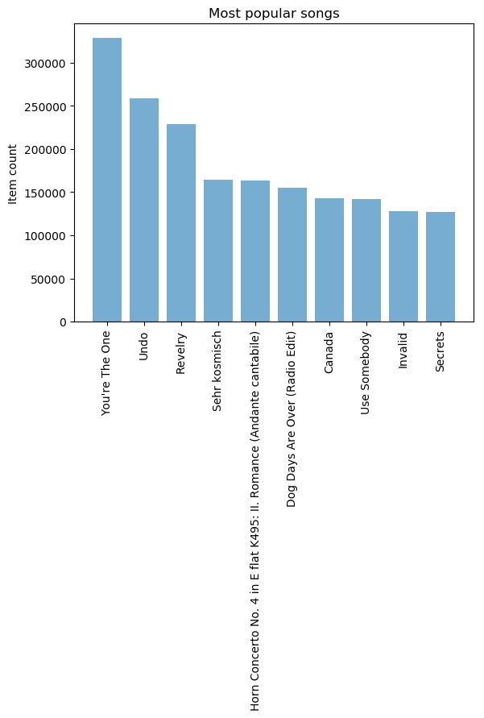
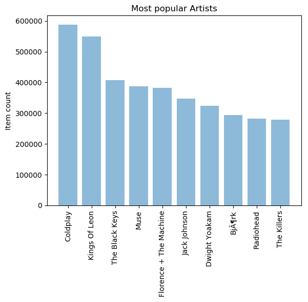
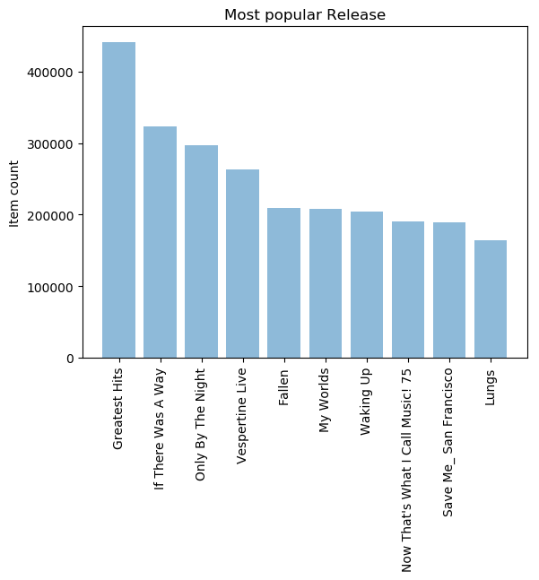
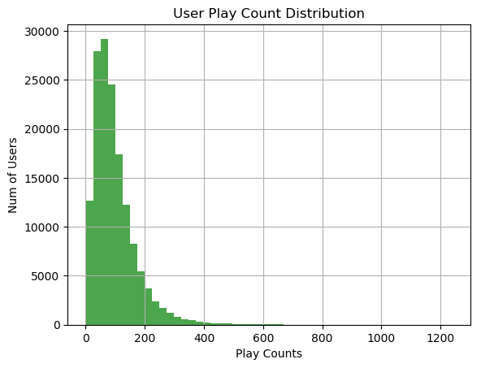

# Item_based Collaborative Filtering Recommender
## (基于物品的协同过滤推荐系统)
#### ----Music Recommender (data from Youtube)


```python
import pandas as pd
import numpy as np
import time
import sqlite3
```


```python
data_home = './'
```

## 一 数据的加载及筛选
reading user, song, play_count data


```python
triplet_dataset = pd.read_csv(filepath_or_buffer=data_home+'train_triplets.txt', 
                              sep='\t', header=None, 
                              names=['user','song','play_count'])
```


```python
triplet_dataset.shape
```


    (48373586, 3)


```python
triplet_dataset.head(n=10)
```


<div>
<style>
    .dataframe thead tr:only-child th {
        text-align: right;
    }

    .dataframe thead th {
        text-align: left;
    }

    .dataframe tbody tr th {
        vertical-align: top;
    }
</style>
<table border="1" class="dataframe">
  <thead>
    <tr style="text-align: right;">
      <th></th>
      <th>user</th>
      <th>song</th>
      <th>play_count</th>
    </tr>
  </thead>
  <tbody>
    <tr>
      <th>0</th>
      <td>b80344d063b5ccb3212f76538f3d9e43d87dca9e</td>
      <td>SOAKIMP12A8C130995</td>
      <td>1</td>
    </tr>
    <tr>
      <th>1</th>
      <td>b80344d063b5ccb3212f76538f3d9e43d87dca9e</td>
      <td>SOAPDEY12A81C210A9</td>
      <td>1</td>
    </tr>
    <tr>
      <th>2</th>
      <td>b80344d063b5ccb3212f76538f3d9e43d87dca9e</td>
      <td>SOBBMDR12A8C13253B</td>
      <td>2</td>
    </tr>
    <tr>
      <th>3</th>
      <td>b80344d063b5ccb3212f76538f3d9e43d87dca9e</td>
      <td>SOBFNSP12AF72A0E22</td>
      <td>1</td>
    </tr>
    <tr>
      <th>4</th>
      <td>b80344d063b5ccb3212f76538f3d9e43d87dca9e</td>
      <td>SOBFOVM12A58A7D494</td>
      <td>1</td>
    </tr>
    <tr>
      <th>5</th>
      <td>b80344d063b5ccb3212f76538f3d9e43d87dca9e</td>
      <td>SOBNZDC12A6D4FC103</td>
      <td>1</td>
    </tr>
    <tr>
      <th>6</th>
      <td>b80344d063b5ccb3212f76538f3d9e43d87dca9e</td>
      <td>SOBSUJE12A6D4F8CF5</td>
      <td>2</td>
    </tr>
    <tr>
      <th>7</th>
      <td>b80344d063b5ccb3212f76538f3d9e43d87dca9e</td>
      <td>SOBVFZR12A6D4F8AE3</td>
      <td>1</td>
    </tr>
    <tr>
      <th>8</th>
      <td>b80344d063b5ccb3212f76538f3d9e43d87dca9e</td>
      <td>SOBXALG12A8C13C108</td>
      <td>1</td>
    </tr>
    <tr>
      <th>9</th>
      <td>b80344d063b5ccb3212f76538f3d9e43d87dca9e</td>
      <td>SOBXHDL12A81C204C0</td>
      <td>1</td>
    </tr>
  </tbody>
</table>
</div>


### 1 Play count for each user (每个用户的播放总数)


```python
output_dict = {}
with open(data_home+'train_triplets.txt') as f:
    for line_number, line in enumerate(f):
        user = line.split('\t')[0]
        play_count = int(line.split('\t')[2])
        # user in dict
        if user in output_dict:
            play_count +=output_dict[user]
            output_dict.update({user:play_count}) 
        # user not in dict
        output_dict.update({user:play_count})
output_list = [{'user':k,'play_count':v} for k,v in output_dict.items()]
# list to df
play_count_df = pd.DataFrame(output_list)
# ASC sort by play_count
play_count_df = play_count_df.sort_values(by = 'play_count', ascending = False)
```


```python
# save as csv, for later use
play_count_df.to_csv(path_or_buf='user_playcount_df.csv', index = False)
```

### 2 Play count for each song (每首歌的播放总数)


```python
output_dict = {}
with open(data_home+'train_triplets.txt') as f:
    for line_number, line in enumerate(f):
        song = line.split('\t')[1]
        play_count = int(line.split('\t')[2])
        if song in output_dict:
            play_count +=output_dict[song]
            output_dict.update({song:play_count})
        output_dict.update({song:play_count})
output_list = [{'song':k,'play_count':v} for k,v in output_dict.items()]
song_count_df = pd.DataFrame(output_list)
song_count_df = song_count_df.sort_values(by = 'play_count', ascending = False)
```


```python
song_count_df.to_csv(path_or_buf='song_playcount_df.csv', index = False)
```

### 3 reading user_playcount_df, song_count_df （读取排序好的数据）


```python
play_count_df = pd.read_csv(filepath_or_buffer='user_playcount_df.csv')
play_count_df.head(n =10)
```


<div>
<style>
    .dataframe thead tr:only-child th {
        text-align: right;
    }

    .dataframe thead th {
        text-align: left;
    }

    .dataframe tbody tr th {
        vertical-align: top;
    }
</style>
<table border="1" class="dataframe">
  <thead>
    <tr style="text-align: right;">
      <th></th>
      <th>play_count</th>
      <th>user</th>
    </tr>
  </thead>
  <tbody>
    <tr>
      <th>0</th>
      <td>13132</td>
      <td>093cb74eb3c517c5179ae24caf0ebec51b24d2a2</td>
    </tr>
    <tr>
      <th>1</th>
      <td>9884</td>
      <td>119b7c88d58d0c6eb051365c103da5caf817bea6</td>
    </tr>
    <tr>
      <th>2</th>
      <td>8210</td>
      <td>3fa44653315697f42410a30cb766a4eb102080bb</td>
    </tr>
    <tr>
      <th>3</th>
      <td>7015</td>
      <td>a2679496cd0af9779a92a13ff7c6af5c81ea8c7b</td>
    </tr>
    <tr>
      <th>4</th>
      <td>6494</td>
      <td>d7d2d888ae04d16e994d6964214a1de81392ee04</td>
    </tr>
    <tr>
      <th>5</th>
      <td>6472</td>
      <td>4ae01afa8f2430ea0704d502bc7b57fb52164882</td>
    </tr>
    <tr>
      <th>6</th>
      <td>6150</td>
      <td>b7c24f770be6b802805ac0e2106624a517643c17</td>
    </tr>
    <tr>
      <th>7</th>
      <td>5656</td>
      <td>113255a012b2affeab62607563d03fbdf31b08e7</td>
    </tr>
    <tr>
      <th>8</th>
      <td>5620</td>
      <td>6d625c6557df84b60d90426c0116138b617b9449</td>
    </tr>
    <tr>
      <th>9</th>
      <td>5602</td>
      <td>99ac3d883681e21ea68071019dba828ce76fe94d</td>
    </tr>
  </tbody>
</table>
</div>


```python
song_count_df = pd.read_csv(filepath_or_buffer='song_playcount_df.csv')
song_count_df.head(10)
```


<div>
<style>
    .dataframe thead tr:only-child th {
        text-align: right;
    }

    .dataframe thead th {
        text-align: left;
    }

    .dataframe tbody tr th {
        vertical-align: top;
    }
</style>
<table border="1" class="dataframe">
  <thead>
    <tr style="text-align: right;">
      <th></th>
      <th>play_count</th>
      <th>song</th>
    </tr>
  </thead>
  <tbody>
    <tr>
      <th>0</th>
      <td>726885</td>
      <td>SOBONKR12A58A7A7E0</td>
    </tr>
    <tr>
      <th>1</th>
      <td>648239</td>
      <td>SOAUWYT12A81C206F1</td>
    </tr>
    <tr>
      <th>2</th>
      <td>527893</td>
      <td>SOSXLTC12AF72A7F54</td>
    </tr>
    <tr>
      <th>3</th>
      <td>425463</td>
      <td>SOFRQTD12A81C233C0</td>
    </tr>
    <tr>
      <th>4</th>
      <td>389880</td>
      <td>SOEGIYH12A6D4FC0E3</td>
    </tr>
    <tr>
      <th>5</th>
      <td>356533</td>
      <td>SOAXGDH12A8C13F8A1</td>
    </tr>
    <tr>
      <th>6</th>
      <td>292642</td>
      <td>SONYKOW12AB01849C9</td>
    </tr>
    <tr>
      <th>7</th>
      <td>274627</td>
      <td>SOPUCYA12A8C13A694</td>
    </tr>
    <tr>
      <th>8</th>
      <td>268353</td>
      <td>SOUFTBI12AB0183F65</td>
    </tr>
    <tr>
      <th>9</th>
      <td>244730</td>
      <td>SOVDSJC12A58A7A271</td>
    </tr>
  </tbody>
</table>
</div>


```python
song_count_df.tail(100)
```


<div>
<style>
    .dataframe thead tr:only-child th {
        text-align: right;
    }

    .dataframe thead th {
        text-align: left;
    }

    .dataframe tbody tr th {
        vertical-align: top;
    }
</style>
<table border="1" class="dataframe">
  <thead>
    <tr style="text-align: right;">
      <th></th>
      <th>play_count</th>
      <th>song</th>
    </tr>
  </thead>
  <tbody>
    <tr>
      <th>384446</th>
      <td>1</td>
      <td>SOLISVT12AB018A3DA</td>
    </tr>
    <tr>
      <th>384447</th>
      <td>1</td>
      <td>SOGUIBA12A81C22838</td>
    </tr>
    <tr>
      <th>384448</th>
      <td>1</td>
      <td>SOUXWZU12A6D4F5C1A</td>
    </tr>
    <tr>
      <th>384449</th>
      <td>1</td>
      <td>SODYGBQ12A6D4F5C17</td>
    </tr>
    <tr>
      <th>384450</th>
      <td>1</td>
      <td>SOEFSRN12A6D4F7B08</td>
    </tr>
    <tr>
      <th>384451</th>
      <td>1</td>
      <td>SOEHFVN12AB017F8A3</td>
    </tr>
    <tr>
      <th>384452</th>
      <td>1</td>
      <td>SOBGACN12A8C13E14D</td>
    </tr>
    <tr>
      <th>384453</th>
      <td>1</td>
      <td>SOGQOPP12AB0182202</td>
    </tr>
    <tr>
      <th>384454</th>
      <td>1</td>
      <td>SOBVKJJ12A6D4F8C85</td>
    </tr>
    <tr>
      <th>384455</th>
      <td>1</td>
      <td>SOKDDNH12AB017EEA9</td>
    </tr>
    <tr>
      <th>384456</th>
      <td>1</td>
      <td>SOLDOJV12A8151E099</td>
    </tr>
    <tr>
      <th>384457</th>
      <td>1</td>
      <td>SOTRRPI12AAF3B4FF7</td>
    </tr>
    <tr>
      <th>384458</th>
      <td>1</td>
      <td>SOYVPQT12A58A796ED</td>
    </tr>
    <tr>
      <th>384459</th>
      <td>1</td>
      <td>SOOUIUV12A6D4F9E8E</td>
    </tr>
    <tr>
      <th>384460</th>
      <td>1</td>
      <td>SOKRQIB12A6D4F9E8F</td>
    </tr>
    <tr>
      <th>384461</th>
      <td>1</td>
      <td>SOGWBER12A8C13ECFB</td>
    </tr>
    <tr>
      <th>384462</th>
      <td>1</td>
      <td>SOEEZDN12A6D4F9E8D</td>
    </tr>
    <tr>
      <th>384463</th>
      <td>1</td>
      <td>SOMUFQI12AB0187429</td>
    </tr>
    <tr>
      <th>384464</th>
      <td>1</td>
      <td>SODTXMH12A8C135607</td>
    </tr>
    <tr>
      <th>384465</th>
      <td>1</td>
      <td>SOAQIRD12A6D4F8346</td>
    </tr>
    <tr>
      <th>384466</th>
      <td>1</td>
      <td>SOGSMDR12AB018BE42</td>
    </tr>
    <tr>
      <th>384467</th>
      <td>1</td>
      <td>SOHBIOW12AB018A4AA</td>
    </tr>
    <tr>
      <th>384468</th>
      <td>1</td>
      <td>SOLMMXJ12AB0182891</td>
    </tr>
    <tr>
      <th>384469</th>
      <td>1</td>
      <td>SORTFNJ12A8C141773</td>
    </tr>
    <tr>
      <th>384470</th>
      <td>1</td>
      <td>SOLDEVA12A8C133E43</td>
    </tr>
    <tr>
      <th>384471</th>
      <td>1</td>
      <td>SOGNGGQ12A8C134689</td>
    </tr>
    <tr>
      <th>384472</th>
      <td>1</td>
      <td>SOWLZPN12A58A7CB0D</td>
    </tr>
    <tr>
      <th>384473</th>
      <td>1</td>
      <td>SOKXODU12A6701FF9E</td>
    </tr>
    <tr>
      <th>384474</th>
      <td>1</td>
      <td>SOTMIZV12A58A7D3AA</td>
    </tr>
    <tr>
      <th>384475</th>
      <td>1</td>
      <td>SOJOUSN12AF72AD03C</td>
    </tr>
    <tr>
      <th>...</th>
      <td>...</td>
      <td>...</td>
    </tr>
    <tr>
      <th>384516</th>
      <td>1</td>
      <td>SOABGTM12AC4688122</td>
    </tr>
    <tr>
      <th>384517</th>
      <td>1</td>
      <td>SOABYGG12AB018BD60</td>
    </tr>
    <tr>
      <th>384518</th>
      <td>1</td>
      <td>SORQYLV12A8C13BD92</td>
    </tr>
    <tr>
      <th>384519</th>
      <td>1</td>
      <td>SOHLAXW12AB01813FC</td>
    </tr>
    <tr>
      <th>384520</th>
      <td>1</td>
      <td>SOGIRUJ12AB018AD79</td>
    </tr>
    <tr>
      <th>384521</th>
      <td>1</td>
      <td>SOAOAOQ12A8C13FAAD</td>
    </tr>
    <tr>
      <th>384522</th>
      <td>1</td>
      <td>SOIYBRH12A8C140CCF</td>
    </tr>
    <tr>
      <th>384523</th>
      <td>1</td>
      <td>SOAKAFJ12A8C13967F</td>
    </tr>
    <tr>
      <th>384524</th>
      <td>1</td>
      <td>SOULSPL12A6D4FBD72</td>
    </tr>
    <tr>
      <th>384525</th>
      <td>1</td>
      <td>SOWOARW12A6D4FBD6F</td>
    </tr>
    <tr>
      <th>384526</th>
      <td>1</td>
      <td>SOZWRLL12A6D4FBD70</td>
    </tr>
    <tr>
      <th>384527</th>
      <td>1</td>
      <td>SOFFZUS12AB018865D</td>
    </tr>
    <tr>
      <th>384528</th>
      <td>1</td>
      <td>SODYLBR12AB017F4F4</td>
    </tr>
    <tr>
      <th>384529</th>
      <td>1</td>
      <td>SONFDYZ12A6D4FE56A</td>
    </tr>
    <tr>
      <th>384530</th>
      <td>1</td>
      <td>SODHIXU12A58A79BAC</td>
    </tr>
    <tr>
      <th>384531</th>
      <td>1</td>
      <td>SORPUMV12A8C140BB5</td>
    </tr>
    <tr>
      <th>384532</th>
      <td>1</td>
      <td>SOEUUBA12A8C138705</td>
    </tr>
    <tr>
      <th>384533</th>
      <td>1</td>
      <td>SOBLWJV12AB01874A7</td>
    </tr>
    <tr>
      <th>384534</th>
      <td>1</td>
      <td>SOJNESC12A58A7E2AE</td>
    </tr>
    <tr>
      <th>384535</th>
      <td>1</td>
      <td>SOJHNNB12AB01870DC</td>
    </tr>
    <tr>
      <th>384536</th>
      <td>1</td>
      <td>SOIWHVN12AB0185FA1</td>
    </tr>
    <tr>
      <th>384537</th>
      <td>1</td>
      <td>SOIWHYP12AB01851EC</td>
    </tr>
    <tr>
      <th>384538</th>
      <td>1</td>
      <td>SOPCYBK12A8C13AAEC</td>
    </tr>
    <tr>
      <th>384539</th>
      <td>1</td>
      <td>SOXABZJ12A6D4F99AB</td>
    </tr>
    <tr>
      <th>384540</th>
      <td>1</td>
      <td>SORVPSU12AB0185FA6</td>
    </tr>
    <tr>
      <th>384541</th>
      <td>1</td>
      <td>SOXZARS12AB01851EE</td>
    </tr>
    <tr>
      <th>384542</th>
      <td>1</td>
      <td>SOCCQEA12AB017E7CF</td>
    </tr>
    <tr>
      <th>384543</th>
      <td>1</td>
      <td>SOGNHOL12A8C13C379</td>
    </tr>
    <tr>
      <th>384544</th>
      <td>1</td>
      <td>SOPXELI12A8C13FAB0</td>
    </tr>
    <tr>
      <th>384545</th>
      <td>1</td>
      <td>SONAEOM12AF72A05DF</td>
    </tr>
  </tbody>
</table>
<p>100 rows × 2 columns</p>
</div>


### 4 取出数据的一部分子集(可代表大部分样本)作为实验数据


```python
# 前20w用户播放量占总播放量的比例  
total_play_count = sum(song_count_df.play_count)
print ((float(play_count_df.head(n=150000).play_count.sum())/total_play_count)*100)
play_count_subset = play_count_df.head(n=150000)
```

    51.1606033168


```python
# 前3w首歌播放量占总播放量的比例 
print((float(song_count_df.head(n=30000).play_count.sum())/total_play_count)*100)
song_count_subset = song_count_df.head(n=30000)
```

    78.3931536665


从以上数据中可以看出，少部分用户播放量占总体大部分，少部分歌曲被播放的次数占总体大部分。


```python
user_subset = list(play_count_subset.user)
song_subset = list(song_count_subset.song)
```

#### 过滤其他数据


```python
triplet_dataset = pd.read_csv(filepath_or_buffer=data_home+'train_triplets.txt',sep='\t', 
                              header=None, names=['user','song','play_count'])
triplet_dataset_sub = triplet_dataset[triplet_dataset.user.isin(user_subset) ]
del(triplet_dataset)
triplet_dataset_sub_song = triplet_dataset_sub[triplet_dataset_sub.song.isin(song_subset)]
del(triplet_dataset_sub)
```


```python
triplet_dataset_sub_song.to_csv(path_or_buf=data_home+'triplet_dataset_sub_song.csv', index=False)
```


```python
triplet_dataset_sub_song.shape
```


    (14170027, 3)


```python
triplet_dataset_sub_song.head(n=10)
```


<div>
<style>
    .dataframe thead tr:only-child th {
        text-align: right;
    }

    .dataframe thead th {
        text-align: left;
    }

    .dataframe tbody tr th {
        vertical-align: top;
    }
</style>
<table border="1" class="dataframe">
  <thead>
    <tr style="text-align: right;">
      <th></th>
      <th>user</th>
      <th>song</th>
      <th>play_count</th>
    </tr>
  </thead>
  <tbody>
    <tr>
      <th>498</th>
      <td>d6589314c0a9bcbca4fee0c93b14bc402363afea</td>
      <td>SOADQPP12A67020C82</td>
      <td>12</td>
    </tr>
    <tr>
      <th>499</th>
      <td>d6589314c0a9bcbca4fee0c93b14bc402363afea</td>
      <td>SOAFTRR12AF72A8D4D</td>
      <td>1</td>
    </tr>
    <tr>
      <th>500</th>
      <td>d6589314c0a9bcbca4fee0c93b14bc402363afea</td>
      <td>SOANQFY12AB0183239</td>
      <td>1</td>
    </tr>
    <tr>
      <th>501</th>
      <td>d6589314c0a9bcbca4fee0c93b14bc402363afea</td>
      <td>SOAYATB12A6701FD50</td>
      <td>1</td>
    </tr>
    <tr>
      <th>502</th>
      <td>d6589314c0a9bcbca4fee0c93b14bc402363afea</td>
      <td>SOBOAFP12A8C131F36</td>
      <td>7</td>
    </tr>
    <tr>
      <th>503</th>
      <td>d6589314c0a9bcbca4fee0c93b14bc402363afea</td>
      <td>SOBONKR12A58A7A7E0</td>
      <td>26</td>
    </tr>
    <tr>
      <th>504</th>
      <td>d6589314c0a9bcbca4fee0c93b14bc402363afea</td>
      <td>SOBZZDU12A6310D8A3</td>
      <td>7</td>
    </tr>
    <tr>
      <th>505</th>
      <td>d6589314c0a9bcbca4fee0c93b14bc402363afea</td>
      <td>SOCAHRT12A8C13A1A4</td>
      <td>5</td>
    </tr>
    <tr>
      <th>506</th>
      <td>d6589314c0a9bcbca4fee0c93b14bc402363afea</td>
      <td>SODASIJ12A6D4F5D89</td>
      <td>1</td>
    </tr>
    <tr>
      <th>507</th>
      <td>d6589314c0a9bcbca4fee0c93b14bc402363afea</td>
      <td>SODEAWL12AB0187032</td>
      <td>8</td>
    </tr>
  </tbody>
</table>
</div>


### 5 从数据库文件中读取歌曲详细信息数据
.db文件需要稍微处理下 转换成csv


```python
conn = sqlite3.connect(data_home + 'track_metadata.db')
cur = conn.cursor()
cur.execute("SELECT name FROM sqlite_master WHERE type='table'")
cur.fetchall()
```


    [('songs',)]


```python
track_metadata_df = pd.read_sql(con=conn, sql='SELECT * FROM songs')                                      
track_metadata_df_sub = track_metadata_df[track_metadata_df.song_id.isin(song_subset)]                                          
```


```python
track_metadata_df_sub.to_csv(path_or_buf=data_home+'track_metadata_df_sub.csv', index=False)
```


```python
track_metadata_df_sub.shape
```


    (30447, 14)


```python
triplet_dataset_sub_song = pd.read_csv(filepath_or_buffer=data_home+'triplet_dataset_sub_song.csv',encoding = "ISO-8859-1")
track_metadata_df_sub = pd.read_csv(filepath_or_buffer=data_home+'track_metadata_df_sub.csv',encoding = "ISO-8859-1")
```


```python
triplet_dataset_sub_song.head()
```


<div>
<style>
    .dataframe thead tr:only-child th {
        text-align: right;
    }

    .dataframe thead th {
        text-align: left;
    }

    .dataframe tbody tr th {
        vertical-align: top;
    }
</style>
<table border="1" class="dataframe">
  <thead>
    <tr style="text-align: right;">
      <th></th>
      <th>user</th>
      <th>song</th>
      <th>play_count</th>
    </tr>
  </thead>
  <tbody>
    <tr>
      <th>0</th>
      <td>d6589314c0a9bcbca4fee0c93b14bc402363afea</td>
      <td>SOADQPP12A67020C82</td>
      <td>12</td>
    </tr>
    <tr>
      <th>1</th>
      <td>d6589314c0a9bcbca4fee0c93b14bc402363afea</td>
      <td>SOAFTRR12AF72A8D4D</td>
      <td>1</td>
    </tr>
    <tr>
      <th>2</th>
      <td>d6589314c0a9bcbca4fee0c93b14bc402363afea</td>
      <td>SOANQFY12AB0183239</td>
      <td>1</td>
    </tr>
    <tr>
      <th>3</th>
      <td>d6589314c0a9bcbca4fee0c93b14bc402363afea</td>
      <td>SOAYATB12A6701FD50</td>
      <td>1</td>
    </tr>
    <tr>
      <th>4</th>
      <td>d6589314c0a9bcbca4fee0c93b14bc402363afea</td>
      <td>SOBOAFP12A8C131F36</td>
      <td>7</td>
    </tr>
  </tbody>
</table>
</div>


```python
track_metadata_df_sub.head()
```


<div>
<style>
    .dataframe thead tr:only-child th {
        text-align: right;
    }

    .dataframe thead th {
        text-align: left;
    }

    .dataframe tbody tr th {
        vertical-align: top;
    }
</style>
<table border="1" class="dataframe">
  <thead>
    <tr style="text-align: right;">
      <th></th>
      <th>track_id</th>
      <th>title</th>
      <th>song_id</th>
      <th>release</th>
      <th>artist_id</th>
      <th>artist_mbid</th>
      <th>artist_name</th>
      <th>duration</th>
      <th>artist_familiarity</th>
      <th>artist_hotttnesss</th>
      <th>year</th>
      <th>track_7digitalid</th>
      <th>shs_perf</th>
      <th>shs_work</th>
    </tr>
  </thead>
  <tbody>
    <tr>
      <th>0</th>
      <td>TRMMGCB128E079651D</td>
      <td>Get Along (Feat: Pace Won) (Instrumental)</td>
      <td>SOHNWIM12A67ADF7D9</td>
      <td>Charango</td>
      <td>ARU3C671187FB3F71B</td>
      <td>067102ea-9519-4622-9077-57ca4164cfbb</td>
      <td>Morcheeba</td>
      <td>227.47383</td>
      <td>0.819087</td>
      <td>0.533117</td>
      <td>2002</td>
      <td>185967</td>
      <td>-1</td>
      <td>0</td>
    </tr>
    <tr>
      <th>1</th>
      <td>TRMMGTX128F92FB4D9</td>
      <td>Viejo</td>
      <td>SOECFIW12A8C144546</td>
      <td>Caraluna</td>
      <td>ARPAAPH1187FB3601B</td>
      <td>f69d655c-ffd6-4bee-8c2a-3086b2be2fc6</td>
      <td>Bacilos</td>
      <td>307.51302</td>
      <td>0.595554</td>
      <td>0.400705</td>
      <td>0</td>
      <td>6825058</td>
      <td>-1</td>
      <td>0</td>
    </tr>
    <tr>
      <th>2</th>
      <td>TRMMGDP128F933E59A</td>
      <td>I Say A Little Prayer</td>
      <td>SOGWEOB12AB018A4D0</td>
      <td>The Legendary Hi Records Albums_ Volume 3: Ful...</td>
      <td>ARNNRN31187B9AE7B7</td>
      <td>fb7272ba-f130-4f0a-934d-6eeea4c18c9a</td>
      <td>Al Green</td>
      <td>133.58975</td>
      <td>0.779490</td>
      <td>0.599210</td>
      <td>1978</td>
      <td>5211723</td>
      <td>-1</td>
      <td>11898</td>
    </tr>
    <tr>
      <th>3</th>
      <td>TRMMHBF12903CF6E59</td>
      <td>At the Ball_ That's All</td>
      <td>SOJGCRL12A8C144187</td>
      <td>Best of Laurel &amp; Hardy - The Lonesome Pine</td>
      <td>AR1FEUF1187B9AF3E3</td>
      <td>4a8ae4fd-ad6f-4912-851f-093f12ee3572</td>
      <td>Laurel &amp; Hardy</td>
      <td>123.71546</td>
      <td>0.438709</td>
      <td>0.307120</td>
      <td>0</td>
      <td>8645877</td>
      <td>-1</td>
      <td>0</td>
    </tr>
    <tr>
      <th>4</th>
      <td>TRMMHKG12903CDB1B5</td>
      <td>Black Gold</td>
      <td>SOHNFBA12AB018CD1D</td>
      <td>Total Life Forever</td>
      <td>ARVXV1J1187FB5BF88</td>
      <td>6a65d878-fcd0-42cf-aff9-ca1d636a8bcc</td>
      <td>Foals</td>
      <td>386.32444</td>
      <td>0.842578</td>
      <td>0.514523</td>
      <td>2010</td>
      <td>9007438</td>
      <td>-1</td>
      <td>0</td>
    </tr>
  </tbody>
</table>
</div>


## 二 数据清洗

### 1 删除与推荐关系不大的以及重复的数据


```python
del(track_metadata_df_sub['track_id'])
del(track_metadata_df_sub['artist_mbid'])
```


```python
triplet_dataset_sub_song_merged = pd.merge(triplet_dataset_sub_song, track_metadata_df_sub, how='left', left_on='song', right_on='song_id')
triplet_dataset_sub_song_merged.rename(columns={'play_count':'listen_count'},inplace=True)
triplet_dataset_sub_song_merged.head()
```


<div>
<style>
    .dataframe thead tr:only-child th {
        text-align: right;
    }

    .dataframe thead th {
        text-align: left;
    }

    .dataframe tbody tr th {
        vertical-align: top;
    }
</style>
<table border="1" class="dataframe">
  <thead>
    <tr style="text-align: right;">
      <th></th>
      <th>user</th>
      <th>song</th>
      <th>listen_count</th>
      <th>title</th>
      <th>song_id</th>
      <th>release</th>
      <th>artist_id</th>
      <th>artist_name</th>
      <th>duration</th>
      <th>artist_familiarity</th>
      <th>artist_hotttnesss</th>
      <th>year</th>
      <th>track_7digitalid</th>
      <th>shs_perf</th>
      <th>shs_work</th>
    </tr>
  </thead>
  <tbody>
    <tr>
      <th>0</th>
      <td>d6589314c0a9bcbca4fee0c93b14bc402363afea</td>
      <td>SOADQPP12A67020C82</td>
      <td>12</td>
      <td>You And Me Jesus</td>
      <td>SOADQPP12A67020C82</td>
      <td>Tribute To Jake Hess</td>
      <td>ARDFZE61187FB45994</td>
      <td>Jake Hess</td>
      <td>199.26159</td>
      <td>0.374553</td>
      <td>0.327544</td>
      <td>2004</td>
      <td>142275</td>
      <td>-1</td>
      <td>0</td>
    </tr>
    <tr>
      <th>1</th>
      <td>d6589314c0a9bcbca4fee0c93b14bc402363afea</td>
      <td>SOAFTRR12AF72A8D4D</td>
      <td>1</td>
      <td>Harder Better Faster Stronger</td>
      <td>SOAFTRR12AF72A8D4D</td>
      <td>Discovery</td>
      <td>ARF8HTQ1187B9AE693</td>
      <td>Daft Punk</td>
      <td>223.60771</td>
      <td>0.902841</td>
      <td>1.021256</td>
      <td>2007</td>
      <td>485119</td>
      <td>-1</td>
      <td>0</td>
    </tr>
    <tr>
      <th>2</th>
      <td>d6589314c0a9bcbca4fee0c93b14bc402363afea</td>
      <td>SOANQFY12AB0183239</td>
      <td>1</td>
      <td>Uprising</td>
      <td>SOANQFY12AB0183239</td>
      <td>Uprising</td>
      <td>ARR3ONV1187B9A2F59</td>
      <td>Muse</td>
      <td>304.84853</td>
      <td>0.929030</td>
      <td>0.750427</td>
      <td>0</td>
      <td>6024257</td>
      <td>-1</td>
      <td>0</td>
    </tr>
    <tr>
      <th>3</th>
      <td>d6589314c0a9bcbca4fee0c93b14bc402363afea</td>
      <td>SOAYATB12A6701FD50</td>
      <td>1</td>
      <td>Breakfast At Tiffany's</td>
      <td>SOAYATB12A6701FD50</td>
      <td>Home</td>
      <td>AR97V5X1187FB4AE98</td>
      <td>Deep Blue Something</td>
      <td>257.22730</td>
      <td>0.655889</td>
      <td>0.409729</td>
      <td>1993</td>
      <td>163047</td>
      <td>-1</td>
      <td>0</td>
    </tr>
    <tr>
      <th>4</th>
      <td>d6589314c0a9bcbca4fee0c93b14bc402363afea</td>
      <td>SOBOAFP12A8C131F36</td>
      <td>7</td>
      <td>Lucky (Album Version)</td>
      <td>SOBOAFP12A8C131F36</td>
      <td>We Sing.  We Dance.  We Steal Things.</td>
      <td>ARML3X41187FB35F2E</td>
      <td>Jason Mraz &amp; Colbie Caillat</td>
      <td>189.62240</td>
      <td>0.842972</td>
      <td>0.770117</td>
      <td>0</td>
      <td>2638597</td>
      <td>-1</td>
      <td>0</td>
    </tr>
  </tbody>
</table>
</div>


```python
del(triplet_dataset_sub_song_merged['song_id'])
del(triplet_dataset_sub_song_merged['artist_id'])
del(triplet_dataset_sub_song_merged['duration'])
del(triplet_dataset_sub_song_merged['artist_familiarity'])
del(triplet_dataset_sub_song_merged['artist_hotttnesss'])
del(triplet_dataset_sub_song_merged['track_7digitalid'])
del(triplet_dataset_sub_song_merged['shs_perf'])
del(triplet_dataset_sub_song_merged['shs_work'])
```


```python
triplet_dataset_sub_song_merged.head()
```


<div>
<style>
    .dataframe thead tr:only-child th {
        text-align: right;
    }

    .dataframe thead th {
        text-align: left;
    }

    .dataframe tbody tr th {
        vertical-align: top;
    }
</style>
<table border="1" class="dataframe">
  <thead>
    <tr style="text-align: right;">
      <th></th>
      <th>user</th>
      <th>song</th>
      <th>listen_count</th>
      <th>title</th>
      <th>release</th>
      <th>artist_name</th>
      <th>year</th>
    </tr>
  </thead>
  <tbody>
    <tr>
      <th>0</th>
      <td>d6589314c0a9bcbca4fee0c93b14bc402363afea</td>
      <td>SOADQPP12A67020C82</td>
      <td>12</td>
      <td>You And Me Jesus</td>
      <td>Tribute To Jake Hess</td>
      <td>Jake Hess</td>
      <td>2004</td>
    </tr>
    <tr>
      <th>1</th>
      <td>d6589314c0a9bcbca4fee0c93b14bc402363afea</td>
      <td>SOAFTRR12AF72A8D4D</td>
      <td>1</td>
      <td>Harder Better Faster Stronger</td>
      <td>Discovery</td>
      <td>Daft Punk</td>
      <td>2007</td>
    </tr>
    <tr>
      <th>2</th>
      <td>d6589314c0a9bcbca4fee0c93b14bc402363afea</td>
      <td>SOANQFY12AB0183239</td>
      <td>1</td>
      <td>Uprising</td>
      <td>Uprising</td>
      <td>Muse</td>
      <td>0</td>
    </tr>
    <tr>
      <th>3</th>
      <td>d6589314c0a9bcbca4fee0c93b14bc402363afea</td>
      <td>SOAYATB12A6701FD50</td>
      <td>1</td>
      <td>Breakfast At Tiffany's</td>
      <td>Home</td>
      <td>Deep Blue Something</td>
      <td>1993</td>
    </tr>
    <tr>
      <th>4</th>
      <td>d6589314c0a9bcbca4fee0c93b14bc402363afea</td>
      <td>SOBOAFP12A8C131F36</td>
      <td>7</td>
      <td>Lucky (Album Version)</td>
      <td>We Sing.  We Dance.  We Steal Things.</td>
      <td>Jason Mraz &amp; Colbie Caillat</td>
      <td>0</td>
    </tr>
  </tbody>
</table>
</div>


```python
triplet_dataset_sub_song_merged.to_csv(path_or_buf=data_home+'triplet_dataset_sub_song_merged.csv', index=False)
```

## 三 数据探索
有了这些数据之后，我们可能会想给用户展示最受欢迎的歌手，歌曲，专辑有哪些。


```python
import matplotlib.pyplot as plt; plt.rcdefaults()
import numpy as np
import matplotlib.pyplot as plt
```


```python
triplet_dataset_sub_song_merged = pd.read_csv(filepath_or_buffer=data_home+'triplet_dataset_sub_song_merged.csv')
```

### 1 最受欢迎的Top10歌曲
这里通过统计每首歌的播放量，作为衡量标准。


```python
popular_songs = triplet_dataset_sub_song_merged[['title','listen_count']].groupby('title').sum().reset_index()
# 或者 popular_songs = triplet_dataset_sub_song_merged.groupby('title')['listen_count'].sum().reset_index()
popular_songs_top_10 = popular_songs.sort_values('listen_count', ascending=False).head(n=10)
```


```python
popular_songs_top_10.head()
```


<div>
<style>
    .dataframe thead tr:only-child th {
        text-align: right;
    }

    .dataframe thead th {
        text-align: left;
    }

    .dataframe tbody tr th {
        vertical-align: top;
    }
</style>
<table border="1" class="dataframe">
  <thead>
    <tr style="text-align: right;">
      <th></th>
      <th>title</th>
      <th>listen_count</th>
    </tr>
  </thead>
  <tbody>
    <tr>
      <th>27353</th>
      <td>You're The One</td>
      <td>328896</td>
    </tr>
    <tr>
      <th>25106</th>
      <td>Undo</td>
      <td>258437</td>
    </tr>
    <tr>
      <th>18662</th>
      <td>Revelry</td>
      <td>229079</td>
    </tr>
    <tr>
      <th>19608</th>
      <td>Sehr kosmisch</td>
      <td>164356</td>
    </tr>
    <tr>
      <th>9935</th>
      <td>Horn Concerto No. 4 in E flat K495: II. Romanc...</td>
      <td>163878</td>
    </tr>
  </tbody>
</table>
</div>


```python
titles = list(popular_songs_top_10['title'])
x = np.arange(len(titles))
height = list(popular_songs_top_10['listen_count'])

plt.bar(x, height, align='center', alpha=0.6)
plt.xticks(x, titles, rotation='vertical')
plt.ylabel('Item count')
plt.title('Most popular songs')

plt.show()
```





### 2 最受欢迎的Top10歌手


```python
popular_artist = triplet_dataset_sub_song_merged[['artist_name','listen_count']].groupby('artist_name').sum().reset_index()
popular_artist_top_10 = popular_artist.sort_values('listen_count', ascending=False).head(n=10)

artist_names = (list(popular_artist_top_10['artist_name']))
x = np.arange(len(artist_names))
height = list(popular_artist_top_10['listen_count'])
 
plt.bar(x, height, align='center', alpha=0.5)
plt.xticks(x, artist_names, rotation='vertical')
plt.ylabel('Item count')
plt.title('Most popular Artists')
 
plt.show()
```





### 3 最受欢迎的Top10专辑


```python
popular_release = triplet_dataset_sub_song_merged[['release','listen_count']].groupby('release').sum().reset_index()
popular_release_top_10 = popular_release.sort_values('listen_count', ascending=False).head(n=10)

releases = (list(popular_release_top_10['release']))
x = np.arange(len(releases))
height = list(popular_release_top_10['listen_count'])
 
plt.bar(x, height, align='center', alpha=0.5)
plt.xticks(x, releases, rotation='vertical')
plt.ylabel('Item count')
plt.title('Most popular Release')
 
plt.show()
```





### 4 播放量与用户的关系


```python
user_song_count_distribution = triplet_dataset_sub_song_merged[['user','title']].groupby('user').count().reset_index().sort_values(
by='title',ascending = False)
user_song_count_distribution.head()
```


<div>
<style>
    .dataframe thead tr:only-child th {
        text-align: right;
    }

    .dataframe thead th {
        text-align: left;
    }

    .dataframe tbody tr th {
        vertical-align: top;
    }
</style>
<table border="1" class="dataframe">
  <thead>
    <tr style="text-align: right;">
      <th></th>
      <th>user</th>
      <th>title</th>
    </tr>
  </thead>
  <tbody>
    <tr>
      <th>45748</th>
      <td>4e73d9e058d2b1f2dba9c1fe4a8f416f9f58364f</td>
      <td>1240</td>
    </tr>
    <tr>
      <th>82138</th>
      <td>8cb51abc6bf8ea29341cb070fe1e1af5e4c3ffcc</td>
      <td>1218</td>
    </tr>
    <tr>
      <th>113115</th>
      <td>c1255748c06ee3f6440c51c439446886c7807095</td>
      <td>1214</td>
    </tr>
    <tr>
      <th>10099</th>
      <td>119b7c88d58d0c6eb051365c103da5caf817bea6</td>
      <td>1184</td>
    </tr>
    <tr>
      <th>88297</th>
      <td>96f7b4f800cafef33eae71a6bc44f7139f63cd7a</td>
      <td>1094</td>
    </tr>
  </tbody>
</table>
</div>


```python
x = user_song_count_distribution.title
n, bins, patches = plt.hist(x, 50, facecolor='green', alpha=0.7)
plt.xlabel('Play Counts')
plt.ylabel('Num of Users')
plt.title('User Play Count Distribution')
plt.grid(True)
plt.show()

```





从图中可以看出，播放量为100左右的人数是最多的。

## 四 进行推荐

### 加载数据


```python
triplet_dataset_sub_song_merged = pd.read_csv(filepath_or_buffer=data_home+'triplet_dataset_sub_song_merged.csv')
```

### 1 协同过滤方法进行个性化推荐
这里采用了基于商品的协同过滤方法进行推荐系统模型的构建，简单来说就是根据用户行为，通过计算商品与商品的相似度来给指定用户进行推荐 。

之所以采用基于商品的协同过滤而不用基于用户的协同过滤，是因为：
用户容易善变，他们的喜好易改变；而商品不易变，可以事先离线计算出商品间的相似度，并保留此计算结果。这样计算效率就能得到提高。
而且商品通常比用户少，计算量就相对较少。


```python
# 选择一小部分数据进行实验
song_count_subset = song_count_df.head(n=5000)
user_subset = list(play_count_subset.user)
song_subset = list(song_count_subset.song)
triplet_dataset_sub_song_merged_sub = triplet_dataset_sub_song_merged[triplet_dataset_sub_song_merged.song.isin(song_subset)]
```


```python
from sklearn.model_selection import train_test_split
import Recommenders as Recommenders

train_data, test_data = train_test_split(triplet_dataset_sub_song_merged_sub, test_size = 0.30, random_state=0)
```


```python
train_data.head()
```


<div>
<style>
    .dataframe thead tr:only-child th {
        text-align: right;
    }

    .dataframe thead th {
        text-align: left;
    }

    .dataframe tbody tr th {
        vertical-align: top;
    }
</style>
<table border="1" class="dataframe">
  <thead>
    <tr style="text-align: right;">
      <th></th>
      <th>user</th>
      <th>song</th>
      <th>listen_count</th>
      <th>title</th>
      <th>release</th>
      <th>artist_name</th>
      <th>year</th>
    </tr>
  </thead>
  <tbody>
    <tr>
      <th>1248632</th>
      <td>f02af078448987c1f41d32bf92860edc731a8d01</td>
      <td>SOJTIXE12AB018C99E</td>
      <td>1</td>
      <td>Sinister Kid</td>
      <td>Brothers</td>
      <td>The Black Keys</td>
      <td>2010</td>
    </tr>
    <tr>
      <th>7775865</th>
      <td>a165f6d52920f77433932763ad0b162e9fd6f3f2</td>
      <td>SONAKBL12AB0183CF5</td>
      <td>3</td>
      <td>Stupid Girl</td>
      <td>Garbage</td>
      <td>Garbage</td>
      <td>1995</td>
    </tr>
    <tr>
      <th>3117870</th>
      <td>47d62d936875573f16c2d2ff3aba23fcbb1b9f38</td>
      <td>SOPHQPE12AB0183798</td>
      <td>1</td>
      <td>Touched By The Sun</td>
      <td>30 Best Trance Anthems Best Ever</td>
      <td>Envio</td>
      <td>2003</td>
    </tr>
    <tr>
      <th>9988303</th>
      <td>1a1ad6b2adc4573e8ea272660e8748a5b244830f</td>
      <td>SOUSMXX12AB0185C24</td>
      <td>116</td>
      <td>OMG</td>
      <td>OMG - The Remixes</td>
      <td>Usher featuring will.i.am</td>
      <td>2010</td>
    </tr>
    <tr>
      <th>1974093</th>
      <td>55834d99aa5e4dc334b3244b053bfe7360f072e4</td>
      <td>SOTVLQY12A58A798C2</td>
      <td>2</td>
      <td>Home</td>
      <td>Up From Below</td>
      <td>Edward Sharpe &amp; The Magnetic Zeros</td>
      <td>2009</td>
    </tr>
  </tbody>
</table>
</div>


```python
# 实例化推荐模型对象
is_model = Recommenders.item_similarity_recommender_py()
is_model.create(train_data, 'user', 'title')
# 随机指定用户
user_id = list(train_data.user)[7]
# 获取指定用户听过的所有歌
user_items = is_model.get_user_items(user_id)
```


```python
# 使用个性化模型对用户进行歌曲推荐
is_model.recommend(user_id)
```

    No. of unique songs for the user: 14
    No. of unique songs in the training set: 1004
    Non zero values in cooccurence_matrix :14010


<div>
<style>
    .dataframe thead tr:only-child th {
        text-align: right;
    }

    .dataframe thead th {
        text-align: left;
    }

    .dataframe tbody tr th {
        vertical-align: top;
    }
</style>
<table border="1" class="dataframe">
  <thead>
    <tr style="text-align: right;">
      <th></th>
      <th>user_id</th>
      <th>song</th>
      <th>score</th>
      <th>rank</th>
    </tr>
  </thead>
  <tbody>
    <tr>
      <th>0</th>
      <td>9292a0400ebe3969c21af8ce049274bf8c00cfc0</td>
      <td>Songs Of The Season</td>
      <td>0.081720</td>
      <td>1</td>
    </tr>
    <tr>
      <th>1</th>
      <td>9292a0400ebe3969c21af8ce049274bf8c00cfc0</td>
      <td>Such Great Heights</td>
      <td>0.062326</td>
      <td>2</td>
    </tr>
    <tr>
      <th>2</th>
      <td>9292a0400ebe3969c21af8ce049274bf8c00cfc0</td>
      <td>The District Sleeps Alone Tonight (Album)</td>
      <td>0.059663</td>
      <td>3</td>
    </tr>
    <tr>
      <th>3</th>
      <td>9292a0400ebe3969c21af8ce049274bf8c00cfc0</td>
      <td>A-Punk (Album)</td>
      <td>0.055966</td>
      <td>4</td>
    </tr>
    <tr>
      <th>4</th>
      <td>9292a0400ebe3969c21af8ce049274bf8c00cfc0</td>
      <td>Oxford Comma (Album)</td>
      <td>0.055926</td>
      <td>5</td>
    </tr>
    <tr>
      <th>5</th>
      <td>9292a0400ebe3969c21af8ce049274bf8c00cfc0</td>
      <td>Gimme Sympathy</td>
      <td>0.055116</td>
      <td>6</td>
    </tr>
    <tr>
      <th>6</th>
      <td>9292a0400ebe3969c21af8ce049274bf8c00cfc0</td>
      <td>Cousins</td>
      <td>0.050705</td>
      <td>7</td>
    </tr>
    <tr>
      <th>7</th>
      <td>9292a0400ebe3969c21af8ce049274bf8c00cfc0</td>
      <td>Gold Guns Girls</td>
      <td>0.048389</td>
      <td>8</td>
    </tr>
    <tr>
      <th>8</th>
      <td>9292a0400ebe3969c21af8ce049274bf8c00cfc0</td>
      <td>The Kids Dont Stand A Chance (Album)</td>
      <td>0.047974</td>
      <td>9</td>
    </tr>
    <tr>
      <th>9</th>
      <td>9292a0400ebe3969c21af8ce049274bf8c00cfc0</td>
      <td>Cape Cod Kwassa Kwassa (Album)</td>
      <td>0.046401</td>
      <td>10</td>
    </tr>
  </tbody>
</table>
</div>


```python
# 使用个性化模型对用户进行歌曲推荐
is_model.recommend(user_id)
```

    No. of unique songs for the user: 107
    No. of unique songs in the training set: 4894
    Non zero values in cooccurence_matrix :494650


<div>
<style>
    .dataframe thead tr:only-child th {
        text-align: right;
    }

    .dataframe thead th {
        text-align: left;
    }

    .dataframe tbody tr th {
        vertical-align: top;
    }
</style>
<table border="1" class="dataframe">
  <thead>
    <tr style="text-align: right;">
      <th></th>
      <th>user_id</th>
      <th>song</th>
      <th>score</th>
      <th>rank</th>
    </tr>
  </thead>
  <tbody>
    <tr>
      <th>0</th>
      <td>fcce3a887a002eadcc2c90805c9be54cd4add2c9</td>
      <td>Fast As I Can</td>
      <td>0.096455</td>
      <td>1</td>
    </tr>
    <tr>
      <th>1</th>
      <td>fcce3a887a002eadcc2c90805c9be54cd4add2c9</td>
      <td>The Prize</td>
      <td>0.092351</td>
      <td>2</td>
    </tr>
    <tr>
      <th>2</th>
      <td>fcce3a887a002eadcc2c90805c9be54cd4add2c9</td>
      <td>From The Station</td>
      <td>0.091144</td>
      <td>3</td>
    </tr>
    <tr>
      <th>3</th>
      <td>fcce3a887a002eadcc2c90805c9be54cd4add2c9</td>
      <td>Daisy And Prudence</td>
      <td>0.085588</td>
      <td>4</td>
    </tr>
    <tr>
      <th>4</th>
      <td>fcce3a887a002eadcc2c90805c9be54cd4add2c9</td>
      <td>Hands Up</td>
      <td>0.085574</td>
      <td>5</td>
    </tr>
    <tr>
      <th>5</th>
      <td>fcce3a887a002eadcc2c90805c9be54cd4add2c9</td>
      <td>Rhode Island Is Famous For You</td>
      <td>0.085070</td>
      <td>6</td>
    </tr>
    <tr>
      <th>6</th>
      <td>fcce3a887a002eadcc2c90805c9be54cd4add2c9</td>
      <td>You're A Cad</td>
      <td>0.082599</td>
      <td>7</td>
    </tr>
    <tr>
      <th>7</th>
      <td>fcce3a887a002eadcc2c90805c9be54cd4add2c9</td>
      <td>Songs Of The Season</td>
      <td>0.082401</td>
      <td>8</td>
    </tr>
    <tr>
      <th>8</th>
      <td>fcce3a887a002eadcc2c90805c9be54cd4add2c9</td>
      <td>Mia</td>
      <td>0.080938</td>
      <td>9</td>
    </tr>
    <tr>
      <th>9</th>
      <td>fcce3a887a002eadcc2c90805c9be54cd4add2c9</td>
      <td>Sour Cherry</td>
      <td>0.077127</td>
      <td>10</td>
    </tr>
  </tbody>
</table>
</div>


### 2 进行排行榜推荐（热门歌曲推荐）
此方法是解决协同过滤冷启动问题的方法之一。

要做此推荐就要对每首歌进行评分，这里以每首歌被不同用户点击的数量作为评估分数，再对此进行排序，取出点击量最高的前10首。

与上面不同，triplet_dataset_sub_song_merged[['title','listen_count']].groupby('title').sum().reset_index()，是以每首歌的总播放量作为评估标准；
triplet_dataset_sub_song_merged.groupby([item_id]).agg({user_id: 'count'}).reset_index(),是以每首歌被不同用户的点击量作为评估标准。


```python
def create_popularity_recommendation(data, user_id, item_id):
    #Get a count of user_ids for each unique song as recommendation score
    data_grouped = data.groupby([item_id]).agg({user_id: 'count'}).reset_index()
    data_grouped.rename(columns = {user_id: 'score'},inplace=True)
    
    #Sort the songs based upon recommendation score
    data_sort = data_grouped.sort_values('score', ascending = False)
    
    #Generate a recommendation rank based upon score
    data_sort['Rank'] = data_sort['score'].rank(ascending=False, method='first')
        
    #Get the top 10 recommendations
    popularity_recommendations = data_sort[:10]
    return popularity_recommendations
```


```python
recommendations = create_popularity_recommendation(triplet_dataset_sub_song_merged,'user','title')
```


```python
recommendations
```


<div>
<style>
    .dataframe thead tr:only-child th {
        text-align: right;
    }

    .dataframe thead th {
        text-align: left;
    }

    .dataframe tbody tr th {
        vertical-align: top;
    }
</style>
<table border="1" class="dataframe">
  <thead>
    <tr style="text-align: right;">
      <th></th>
      <th>title</th>
      <th>score</th>
      <th>Rank</th>
    </tr>
  </thead>
  <tbody>
    <tr>
      <th>25252</th>
      <td>Use Somebody</td>
      <td>34726</td>
      <td>1.0</td>
    </tr>
    <tr>
      <th>27013</th>
      <td>Yellow</td>
      <td>29149</td>
      <td>2.0</td>
    </tr>
    <tr>
      <th>19608</th>
      <td>Sehr kosmisch</td>
      <td>26648</td>
      <td>3.0</td>
    </tr>
    <tr>
      <th>5789</th>
      <td>Dog Days Are Over (Radio Edit)</td>
      <td>24866</td>
      <td>4.0</td>
    </tr>
    <tr>
      <th>27353</th>
      <td>You're The One</td>
      <td>22749</td>
      <td>5.0</td>
    </tr>
    <tr>
      <th>13922</th>
      <td>Love Story</td>
      <td>21526</td>
      <td>6.0</td>
    </tr>
    <tr>
      <th>19570</th>
      <td>Secrets</td>
      <td>21400</td>
      <td>7.0</td>
    </tr>
    <tr>
      <th>20788</th>
      <td>Somebody To Love</td>
      <td>21321</td>
      <td>8.0</td>
    </tr>
    <tr>
      <th>25106</th>
      <td>Undo</td>
      <td>21153</td>
      <td>9.0</td>
    </tr>
    <tr>
      <th>18662</th>
      <td>Revelry</td>
      <td>21144</td>
      <td>10.0</td>
    </tr>
  </tbody>
</table>
</div>


