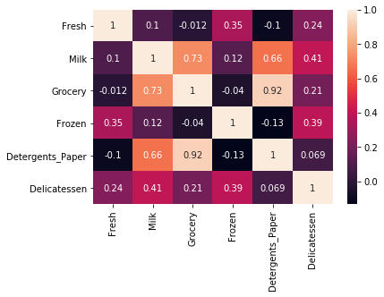
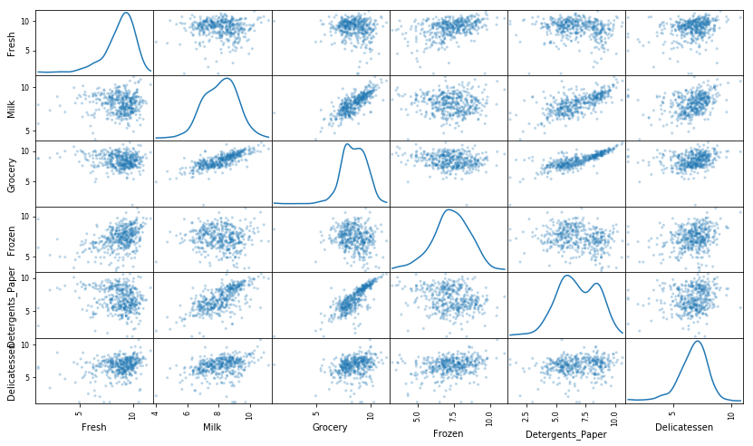
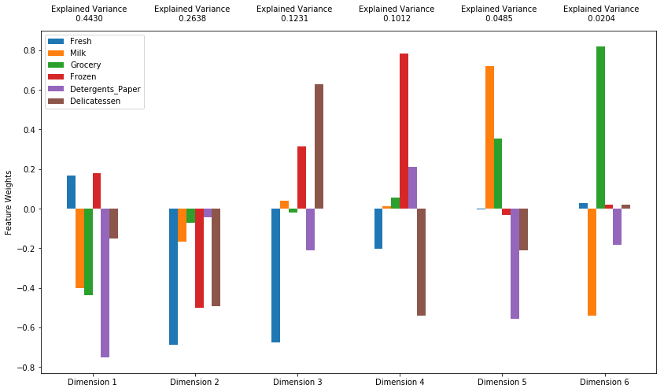
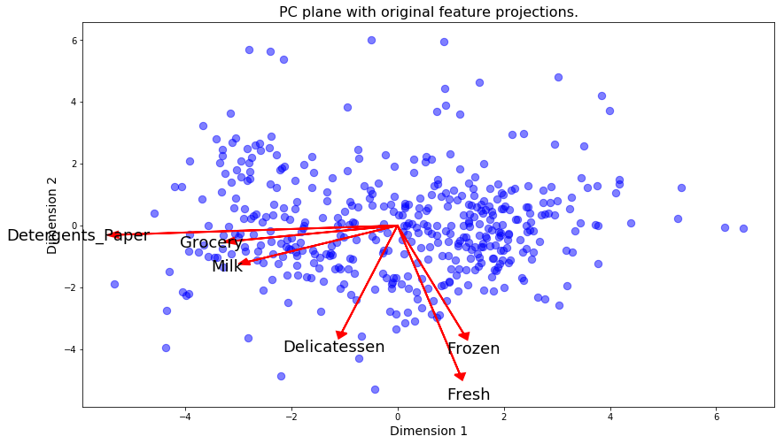
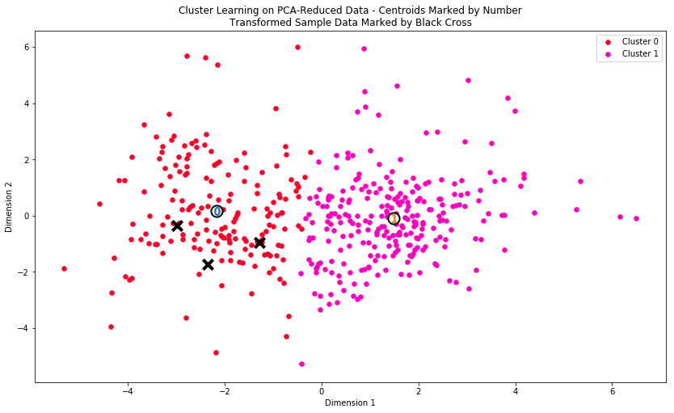

# CUSTOMERS SEGMENT

## Project Overview
In this project I will apply unsupervised learning techniques on product spending data collected for customers of a wholesale distributor in Lisbon, Portugal to identify customer segments hidden in the data. You will first explore the data by selecting a small subset to sample and determine if any product categories highly correlate with one another. Afterwards, I will preprocess the data by scaling each product category and then identifying (and removing) unwanted outliers. With the good, clean customer spending data, I will apply PCA transformations to the data and implement clustering algorithms to segment the transformed customer data. Finally, comparing the segmentation found and considering ways this information could assist the wholesale distributor with future service changes.

## Project Highlights
This project is designed with unsupervised learning and work towards developing conclusions for a potential client on a real-world dataset. 
Many companies today collect vast amounts of data on customers and clientele, and have a strong desire to understand the meaningful relationships hidden in their customer base. Being equipped with this information can assist a company engineer future products and services that best satisfy the demands or needs of their customers.

Things learned by completing this project:

- How to apply preprocessing techniques such as feature scaling and outlier detection.
- How to interpret data points that have been scaled, transformed, or reduced from PCA.
- How to analyze PCA dimensions and construct a new feature space.
- How to optimally cluster a set of data to find hidden patterns in a dataset.
- How to assess information given by cluster data and use it in a meaningful way.


## Description
A wholesale distributor recently tested a change to their delivery method for some customers, by moving from a morning delivery service five days a week to a cheaper evening delivery service three days a week. Initial testing did not discover any significant unsatisfactory results, so they implemented the cheaper option for all customers. Almost immediately, the distributor began getting complaints about the delivery service change and customers were canceling deliveries, losing the distributor more money than what was being saved. You've been hired by the wholesale distributor to find what types of customers they have to help them make better, more informed business decisions in the future. Your task is to use unsupervised learning techniques to see if any similarities exist between customers, and how to best segment customers into distinct categories.


## Software and Libraries
This project uses the following software and Python libraries:
- [Python](https://www.python.org/downloads/release/python-364/)
- [NumPy](http://www.numpy.org/)
- [pandas](http://pandas.pydata.org/)
- [scikit-learn](http://scikit-learn.org/0.17/install.html) (v0.17)
- [matplotlib](http://matplotlib.org/)

also need to have software installed run and execute a [Jupyter Notebook](http://ipython.org/notebook.html)。
Python 3.x installer.


# 项目：细分客户群体
* 数据集包含关于来自多种产品类别的各种客户年度消费额（货币单位计价）的数据。
* 该项目的目标之一是准确地描述与批发商进行交易的不同类型的客户之间的差别。这样可以使分销商清晰地了解如何安排送货服务，以便满足每位客户的需求。


# 一 数据加载及探索


```python
# Import libraries necessary for this project
import numpy as np
import pandas as pd
from IPython.display import display # Allows the use of display() for DataFrames

# Import supplementary visualizations code visuals.py
import visuals as vs

# Pretty display for notebooks
%matplotlib inline

# Load the wholesale customers dataset
try:
    data = pd.read_csv("customers.csv")
    data.drop(['Region', 'Channel'], axis = 1, inplace = True) # 对于此项目，将重点分析记录的六个客户产品类别，因此忽略特征 'Channel' 和 'Region'，
    print("Wholesale customers dataset has {} samples with {} features each.".format(*data.shape))
except:
    print("Dataset could not be loaded. Is the dataset missing?")
```

    Wholesale customers dataset has 440 samples with 6 features each.


## 观察数据集的统计学描述内容&探索缺失值


```python
# Display a description of the dataset
display(data.describe())
data.isnull().any()
```


<div>
<style>
    .dataframe thead tr:only-child th {
        text-align: right;
    }

    .dataframe thead th {
        text-align: left;
    }

    .dataframe tbody tr th {
        vertical-align: top;
    }
</style>
<table border="1" class="dataframe">
  <thead>
    <tr style="text-align: right;">
      <th></th>
      <th>Fresh</th>
      <th>Milk</th>
      <th>Grocery</th>
      <th>Frozen</th>
      <th>Detergents_Paper</th>
      <th>Delicatessen</th>
    </tr>
  </thead>
  <tbody>
    <tr>
      <th>count</th>
      <td>440.000000</td>
      <td>440.000000</td>
      <td>440.000000</td>
      <td>440.000000</td>
      <td>440.000000</td>
      <td>440.000000</td>
    </tr>
    <tr>
      <th>mean</th>
      <td>12000.297727</td>
      <td>5796.265909</td>
      <td>7951.277273</td>
      <td>3071.931818</td>
      <td>2881.493182</td>
      <td>1524.870455</td>
    </tr>
    <tr>
      <th>std</th>
      <td>12647.328865</td>
      <td>7380.377175</td>
      <td>9503.162829</td>
      <td>4854.673333</td>
      <td>4767.854448</td>
      <td>2820.105937</td>
    </tr>
    <tr>
      <th>min</th>
      <td>3.000000</td>
      <td>55.000000</td>
      <td>3.000000</td>
      <td>25.000000</td>
      <td>3.000000</td>
      <td>3.000000</td>
    </tr>
    <tr>
      <th>25%</th>
      <td>3127.750000</td>
      <td>1533.000000</td>
      <td>2153.000000</td>
      <td>742.250000</td>
      <td>256.750000</td>
      <td>408.250000</td>
    </tr>
    <tr>
      <th>50%</th>
      <td>8504.000000</td>
      <td>3627.000000</td>
      <td>4755.500000</td>
      <td>1526.000000</td>
      <td>816.500000</td>
      <td>965.500000</td>
    </tr>
    <tr>
      <th>75%</th>
      <td>16933.750000</td>
      <td>7190.250000</td>
      <td>10655.750000</td>
      <td>3554.250000</td>
      <td>3922.000000</td>
      <td>1820.250000</td>
    </tr>
    <tr>
      <th>max</th>
      <td>112151.000000</td>
      <td>73498.000000</td>
      <td>92780.000000</td>
      <td>60869.000000</td>
      <td>40827.000000</td>
      <td>47943.000000</td>
    </tr>
  </tbody>
</table>
</div>


    Fresh               False
    Milk                False
    Grocery             False
    Frozen              False
    Detergents_Paper    False
    Delicatessen        False
    dtype: bool


数据集由 6 个重要的产品类别构成：“Fresh”、“Milk”、“Grocery”、“Frozen”、“Detergents_Paper”和“Delicatessen”（生鲜，牛奶，食品杂货，冷冻，熟食，清洁用品）。


各特征中值与均值差距较大，初步推断是偏态分布数据。

## 进行数据相关性探索

### 1 可视化特征分布
为了更好的理解数据集，更直观的观察数据分布情况及特征间关系，画出散布矩阵图。


```python
# Produce a scatter matrix for each pair of features in the data
pd.plotting.scatter_matrix(data, alpha = 0.3, figsize = (14,8), diagonal = 'kde')
```


    array([[<matplotlib.axes._subplots.AxesSubplot object at 0x10cf8a438>,
            <matplotlib.axes._subplots.AxesSubplot object at 0x111f7bd68>,
            <matplotlib.axes._subplots.AxesSubplot object at 0x111fc21d0>,
            <matplotlib.axes._subplots.AxesSubplot object at 0x111ffa240>,
            <matplotlib.axes._subplots.AxesSubplot object at 0x111f8fb70>,
            <matplotlib.axes._subplots.AxesSubplot object at 0x111f8f4e0>],
           [<matplotlib.axes._subplots.AxesSubplot object at 0x1120947b8>,
            <matplotlib.axes._subplots.AxesSubplot object at 0x1120ce7b8>,
            <matplotlib.axes._subplots.AxesSubplot object at 0x1121047b8>,
            <matplotlib.axes._subplots.AxesSubplot object at 0x11213a048>,
            <matplotlib.axes._subplots.AxesSubplot object at 0x112170518>,
            <matplotlib.axes._subplots.AxesSubplot object at 0x1121a9a58>],
           [<matplotlib.axes._subplots.AxesSubplot object at 0x1121e2f98>,
            <matplotlib.axes._subplots.AxesSubplot object at 0x11220dd68>,
            <matplotlib.axes._subplots.AxesSubplot object at 0x112243d68>,
            <matplotlib.axes._subplots.AxesSubplot object at 0x11227dd68>,
            <matplotlib.axes._subplots.AxesSubplot object at 0x1122b6d68>,
            <matplotlib.axes._subplots.AxesSubplot object at 0x112256a90>],
           [<matplotlib.axes._subplots.AxesSubplot object at 0x112322828>,
            <matplotlib.axes._subplots.AxesSubplot object at 0x11235acf8>,
            <matplotlib.axes._subplots.AxesSubplot object at 0x11239e278>,
            <matplotlib.axes._subplots.AxesSubplot object at 0x1123c4080>,
            <matplotlib.axes._subplots.AxesSubplot object at 0x1124032e8>,
            <matplotlib.axes._subplots.AxesSubplot object at 0x11243b668>],
           [<matplotlib.axes._subplots.AxesSubplot object at 0x11245a940>,
            <matplotlib.axes._subplots.AxesSubplot object at 0x1124ad5f8>,
            <matplotlib.axes._subplots.AxesSubplot object at 0x1124d5c88>,
            <matplotlib.axes._subplots.AxesSubplot object at 0x112510d68>,
            <matplotlib.axes._subplots.AxesSubplot object at 0x112549d68>,
            <matplotlib.axes._subplots.AxesSubplot object at 0x112580d68>],
           [<matplotlib.axes._subplots.AxesSubplot object at 0x1125675c0>,
            <matplotlib.axes._subplots.AxesSubplot object at 0x1125ed898>,
            <matplotlib.axes._subplots.AxesSubplot object at 0x112629828>,
            <matplotlib.axes._subplots.AxesSubplot object at 0x112660828>,
            <matplotlib.axes._subplots.AxesSubplot object at 0x112697cf8>,
            <matplotlib.axes._subplots.AxesSubplot object at 0x1126c4438>]], dtype=object)


通过画散布矩阵图，可以观察到各特征呈严重右偏态分布；

同时可以观察到特征两两间的关系，某些特征对存在类线性的关系。相关性较大的特征对有：食品杂货与牛奶，食品杂货与清洁用品，清洁用品与牛奶。

为了进一步了解特征对的相关性，接着画出特征关系的热图，并标上相关性程度值，更直观的证明了以上的观察结果。


```python
# 使用 corr() 得出特征关系，然后使用 heatmap（要提供给热图的数据是联系值。例如 data.corr()）可视化这些特征，以进一步获得信息。
import seaborn as sns
sns.heatmap(data.corr(), annot=True)
```


    <matplotlib.axes._subplots.AxesSubplot at 0x114281390>





通过data.corr()的热力图可以看出： 'Grocery'和'Detergents_Paper'相关性达到0.92，'Grocery'和'Milk'相关性为0.73，'Detergents_Paper'和'Milk'相关性为0.66。 证实这三个特征对是相关性前三的特征对。

### 2 特征相关性探索（通过回归进行预测）
* 为了进一步判断客户购买某个类别产品时是否也会购买另一个类别产品。换句话说，某个特征是否可以通过其他特征预测得到。
* 预测特征选择：通过上一步观察中可知道，食品杂货和牛奶,清洁用品存在很大的相关性。因此选择通过牛奶和清洁用品预测食品杂货的购买额。
* 通过训练监督式回归学习器，使用其他特征去预测某一个特征，再进行模型评分，则可判断这个特征与其他特征间的关系。


```python
y_data = data['Grocery']
x_data = data[['Milk', 'Detergents_Paper']]

# Split the data into training and testing sets(0.25) using the given feature as the target
from sklearn.model_selection import train_test_split
X_train, X_test, y_train, y_test = train_test_split(x_data, y_data, test_size=0.25, random_state=42)

# Create a liear regressor and fit it to the training set
from sklearn.linear_model import LinearRegression
regressor = LinearRegression()
regressor.fit(X_train, y_train)

# Report the score of the prediction using the testing set
score = regressor.score(X_test, y_test)  

# Returns the coefficient of determination R^2 of the prediction. 
# R^2 [0, 1], 越接近1说明拟合效果越好，越呈线性相关
print(score)
```

    0.778298552353


结果：

R^2 得分为0.778，接近0.8，相对来说是个比较高的得分。

说明通过牛奶和清洁用品预测‘食品杂货’的购买额，即用户在购买牛奶和清洁用品的同时也会购买食品杂货。

# 二 数据预处理

### 选择样本
为了更好地通过分析了解客户以及他们的数据会如何变化，最好的方式是选择几个样本数据点并更详细地分析这些数据点。


```python
# Select three indices of your choice you wish to sample from the dataset
indices = [100, 200, 300]

# Create a DataFrame of the chosen samples
samples = pd.DataFrame(data.loc[indices], columns = data.keys()).reset_index(drop = True)
print("Chosen samples of wholesale customers dataset:")
display(samples)
```

    Chosen samples of wholesale customers dataset:


<div>
<style>
    .dataframe thead tr:only-child th {
        text-align: right;
    }

    .dataframe thead th {
        text-align: left;
    }

    .dataframe tbody tr th {
        vertical-align: top;
    }
</style>
<table border="1" class="dataframe">
  <thead>
    <tr style="text-align: right;">
      <th></th>
      <th>Fresh</th>
      <th>Milk</th>
      <th>Grocery</th>
      <th>Frozen</th>
      <th>Detergents_Paper</th>
      <th>Delicatessen</th>
    </tr>
  </thead>
  <tbody>
    <tr>
      <th>0</th>
      <td>11594</td>
      <td>7779</td>
      <td>12144</td>
      <td>3252</td>
      <td>8035</td>
      <td>3029</td>
    </tr>
    <tr>
      <th>1</th>
      <td>3067</td>
      <td>13240</td>
      <td>23127</td>
      <td>3941</td>
      <td>9959</td>
      <td>731</td>
    </tr>
    <tr>
      <th>2</th>
      <td>16448</td>
      <td>6243</td>
      <td>6360</td>
      <td>824</td>
      <td>2662</td>
      <td>2005</td>
    </tr>
  </tbody>
</table>
</div>


## 1 特征缩放
从前面的观察可知数据呈现严重的右偏态分布。

同时为了防止极大极小值对算法造成不良影响，通过log对数转换的方法可以缩小特征的值范围。

画出转换后数据的散布矩阵图，可观察到转换后的数据更接近正态分布。


```python
# Scale the data using the natural logarithm
log_data = np.log(data)

# cale the sample data using the natural logarithm
log_samples = np.log(samples)

# Produce a scatter matrix for each pair of newly-transformed features
pd.plotting.scatter_matrix(log_data, alpha = 0.3, figsize = (14,8), diagonal = 'kde');
```





** 观察 **

在应用自然对数后样本数据有何变化


```python
# Display the log-transformed sample data
display(log_samples)

```


<div>
<style>
    .dataframe thead tr:only-child th {
        text-align: right;
    }

    .dataframe thead th {
        text-align: left;
    }

    .dataframe tbody tr th {
        vertical-align: top;
    }
</style>
<table border="1" class="dataframe">
  <thead>
    <tr style="text-align: right;">
      <th></th>
      <th>Fresh</th>
      <th>Milk</th>
      <th>Grocery</th>
      <th>Frozen</th>
      <th>Detergents_Paper</th>
      <th>Delicatessen</th>
    </tr>
  </thead>
  <tbody>
    <tr>
      <th>0</th>
      <td>9.358243</td>
      <td>8.959183</td>
      <td>9.404590</td>
      <td>8.087025</td>
      <td>8.991562</td>
      <td>8.015988</td>
    </tr>
    <tr>
      <th>1</th>
      <td>8.028455</td>
      <td>9.490998</td>
      <td>10.048756</td>
      <td>8.279190</td>
      <td>9.206232</td>
      <td>6.594413</td>
    </tr>
    <tr>
      <th>2</th>
      <td>9.707959</td>
      <td>8.739216</td>
      <td>8.757784</td>
      <td>6.714171</td>
      <td>7.886833</td>
      <td>7.603399</td>
    </tr>
  </tbody>
</table>
</div>


## 2 检测离群值

* 有任何数据点属于多个特征的离群值吗？  index为[65, 66, 75, 128, 154]的数据点在多类别中都属于离群值。

* 应该从数据集中删除这些数据点吗？为什么？
K-Means对离群值敏感，离群值会影响中心点的移动方向。因此需要删除一定的离群值。
如果把在一个特征上的离群值都删了，会删除比例较大的数据，对整体数据会有影响，所以可以删除在两个及两个以上特征为离群值的数据。

离群值会对结果造成不利影响，特别是对K-Means这样的聚类算法，它对离群值敏感，离群值会影响中心点的移动方向。因此需要删除一定的离群值。但只删除在多个特征中都属于离群值的数据点。

通过计算超过1.5倍四分位距来得出离群值。


```python
# For each feature find the data points with extreme high or low values
outliers = []
for feature in log_data.keys(): # 或者使用log_data.columns
    Q1 = np.percentile(log_data[feature], 25)
    Q3 = np.percentile(log_data[feature], 75)
    
    # Use the interquartile range to calculate an outlier step (1.5 times the interquartile range)
    step = 1.5*(Q3 - Q1)
    
    print ("Data points considered outliers for the feature '{}':".format(feature))
    
    #bad_data = log_data[~((log_data[feature] >= Q1 - step) & (log_data[feature] <= Q3 + step))]    
    
    bad_data = log_data[~((log_data[feature] <= Q3 + step) & (log_data[feature] >= Q1 - step))]
    
    outliers.extend(bad_data.index.tolist()) # outliers为list类型，存放异常值的index
    #print(type(bad_data))  df 
    #print(type(bad_data.index))  df  index
    #outliers.extend(list(bad_data.inedx))
    # print(bad_data.index) 
    # print(type(outliers)) list
    
    display(bad_data)
    
outliers = [x for x in list(set(outliers)) if outliers.count(x)>=2]
print(np.sort(outliers).tolist())
good_data = log_data.drop(log_data.index[outliers]).reset_index(drop=True) 
# 或者使用下面这种方法
# good_data = log_data.drop(outliers, axis=0).reset_index(drop=True) 
```

    Data points considered outliers for the feature 'Fresh':


<div>
<style>
    .dataframe thead tr:only-child th {
        text-align: right;
    }

    .dataframe thead th {
        text-align: left;
    }

    .dataframe tbody tr th {
        vertical-align: top;
    }
</style>
<table border="1" class="dataframe">
  <thead>
    <tr style="text-align: right;">
      <th></th>
      <th>Fresh</th>
      <th>Milk</th>
      <th>Grocery</th>
      <th>Frozen</th>
      <th>Detergents_Paper</th>
      <th>Delicatessen</th>
    </tr>
  </thead>
  <tbody>
    <tr>
      <th>65</th>
      <td>4.442651</td>
      <td>9.950323</td>
      <td>10.732651</td>
      <td>3.583519</td>
      <td>10.095388</td>
      <td>7.260523</td>
    </tr>
    <tr>
      <th>66</th>
      <td>2.197225</td>
      <td>7.335634</td>
      <td>8.911530</td>
      <td>5.164786</td>
      <td>8.151333</td>
      <td>3.295837</td>
    </tr>
    <tr>
      <th>81</th>
      <td>5.389072</td>
      <td>9.163249</td>
      <td>9.575192</td>
      <td>5.645447</td>
      <td>8.964184</td>
      <td>5.049856</td>
    </tr>
    <tr>
      <th>95</th>
      <td>1.098612</td>
      <td>7.979339</td>
      <td>8.740657</td>
      <td>6.086775</td>
      <td>5.407172</td>
      <td>6.563856</td>
    </tr>
    <tr>
      <th>96</th>
      <td>3.135494</td>
      <td>7.869402</td>
      <td>9.001839</td>
      <td>4.976734</td>
      <td>8.262043</td>
      <td>5.379897</td>
    </tr>
    <tr>
      <th>128</th>
      <td>4.941642</td>
      <td>9.087834</td>
      <td>8.248791</td>
      <td>4.955827</td>
      <td>6.967909</td>
      <td>1.098612</td>
    </tr>
    <tr>
      <th>171</th>
      <td>5.298317</td>
      <td>10.160530</td>
      <td>9.894245</td>
      <td>6.478510</td>
      <td>9.079434</td>
      <td>8.740337</td>
    </tr>
    <tr>
      <th>193</th>
      <td>5.192957</td>
      <td>8.156223</td>
      <td>9.917982</td>
      <td>6.865891</td>
      <td>8.633731</td>
      <td>6.501290</td>
    </tr>
    <tr>
      <th>218</th>
      <td>2.890372</td>
      <td>8.923191</td>
      <td>9.629380</td>
      <td>7.158514</td>
      <td>8.475746</td>
      <td>8.759669</td>
    </tr>
    <tr>
      <th>304</th>
      <td>5.081404</td>
      <td>8.917311</td>
      <td>10.117510</td>
      <td>6.424869</td>
      <td>9.374413</td>
      <td>7.787382</td>
    </tr>
    <tr>
      <th>305</th>
      <td>5.493061</td>
      <td>9.468001</td>
      <td>9.088399</td>
      <td>6.683361</td>
      <td>8.271037</td>
      <td>5.351858</td>
    </tr>
    <tr>
      <th>338</th>
      <td>1.098612</td>
      <td>5.808142</td>
      <td>8.856661</td>
      <td>9.655090</td>
      <td>2.708050</td>
      <td>6.309918</td>
    </tr>
    <tr>
      <th>353</th>
      <td>4.762174</td>
      <td>8.742574</td>
      <td>9.961898</td>
      <td>5.429346</td>
      <td>9.069007</td>
      <td>7.013016</td>
    </tr>
    <tr>
      <th>355</th>
      <td>5.247024</td>
      <td>6.588926</td>
      <td>7.606885</td>
      <td>5.501258</td>
      <td>5.214936</td>
      <td>4.844187</td>
    </tr>
    <tr>
      <th>357</th>
      <td>3.610918</td>
      <td>7.150701</td>
      <td>10.011086</td>
      <td>4.919981</td>
      <td>8.816853</td>
      <td>4.700480</td>
    </tr>
    <tr>
      <th>412</th>
      <td>4.574711</td>
      <td>8.190077</td>
      <td>9.425452</td>
      <td>4.584967</td>
      <td>7.996317</td>
      <td>4.127134</td>
    </tr>
  </tbody>
</table>
</div>


    Data points considered outliers for the feature 'Milk':


<div>
<style>
    .dataframe thead tr:only-child th {
        text-align: right;
    }

    .dataframe thead th {
        text-align: left;
    }

    .dataframe tbody tr th {
        vertical-align: top;
    }
</style>
<table border="1" class="dataframe">
  <thead>
    <tr style="text-align: right;">
      <th></th>
      <th>Fresh</th>
      <th>Milk</th>
      <th>Grocery</th>
      <th>Frozen</th>
      <th>Detergents_Paper</th>
      <th>Delicatessen</th>
    </tr>
  </thead>
  <tbody>
    <tr>
      <th>86</th>
      <td>10.039983</td>
      <td>11.205013</td>
      <td>10.377047</td>
      <td>6.894670</td>
      <td>9.906981</td>
      <td>6.805723</td>
    </tr>
    <tr>
      <th>98</th>
      <td>6.220590</td>
      <td>4.718499</td>
      <td>6.656727</td>
      <td>6.796824</td>
      <td>4.025352</td>
      <td>4.882802</td>
    </tr>
    <tr>
      <th>154</th>
      <td>6.432940</td>
      <td>4.007333</td>
      <td>4.919981</td>
      <td>4.317488</td>
      <td>1.945910</td>
      <td>2.079442</td>
    </tr>
    <tr>
      <th>356</th>
      <td>10.029503</td>
      <td>4.897840</td>
      <td>5.384495</td>
      <td>8.057377</td>
      <td>2.197225</td>
      <td>6.306275</td>
    </tr>
  </tbody>
</table>
</div>


    Data points considered outliers for the feature 'Grocery':


<div>
<style>
    .dataframe thead tr:only-child th {
        text-align: right;
    }

    .dataframe thead th {
        text-align: left;
    }

    .dataframe tbody tr th {
        vertical-align: top;
    }
</style>
<table border="1" class="dataframe">
  <thead>
    <tr style="text-align: right;">
      <th></th>
      <th>Fresh</th>
      <th>Milk</th>
      <th>Grocery</th>
      <th>Frozen</th>
      <th>Detergents_Paper</th>
      <th>Delicatessen</th>
    </tr>
  </thead>
  <tbody>
    <tr>
      <th>75</th>
      <td>9.923192</td>
      <td>7.036148</td>
      <td>1.098612</td>
      <td>8.390949</td>
      <td>1.098612</td>
      <td>6.882437</td>
    </tr>
    <tr>
      <th>154</th>
      <td>6.432940</td>
      <td>4.007333</td>
      <td>4.919981</td>
      <td>4.317488</td>
      <td>1.945910</td>
      <td>2.079442</td>
    </tr>
  </tbody>
</table>
</div>


    Data points considered outliers for the feature 'Frozen':


<div>
<style>
    .dataframe thead tr:only-child th {
        text-align: right;
    }

    .dataframe thead th {
        text-align: left;
    }

    .dataframe tbody tr th {
        vertical-align: top;
    }
</style>
<table border="1" class="dataframe">
  <thead>
    <tr style="text-align: right;">
      <th></th>
      <th>Fresh</th>
      <th>Milk</th>
      <th>Grocery</th>
      <th>Frozen</th>
      <th>Detergents_Paper</th>
      <th>Delicatessen</th>
    </tr>
  </thead>
  <tbody>
    <tr>
      <th>38</th>
      <td>8.431853</td>
      <td>9.663261</td>
      <td>9.723703</td>
      <td>3.496508</td>
      <td>8.847360</td>
      <td>6.070738</td>
    </tr>
    <tr>
      <th>57</th>
      <td>8.597297</td>
      <td>9.203618</td>
      <td>9.257892</td>
      <td>3.637586</td>
      <td>8.932213</td>
      <td>7.156177</td>
    </tr>
    <tr>
      <th>65</th>
      <td>4.442651</td>
      <td>9.950323</td>
      <td>10.732651</td>
      <td>3.583519</td>
      <td>10.095388</td>
      <td>7.260523</td>
    </tr>
    <tr>
      <th>145</th>
      <td>10.000569</td>
      <td>9.034080</td>
      <td>10.457143</td>
      <td>3.737670</td>
      <td>9.440738</td>
      <td>8.396155</td>
    </tr>
    <tr>
      <th>175</th>
      <td>7.759187</td>
      <td>8.967632</td>
      <td>9.382106</td>
      <td>3.951244</td>
      <td>8.341887</td>
      <td>7.436617</td>
    </tr>
    <tr>
      <th>264</th>
      <td>6.978214</td>
      <td>9.177714</td>
      <td>9.645041</td>
      <td>4.110874</td>
      <td>8.696176</td>
      <td>7.142827</td>
    </tr>
    <tr>
      <th>325</th>
      <td>10.395650</td>
      <td>9.728181</td>
      <td>9.519735</td>
      <td>11.016479</td>
      <td>7.148346</td>
      <td>8.632128</td>
    </tr>
    <tr>
      <th>420</th>
      <td>8.402007</td>
      <td>8.569026</td>
      <td>9.490015</td>
      <td>3.218876</td>
      <td>8.827321</td>
      <td>7.239215</td>
    </tr>
    <tr>
      <th>429</th>
      <td>9.060331</td>
      <td>7.467371</td>
      <td>8.183118</td>
      <td>3.850148</td>
      <td>4.430817</td>
      <td>7.824446</td>
    </tr>
    <tr>
      <th>439</th>
      <td>7.932721</td>
      <td>7.437206</td>
      <td>7.828038</td>
      <td>4.174387</td>
      <td>6.167516</td>
      <td>3.951244</td>
    </tr>
  </tbody>
</table>
</div>


    Data points considered outliers for the feature 'Detergents_Paper':


<div>
<style>
    .dataframe thead tr:only-child th {
        text-align: right;
    }

    .dataframe thead th {
        text-align: left;
    }

    .dataframe tbody tr th {
        vertical-align: top;
    }
</style>
<table border="1" class="dataframe">
  <thead>
    <tr style="text-align: right;">
      <th></th>
      <th>Fresh</th>
      <th>Milk</th>
      <th>Grocery</th>
      <th>Frozen</th>
      <th>Detergents_Paper</th>
      <th>Delicatessen</th>
    </tr>
  </thead>
  <tbody>
    <tr>
      <th>75</th>
      <td>9.923192</td>
      <td>7.036148</td>
      <td>1.098612</td>
      <td>8.390949</td>
      <td>1.098612</td>
      <td>6.882437</td>
    </tr>
    <tr>
      <th>161</th>
      <td>9.428190</td>
      <td>6.291569</td>
      <td>5.645447</td>
      <td>6.995766</td>
      <td>1.098612</td>
      <td>7.711101</td>
    </tr>
  </tbody>
</table>
</div>


    Data points considered outliers for the feature 'Delicatessen':


<div>
<style>
    .dataframe thead tr:only-child th {
        text-align: right;
    }

    .dataframe thead th {
        text-align: left;
    }

    .dataframe tbody tr th {
        vertical-align: top;
    }
</style>
<table border="1" class="dataframe">
  <thead>
    <tr style="text-align: right;">
      <th></th>
      <th>Fresh</th>
      <th>Milk</th>
      <th>Grocery</th>
      <th>Frozen</th>
      <th>Detergents_Paper</th>
      <th>Delicatessen</th>
    </tr>
  </thead>
  <tbody>
    <tr>
      <th>66</th>
      <td>2.197225</td>
      <td>7.335634</td>
      <td>8.911530</td>
      <td>5.164786</td>
      <td>8.151333</td>
      <td>3.295837</td>
    </tr>
    <tr>
      <th>109</th>
      <td>7.248504</td>
      <td>9.724899</td>
      <td>10.274568</td>
      <td>6.511745</td>
      <td>6.728629</td>
      <td>1.098612</td>
    </tr>
    <tr>
      <th>128</th>
      <td>4.941642</td>
      <td>9.087834</td>
      <td>8.248791</td>
      <td>4.955827</td>
      <td>6.967909</td>
      <td>1.098612</td>
    </tr>
    <tr>
      <th>137</th>
      <td>8.034955</td>
      <td>8.997147</td>
      <td>9.021840</td>
      <td>6.493754</td>
      <td>6.580639</td>
      <td>3.583519</td>
    </tr>
    <tr>
      <th>142</th>
      <td>10.519646</td>
      <td>8.875147</td>
      <td>9.018332</td>
      <td>8.004700</td>
      <td>2.995732</td>
      <td>1.098612</td>
    </tr>
    <tr>
      <th>154</th>
      <td>6.432940</td>
      <td>4.007333</td>
      <td>4.919981</td>
      <td>4.317488</td>
      <td>1.945910</td>
      <td>2.079442</td>
    </tr>
    <tr>
      <th>183</th>
      <td>10.514529</td>
      <td>10.690808</td>
      <td>9.911952</td>
      <td>10.505999</td>
      <td>5.476464</td>
      <td>10.777768</td>
    </tr>
    <tr>
      <th>184</th>
      <td>5.789960</td>
      <td>6.822197</td>
      <td>8.457443</td>
      <td>4.304065</td>
      <td>5.811141</td>
      <td>2.397895</td>
    </tr>
    <tr>
      <th>187</th>
      <td>7.798933</td>
      <td>8.987447</td>
      <td>9.192075</td>
      <td>8.743372</td>
      <td>8.148735</td>
      <td>1.098612</td>
    </tr>
    <tr>
      <th>203</th>
      <td>6.368187</td>
      <td>6.529419</td>
      <td>7.703459</td>
      <td>6.150603</td>
      <td>6.860664</td>
      <td>2.890372</td>
    </tr>
    <tr>
      <th>233</th>
      <td>6.871091</td>
      <td>8.513988</td>
      <td>8.106515</td>
      <td>6.842683</td>
      <td>6.013715</td>
      <td>1.945910</td>
    </tr>
    <tr>
      <th>285</th>
      <td>10.602965</td>
      <td>6.461468</td>
      <td>8.188689</td>
      <td>6.948897</td>
      <td>6.077642</td>
      <td>2.890372</td>
    </tr>
    <tr>
      <th>289</th>
      <td>10.663966</td>
      <td>5.655992</td>
      <td>6.154858</td>
      <td>7.235619</td>
      <td>3.465736</td>
      <td>3.091042</td>
    </tr>
    <tr>
      <th>343</th>
      <td>7.431892</td>
      <td>8.848509</td>
      <td>10.177932</td>
      <td>7.283448</td>
      <td>9.646593</td>
      <td>3.610918</td>
    </tr>
  </tbody>
</table>
</div>


    [65, 66, 75, 128, 154]


## 3 使用PCA进行主成分分析并进行降维

减少噪音，去除不重要成分；
把复杂问题简单化；
使算法效果更好。

利用主成分分析 (PCA) 得出批发客户数据的基本结构。因为对数据集使用 PCA 会计算哪些维度最适合最大化方差，可以发现哪些特征组合最能描述客户消费情况。
通过之前特征分析，发现某些特征可以通过其他特征预测得到，说明特征中可能存在不重要成分。

通过PCA转换后的6维度和2维度的数据点数值相同。


```python
# Apply PCA by fitting the good data with the same number of dimensions as features
from sklearn.decomposition import PCA
pca = PCA(n_components=6)
pca.fit(good_data)

# Transform log_samples using the PCA fit above
pca_samples = pca.transform(log_samples)

# Generate PCA results plot
pca_results = vs.pca_results(good_data, pca)
```





特定维度的正增长对应的是正加权特征的增长以及负加权特征的降低。增长或降低比例由具体的特征权重决定。

前两个成分的累积方差为：0.4430+0.2638=0.7068

前四个成分的累积方差为：0.4430+0.2638+0.1231+0.1012=0.9311


** 观察 **

经过对数转换的样本数据在六维空间里应用 PCA 转换后有何变化。


```python
# Display sample log-data after having a PCA transformation applied
display(pd.DataFrame(np.round(pca_samples, 4), columns = pca_results.index.values))
```


<div>
<style>
    .dataframe thead tr:only-child th {
        text-align: right;
    }

    .dataframe thead th {
        text-align: left;
    }

    .dataframe tbody tr th {
        vertical-align: top;
    }
</style>
<table border="1" class="dataframe">
  <thead>
    <tr style="text-align: right;">
      <th></th>
      <th>Dimension 1</th>
      <th>Dimension 2</th>
      <th>Dimension 3</th>
      <th>Dimension 4</th>
      <th>Dimension 5</th>
      <th>Dimension 6</th>
    </tr>
  </thead>
  <tbody>
    <tr>
      <th>0</th>
      <td>-2.3579</td>
      <td>-1.7393</td>
      <td>0.2210</td>
      <td>0.2840</td>
      <td>-0.5939</td>
      <td>-0.0148</td>
    </tr>
    <tr>
      <th>1</th>
      <td>-2.9903</td>
      <td>-0.3645</td>
      <td>0.2521</td>
      <td>1.5653</td>
      <td>0.1922</td>
      <td>0.1244</td>
    </tr>
    <tr>
      <th>2</th>
      <td>-1.2804</td>
      <td>-0.9587</td>
      <td>-0.4701</td>
      <td>-0.9124</td>
      <td>-0.2345</td>
      <td>-0.2514</td>
    </tr>
  </tbody>
</table>
</div>


### 实现：降维
在使用主成分分析时，主要目标之一是降低数据维度，以便降低问题的复杂度。降维有一定的代价：使用的维度越少，则解释的总方差就越少。因此，为了了解有多少个维度对问题来说是必要维度，*累积可解释方差比*显得极为重要。此外，如果大量方差仅通过两个或三个维度进行了解释，则缩减的数据可以之后可视化。


```python
# Apply PCA by fitting the good data with only two dimensions
pca = PCA(n_components=2).fit(good_data)

# Transform the good data using the PCA fit above
reduced_data = pca.transform(good_data)

# Transform log_samples using the PCA fit above
pca_samples = pca.transform(log_samples)

# Create a DataFrame for the reduced data
reduced_data = pd.DataFrame(reduced_data, columns = ['Dimension 1', 'Dimension 2'])
```

** 观察 **
经过对数转换的样本数据在仅使用二个维度并应用 PCA 转换后有何变化。


```python
# Display sample log-data after applying PCA transformation in two dimensions
display(pd.DataFrame(np.round(pca_samples, 4), columns = ['Dimension 1', 'Dimension 2']))
```


<div>
<style>
    .dataframe thead tr:only-child th {
        text-align: right;
    }

    .dataframe thead th {
        text-align: left;
    }

    .dataframe tbody tr th {
        vertical-align: top;
    }
</style>
<table border="1" class="dataframe">
  <thead>
    <tr style="text-align: right;">
      <th></th>
      <th>Dimension 1</th>
      <th>Dimension 2</th>
    </tr>
  </thead>
  <tbody>
    <tr>
      <th>0</th>
      <td>-2.3579</td>
      <td>-1.7393</td>
    </tr>
    <tr>
      <th>1</th>
      <td>-2.9903</td>
      <td>-0.3645</td>
    </tr>
    <tr>
      <th>2</th>
      <td>-1.2804</td>
      <td>-0.9587</td>
    </tr>
  </tbody>
</table>
</div>


通过观察，前两个维度的值与六维空间里的 PCA 转换相比没有变化。


#### 可视化双标图
双标图是一种散点图，每个数据点由主成分上的分数表示。坐标轴是主成分（在此图中是 `Dimension 1` 和 `Dimension 2`）。此外，双标图显示了原始特征沿着成分的投影情况。双标图可以帮助我们解释降维数据，并发现主成分与原始特征之间的关系。


```python
# Create a biplot
vs.biplot(good_data, reduced_data, pca)
```


    <matplotlib.axes._subplots.AxesSubplot at 0x115040f60>





# 三 构建聚类模型
通过K-Means算法对客户进行分类。

用轮廓系数对聚类进行评估,并确定最优聚类个数。
轮廓系数用来衡量数据点与所分配聚类的相似程度。范围在-1～1之间，越大说明越相似。

如果无法根据先验判断聚类的数量，则无法保证给定的聚类数量能够以最佳方式细分数据，因为不清楚数据存在什么样的结构（如果有的话）。但是，我们可以根据每个数据点的轮廓系数量化聚类的“优势” 。

数据点的轮廓系数会衡量数据点与所分配的聚类之间的相似度，程度用 -1（不相似）到 1（相似）表示。计算均值轮廓系数是对给定聚类进评分的简单方法。


```python
from sklearn.cluster import KMeans
from sklearn.metrics import silhouette_score

for n in range(2,7):
    clusterer = KMeans(n_clusters = n, random_state = 40).fit(reduced_data)
    
    # Predict the cluster for each data point
    preds = clusterer.predict(reduced_data)
    
    # TODO: Predict the cluster for each transformed sample data point
    sample_preds = clusterer.predict(pca_samples)
    
    # Find the cluster centers
    centers = clusterer.cluster_centers_
    
    # Calculate the mean silhouette coefficient for the number of clusters chosen
    score = silhouette_score(reduced_data, preds)
    
    print("clusters: {}, silhouette_score: {}.".format(n, score))
```

    clusters: 2, silhouette_score: 0.42628101546910846.
    clusters: 3, silhouette_score: 0.39641738719668546.
    clusters: 4, silhouette_score: 0.3323940323950923.
    clusters: 5, silhouette_score: 0.33901706934498804.
    clusters: 6, silhouette_score: 0.3551540910370931.


### 聚类可视化
2个聚类时，轮廓分数最高，即2为最佳聚类数量。
可视化最佳聚类数量。


```python
n = 2
clusterer = KMeans(n_clusters = n, random_state = 40).fit(reduced_data)
preds = clusterer.predict(reduced_data)
centers = clusterer.cluster_centers_

sample_preds = clusterer.predict(pca_samples)
score = silhouette_score(reduced_data, preds)

# Display the results of the clustering from implementation
vs.cluster_results(reduced_data, preds, centers, pca_samples)
```





# 四 数据恢复
为了进一步分析，获取每个聚类代表性客户的数据。
由于数据目前是降维状态，且进行了对数缩放，所以需要通过逆转换还原数据。
这些代表性客户，可以通过聚类的中心点得到，这些中心点（或均值）并不是来自数据中特定的点，而是相应聚类的所有数据点的平均值。


```python
# Inverse transform the centers, 使用 pca.inverse_transform 对 centers 应用逆转换
log_centers  = pca.inverse_transform(centers)

# Exponentiate the centers, 使用 np.exp 对 log_centers 应用 np.log 的逆函数
true_centers = np.exp(log_centers)

# display the true centers
true_centers = pd.DataFrame(np.round(true_centers), columns=data.columns)
display(true_centers)
```


<div>
<style>
    .dataframe thead tr:only-child th {
        text-align: right;
    }

    .dataframe thead th {
        text-align: left;
    }

    .dataframe tbody tr th {
        vertical-align: top;
    }
</style>
<table border="1" class="dataframe">
  <thead>
    <tr style="text-align: right;">
      <th></th>
      <th>Fresh</th>
      <th>Milk</th>
      <th>Grocery</th>
      <th>Frozen</th>
      <th>Detergents_Paper</th>
      <th>Delicatessen</th>
    </tr>
  </thead>
  <tbody>
    <tr>
      <th>0</th>
      <td>4005.0</td>
      <td>7900.0</td>
      <td>12104.0</td>
      <td>952.0</td>
      <td>4561.0</td>
      <td>1036.0</td>
    </tr>
    <tr>
      <th>1</th>
      <td>8867.0</td>
      <td>1897.0</td>
      <td>2477.0</td>
      <td>2088.0</td>
      <td>294.0</td>
      <td>681.0</td>
    </tr>
  </tbody>
</table>
</div>


# 总结及分析
1. 通过每类代表性客户在不同产品间的消费额度，推测每类客户所表示的场所。
   其中第一类在牛奶，食品杂货，清洁用品上的消费比较多，以咖啡店为代表；
   第二类在生鲜和冷冻品消费多一些，则以市场为代表。

2. 可以运用A/B测试等方法对不同聚类的客户采用不同送货方案，来帮助解决送货问题。

3. 还可以把聚类作为数据标签，原数据中各产品消费额度作为特征，当有新数据需要输入时，通过监督式学习算法，可以判断新用户属于哪个类别，以确定合适的送货方式。

