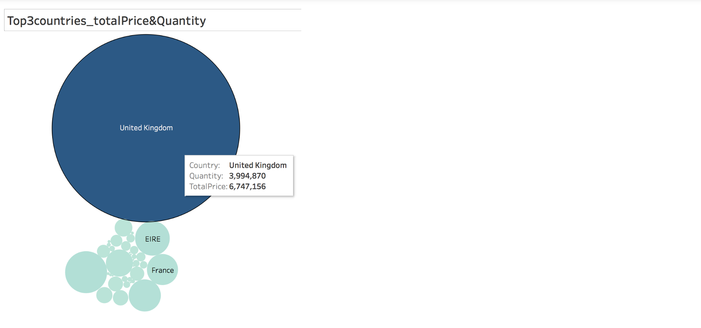
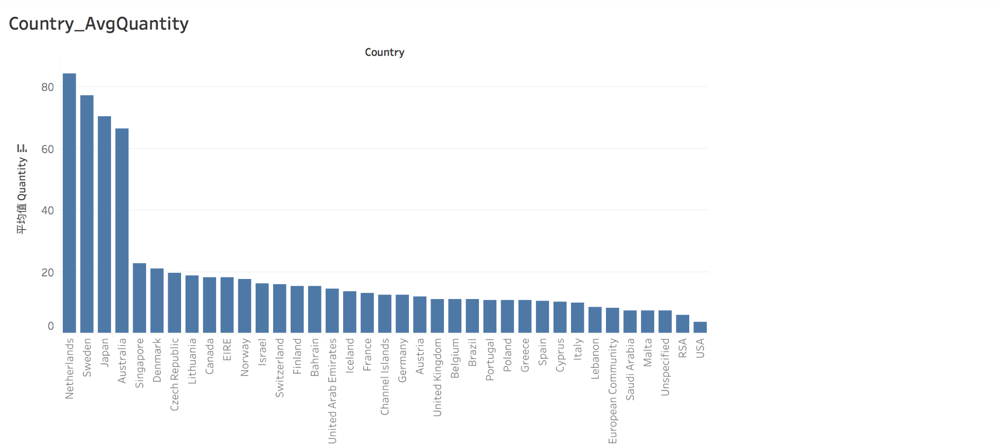
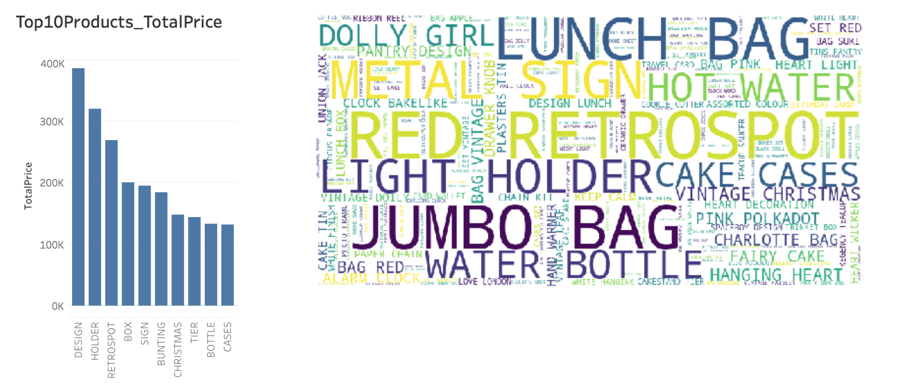

# 项目：销售情况及客户价值分析


## 一. 背景分析

这是一家跨国电商公司，以英国为销售中心，覆盖欧洲及各个地区。

注册店铺在线销售是其主要渠道，公司的许多客户为各地批发商。

该公司主要以销售独特的覆盖各种场合的礼物为主。

数据来源于该公司的销售数据，包含发生于2010-12-01到2011-12-09日一整年的销售数据。

了解整体业务运营情况，找出增长或下降原因，能帮助企业及时做出有效的应对。同时，对客户价值进行分析，把客户分成不同群体，则可对不同群体实施不同的营销策略达到精细化运营的目的，进而帮助企业提高销量，实现增长。


## 二. 目标分析

1. 了解经营情况

从时间，地区，金额，数量等多维度对销售数据进行分析

2. 提高精细化营销

通过RFM方法，对用户行为进行分析，把用户分成不同的群体，则可对不同群体用户采取不同营销策略。


### Data

数据来源：Kaggle "E-Commerce Data"-->https://www.kaggle.com/carrie1/ecommerce-data

各特征变量的解释如下：

* InvoiceNo: Invoice number. Nominal, a 6-digit integral number uniquely assigned to each transaction. If this code starts with letter 'c', it indicates a cancellation. 
* StockCode: Product (item) code. Nominal, a 5-digit integral number uniquely assigned to each distinct product. 
* Description: Product (item) name. Nominal. 
* Quantity: The quantities of each product (item) per transaction. Numeric. 
* InvoiceDate: Invice Date and time. Numeric, the day and time when each transaction was generated. 
* UnitPrice: Unit price. Numeric, Product price per unit in sterling. 
* CustomerID: Customer number. Nominal, a 5-digit integral number uniquely assigned to each customer. 
* Country: Country name. Nominal, the name of the country where each customer resides.


```python
import pandas as pd
import numpy as np
from scipy import stats

import jieba
import jieba.analyse
from wordcloud import WordCloud

import datetime as dt

%matplotlib inline
import matplotlib
import matplotlib.pyplot as plt

```


```python
df = pd.read_csv('data.csv',encoding="ISO-8859-1",dtype={'CustomerID': str,'InvoiceID': str})
print(df.shape)
df.head(10)
```

    (541909, 8)


<div>
<style>
    .dataframe thead tr:only-child th {
        text-align: right;
    }

    .dataframe thead th {
        text-align: left;
    }

    .dataframe tbody tr th {
        vertical-align: top;
    }
</style>
<table border="1" class="dataframe">
  <thead>
    <tr style="text-align: right;">
      <th></th>
      <th>InvoiceNo</th>
      <th>StockCode</th>
      <th>Description</th>
      <th>Quantity</th>
      <th>InvoiceDate</th>
      <th>UnitPrice</th>
      <th>CustomerID</th>
      <th>Country</th>
    </tr>
  </thead>
  <tbody>
    <tr>
      <th>0</th>
      <td>536365</td>
      <td>85123A</td>
      <td>WHITE HANGING HEART T-LIGHT HOLDER</td>
      <td>6</td>
      <td>12/1/2010 8:26</td>
      <td>2.55</td>
      <td>17850</td>
      <td>United Kingdom</td>
    </tr>
    <tr>
      <th>1</th>
      <td>536365</td>
      <td>71053</td>
      <td>WHITE METAL LANTERN</td>
      <td>6</td>
      <td>12/1/2010 8:26</td>
      <td>3.39</td>
      <td>17850</td>
      <td>United Kingdom</td>
    </tr>
    <tr>
      <th>2</th>
      <td>536365</td>
      <td>84406B</td>
      <td>CREAM CUPID HEARTS COAT HANGER</td>
      <td>8</td>
      <td>12/1/2010 8:26</td>
      <td>2.75</td>
      <td>17850</td>
      <td>United Kingdom</td>
    </tr>
    <tr>
      <th>3</th>
      <td>536365</td>
      <td>84029G</td>
      <td>KNITTED UNION FLAG HOT WATER BOTTLE</td>
      <td>6</td>
      <td>12/1/2010 8:26</td>
      <td>3.39</td>
      <td>17850</td>
      <td>United Kingdom</td>
    </tr>
    <tr>
      <th>4</th>
      <td>536365</td>
      <td>84029E</td>
      <td>RED WOOLLY HOTTIE WHITE HEART.</td>
      <td>6</td>
      <td>12/1/2010 8:26</td>
      <td>3.39</td>
      <td>17850</td>
      <td>United Kingdom</td>
    </tr>
    <tr>
      <th>5</th>
      <td>536365</td>
      <td>22752</td>
      <td>SET 7 BABUSHKA NESTING BOXES</td>
      <td>2</td>
      <td>12/1/2010 8:26</td>
      <td>7.65</td>
      <td>17850</td>
      <td>United Kingdom</td>
    </tr>
    <tr>
      <th>6</th>
      <td>536365</td>
      <td>21730</td>
      <td>GLASS STAR FROSTED T-LIGHT HOLDER</td>
      <td>6</td>
      <td>12/1/2010 8:26</td>
      <td>4.25</td>
      <td>17850</td>
      <td>United Kingdom</td>
    </tr>
    <tr>
      <th>7</th>
      <td>536366</td>
      <td>22633</td>
      <td>HAND WARMER UNION JACK</td>
      <td>6</td>
      <td>12/1/2010 8:28</td>
      <td>1.85</td>
      <td>17850</td>
      <td>United Kingdom</td>
    </tr>
    <tr>
      <th>8</th>
      <td>536366</td>
      <td>22632</td>
      <td>HAND WARMER RED POLKA DOT</td>
      <td>6</td>
      <td>12/1/2010 8:28</td>
      <td>1.85</td>
      <td>17850</td>
      <td>United Kingdom</td>
    </tr>
    <tr>
      <th>9</th>
      <td>536367</td>
      <td>84879</td>
      <td>ASSORTED COLOUR BIRD ORNAMENT</td>
      <td>32</td>
      <td>12/1/2010 8:34</td>
      <td>1.69</td>
      <td>13047</td>
      <td>United Kingdom</td>
    </tr>
  </tbody>
</table>
</div>


```python
df.info()
```

    <class 'pandas.core.frame.DataFrame'>
    RangeIndex: 541909 entries, 0 to 541908
    Data columns (total 8 columns):
    InvoiceNo      541909 non-null object
    StockCode      541909 non-null object
    Description    540455 non-null object
    Quantity       541909 non-null int64
    InvoiceDate    541909 non-null object
    UnitPrice      541909 non-null float64
    CustomerID     406829 non-null object
    Country        541909 non-null object
    dtypes: float64(1), int64(1), object(6)
    memory usage: 33.1+ MB


## 三. 数据清洗

### 1. 缺失值处理


```python
def null_info(df):
    info = pd.DataFrame(df.isnull().sum()).T.rename(index={0:'null values (nb)'})
    info=info.append(pd.DataFrame(df.isnull().sum()/df.shape[0]*100).T.rename(index={0:'null values (%)'}))
    display(info)
null_info(df)
```


<div>
<style>
    .dataframe thead tr:only-child th {
        text-align: right;
    }

    .dataframe thead th {
        text-align: left;
    }

    .dataframe tbody tr th {
        vertical-align: top;
    }
</style>
<table border="1" class="dataframe">
  <thead>
    <tr style="text-align: right;">
      <th></th>
      <th>InvoiceNo</th>
      <th>StockCode</th>
      <th>Description</th>
      <th>Quantity</th>
      <th>InvoiceDate</th>
      <th>UnitPrice</th>
      <th>CustomerID</th>
      <th>Country</th>
    </tr>
  </thead>
  <tbody>
    <tr>
      <th>null values (nb)</th>
      <td>0.0</td>
      <td>0.0</td>
      <td>1454.000000</td>
      <td>0.0</td>
      <td>0.0</td>
      <td>0.0</td>
      <td>135080.000000</td>
      <td>0.0</td>
    </tr>
    <tr>
      <th>null values (%)</th>
      <td>0.0</td>
      <td>0.0</td>
      <td>0.268311</td>
      <td>0.0</td>
      <td>0.0</td>
      <td>0.0</td>
      <td>24.926694</td>
      <td>0.0</td>
    </tr>
  </tbody>
</table>
</div>


从上图中可以看到用户ID缺失了近25%，用户ID可用于识别特定的用户，在这里是不能用均值，中位数等填充方法进行填充的，因此进行删除。


```python
df=df[df.CustomerID.notnull()]
print(df.shape)
null_info(df)
```

    (406829, 8)


<div>
<style>
    .dataframe thead tr:only-child th {
        text-align: right;
    }

    .dataframe thead th {
        text-align: left;
    }

    .dataframe tbody tr th {
        vertical-align: top;
    }
</style>
<table border="1" class="dataframe">
  <thead>
    <tr style="text-align: right;">
      <th></th>
      <th>InvoiceNo</th>
      <th>StockCode</th>
      <th>Description</th>
      <th>Quantity</th>
      <th>InvoiceDate</th>
      <th>UnitPrice</th>
      <th>CustomerID</th>
      <th>Country</th>
    </tr>
  </thead>
  <tbody>
    <tr>
      <th>null values (nb)</th>
      <td>0.0</td>
      <td>0.0</td>
      <td>0.0</td>
      <td>0.0</td>
      <td>0.0</td>
      <td>0.0</td>
      <td>0.0</td>
      <td>0.0</td>
    </tr>
    <tr>
      <th>null values (%)</th>
      <td>0.0</td>
      <td>0.0</td>
      <td>0.0</td>
      <td>0.0</td>
      <td>0.0</td>
      <td>0.0</td>
      <td>0.0</td>
      <td>0.0</td>
    </tr>
  </tbody>
</table>
</div>


### 2. 重复值处理


```python
df.duplicated().sum()
```


    5225


```python
df = df.drop_duplicates()
df.duplicated().sum()
```


    0


```python
df.shape
```


    (401604, 8)


### 3. 各属性处理
发现各特征属性中隐含的信息,并进行预处理，方便后续进一步分析。

#### 3.1 InvoiceNo
前面带“C”的则为取消的订单。


```python
df['Canceled']=df['InvoiceNo'].map(lambda x:int('C' in x))
df.head(10)
```


<div>
<style>
    .dataframe thead tr:only-child th {
        text-align: right;
    }

    .dataframe thead th {
        text-align: left;
    }

    .dataframe tbody tr th {
        vertical-align: top;
    }
</style>
<table border="1" class="dataframe">
  <thead>
    <tr style="text-align: right;">
      <th></th>
      <th>InvoiceNo</th>
      <th>StockCode</th>
      <th>Description</th>
      <th>Quantity</th>
      <th>InvoiceDate</th>
      <th>UnitPrice</th>
      <th>CustomerID</th>
      <th>Country</th>
      <th>Canceled</th>
    </tr>
  </thead>
  <tbody>
    <tr>
      <th>0</th>
      <td>536365</td>
      <td>85123A</td>
      <td>WHITE HANGING HEART T-LIGHT HOLDER</td>
      <td>6</td>
      <td>12/1/2010 8:26</td>
      <td>2.55</td>
      <td>17850</td>
      <td>United Kingdom</td>
      <td>0</td>
    </tr>
    <tr>
      <th>1</th>
      <td>536365</td>
      <td>71053</td>
      <td>WHITE METAL LANTERN</td>
      <td>6</td>
      <td>12/1/2010 8:26</td>
      <td>3.39</td>
      <td>17850</td>
      <td>United Kingdom</td>
      <td>0</td>
    </tr>
    <tr>
      <th>2</th>
      <td>536365</td>
      <td>84406B</td>
      <td>CREAM CUPID HEARTS COAT HANGER</td>
      <td>8</td>
      <td>12/1/2010 8:26</td>
      <td>2.75</td>
      <td>17850</td>
      <td>United Kingdom</td>
      <td>0</td>
    </tr>
    <tr>
      <th>3</th>
      <td>536365</td>
      <td>84029G</td>
      <td>KNITTED UNION FLAG HOT WATER BOTTLE</td>
      <td>6</td>
      <td>12/1/2010 8:26</td>
      <td>3.39</td>
      <td>17850</td>
      <td>United Kingdom</td>
      <td>0</td>
    </tr>
    <tr>
      <th>4</th>
      <td>536365</td>
      <td>84029E</td>
      <td>RED WOOLLY HOTTIE WHITE HEART.</td>
      <td>6</td>
      <td>12/1/2010 8:26</td>
      <td>3.39</td>
      <td>17850</td>
      <td>United Kingdom</td>
      <td>0</td>
    </tr>
    <tr>
      <th>5</th>
      <td>536365</td>
      <td>22752</td>
      <td>SET 7 BABUSHKA NESTING BOXES</td>
      <td>2</td>
      <td>12/1/2010 8:26</td>
      <td>7.65</td>
      <td>17850</td>
      <td>United Kingdom</td>
      <td>0</td>
    </tr>
    <tr>
      <th>6</th>
      <td>536365</td>
      <td>21730</td>
      <td>GLASS STAR FROSTED T-LIGHT HOLDER</td>
      <td>6</td>
      <td>12/1/2010 8:26</td>
      <td>4.25</td>
      <td>17850</td>
      <td>United Kingdom</td>
      <td>0</td>
    </tr>
    <tr>
      <th>7</th>
      <td>536366</td>
      <td>22633</td>
      <td>HAND WARMER UNION JACK</td>
      <td>6</td>
      <td>12/1/2010 8:28</td>
      <td>1.85</td>
      <td>17850</td>
      <td>United Kingdom</td>
      <td>0</td>
    </tr>
    <tr>
      <th>8</th>
      <td>536366</td>
      <td>22632</td>
      <td>HAND WARMER RED POLKA DOT</td>
      <td>6</td>
      <td>12/1/2010 8:28</td>
      <td>1.85</td>
      <td>17850</td>
      <td>United Kingdom</td>
      <td>0</td>
    </tr>
    <tr>
      <th>9</th>
      <td>536367</td>
      <td>84879</td>
      <td>ASSORTED COLOUR BIRD ORNAMENT</td>
      <td>32</td>
      <td>12/1/2010 8:34</td>
      <td>1.69</td>
      <td>13047</td>
      <td>United Kingdom</td>
      <td>0</td>
    </tr>
  </tbody>
</table>
</div>


```python
# 总共取消的订单笔数
df['Canceled'].sum()
```


    8872


#### 3.2 StockCode
StockCode代表着每个不同的产品，通过观察，正常情况下用数字表示，但有些特殊的StockCode则用字母来表示，接下来就分析这些特殊的StockCode代表着什么含义。


```python
special_codes = df[df['StockCode'].str.contains('^[a-zA-Z]+', regex=True)]['StockCode'].unique()
special_codes
```


    array(['POST', 'D', 'C2', 'M', 'BANK CHARGES', 'PADS', 'DOT', 'CRUK'], dtype=object)


```python
for code in special_codes:
    print('{}:{}'.format(code,df[df['StockCode']==code]['Description'].unique()[0]))
```

    POST:POSTAGE
    D:Discount
    C2:CARRIAGE
    M:Manual
    BANK CHARGES:Bank Charges
    PADS:PADS TO MATCH ALL CUSHIONS
    DOT:DOTCOM POSTAGE
    CRUK:CRUK Commission


```python
# 生成一列'Trans'以表示这笔交易是普通正常的交易还是其他交易
df['Trans'] = df['StockCode'].map(lambda x:x if x in special_codes else 'Normal')
df.head(3)
```


<div>
<style>
    .dataframe thead tr:only-child th {
        text-align: right;
    }

    .dataframe thead th {
        text-align: left;
    }

    .dataframe tbody tr th {
        vertical-align: top;
    }
</style>
<table border="1" class="dataframe">
  <thead>
    <tr style="text-align: right;">
      <th></th>
      <th>InvoiceNo</th>
      <th>StockCode</th>
      <th>Description</th>
      <th>Quantity</th>
      <th>InvoiceDate</th>
      <th>UnitPrice</th>
      <th>CustomerID</th>
      <th>Country</th>
      <th>Canceled</th>
      <th>Trans</th>
    </tr>
  </thead>
  <tbody>
    <tr>
      <th>0</th>
      <td>536365</td>
      <td>85123A</td>
      <td>WHITE HANGING HEART T-LIGHT HOLDER</td>
      <td>6</td>
      <td>12/1/2010 8:26</td>
      <td>2.55</td>
      <td>17850</td>
      <td>United Kingdom</td>
      <td>0</td>
      <td>Normal</td>
    </tr>
    <tr>
      <th>1</th>
      <td>536365</td>
      <td>71053</td>
      <td>WHITE METAL LANTERN</td>
      <td>6</td>
      <td>12/1/2010 8:26</td>
      <td>3.39</td>
      <td>17850</td>
      <td>United Kingdom</td>
      <td>0</td>
      <td>Normal</td>
    </tr>
    <tr>
      <th>2</th>
      <td>536365</td>
      <td>84406B</td>
      <td>CREAM CUPID HEARTS COAT HANGER</td>
      <td>8</td>
      <td>12/1/2010 8:26</td>
      <td>2.75</td>
      <td>17850</td>
      <td>United Kingdom</td>
      <td>0</td>
      <td>Normal</td>
    </tr>
  </tbody>
</table>
</div>


```python
display(len(df[df['Trans']!='Normal']))
df.Trans.unique()
```


    1915


    array(['Normal', 'POST', 'D', 'C2', 'M', 'BANK CHARGES', 'PADS', 'DOT',
           'CRUK'], dtype=object)


#### 3.3 Description
Description描述了是怎样的产品，先通过绘制词云图观察出现频率较高的商品有哪些；

接着通过观察发现，在普通交易中，Description最后一个词表示的是用户所购买的产品，再构造‘Product’列来表示这些是什么产品。


```python
#首先抽取关键词
def key_words(text):
    key_words = jieba.analyse.extract_tags(text, topK=20, withWeight=False, allowPOS=())
    return key_words

df['key_words'] = df['Description'].apply(key_words)
    
def write_to_text(word_list):
    f = open('word_list_text.txt','a')
    for word in word_list:
        f.writelines((word+',')) 
    f.close()
    
df['key_words'].apply(write_to_text)
    
text = open('word_list_text.txt','r').read() 
    
wcd = WordCloud(width = 800, height = 400,background_color = 'white').generate(text)

fig = plt.figure(figsize=(10,6))
plt.imshow(wcd)
plt.axis("off")
plt.show()
```

    Building prefix dict from the default dictionary ...
    Dumping model to file cache /var/folders/w0/7cdmk6ss44sfc2p4kv4t_zxc0000gn/T/jieba.cache
    Loading model cost 1.045 seconds.
    Prefix dict has been built succesfully.


```python
temp = df[df['Trans']=='Normal']['Description'].str.strip()
df['Product']=temp.str.split(' ').map(lambda x:x[-1])
df.head(3)
```


<div>
<style>
    .dataframe thead tr:only-child th {
        text-align: right;
    }

    .dataframe thead th {
        text-align: left;
    }

    .dataframe tbody tr th {
        vertical-align: top;
    }
</style>
<table border="1" class="dataframe">
  <thead>
    <tr style="text-align: right;">
      <th></th>
      <th>InvoiceNo</th>
      <th>StockCode</th>
      <th>Description</th>
      <th>Quantity</th>
      <th>InvoiceDate</th>
      <th>UnitPrice</th>
      <th>CustomerID</th>
      <th>Country</th>
      <th>Canceled</th>
      <th>Trans</th>
      <th>key_words</th>
      <th>Product</th>
    </tr>
  </thead>
  <tbody>
    <tr>
      <th>0</th>
      <td>536365</td>
      <td>85123A</td>
      <td>WHITE HANGING HEART T-LIGHT HOLDER</td>
      <td>6</td>
      <td>12/1/2010 8:26</td>
      <td>2.55</td>
      <td>17850</td>
      <td>United Kingdom</td>
      <td>0</td>
      <td>Normal</td>
      <td>[WHITE, HANGING, HEART, LIGHT, HOLDER]</td>
      <td>HOLDER</td>
    </tr>
    <tr>
      <th>1</th>
      <td>536365</td>
      <td>71053</td>
      <td>WHITE METAL LANTERN</td>
      <td>6</td>
      <td>12/1/2010 8:26</td>
      <td>3.39</td>
      <td>17850</td>
      <td>United Kingdom</td>
      <td>0</td>
      <td>Normal</td>
      <td>[WHITE, METAL, LANTERN]</td>
      <td>LANTERN</td>
    </tr>
    <tr>
      <th>2</th>
      <td>536365</td>
      <td>84406B</td>
      <td>CREAM CUPID HEARTS COAT HANGER</td>
      <td>8</td>
      <td>12/1/2010 8:26</td>
      <td>2.75</td>
      <td>17850</td>
      <td>United Kingdom</td>
      <td>0</td>
      <td>Normal</td>
      <td>[CREAM, CUPID, HEARTS, COAT, HANGER]</td>
      <td>HANGER</td>
    </tr>
  </tbody>
</table>
</div>


```python
df['Product']=df['Product'].fillna('Special')
df['Product'].isnull().sum()
```


    0


```python
df.groupby('Product')['Quantity'].sum().sort_values(ascending=False)[:10]
```


    Product
    DESIGN        225198
    HOLDER        207856
    CASES         187442
    RETROSPOT     136882
    BOX           128483
    SIGN          107588
    CHRISTMAS      89744
    TISSUES        82986
    DECORATION     72951
    BAG            67122
    Name: Quantity, dtype: int64


#### 3.4 Quantity


```python
df.Quantity.describe()
```


    count    401604.000000
    mean         12.183273
    std         250.283037
    min      -80995.000000
    25%           2.000000
    50%           5.000000
    75%          12.000000
    max       80995.000000
    Name: Quantity, dtype: float64


```python
# 检查是否所有数量为负的订单均为取消的订单
len(df[df['Quantity']<0]) == sum(df['InvoiceNo'].map(lambda x:int('C' in x)))
```


    True


```python
# 观察分布情况
df.plot.scatter(x='Quantity', y='UnitPrice', alpha=0.5)
```


    <matplotlib.axes._subplots.AxesSubplot at 0x1a6a24ac50>


```python
# 观察数量大于10000的交易
df[abs(df['Quantity'])>10000]
```


<div>
<style>
    .dataframe thead tr:only-child th {
        text-align: right;
    }

    .dataframe thead th {
        text-align: left;
    }

    .dataframe tbody tr th {
        vertical-align: top;
    }
</style>
<table border="1" class="dataframe">
  <thead>
    <tr style="text-align: right;">
      <th></th>
      <th>InvoiceNo</th>
      <th>StockCode</th>
      <th>Description</th>
      <th>Quantity</th>
      <th>InvoiceDate</th>
      <th>UnitPrice</th>
      <th>CustomerID</th>
      <th>Country</th>
      <th>Canceled</th>
      <th>Trans</th>
      <th>key_words</th>
      <th>Product</th>
      <th>TotalPrice</th>
      <th>UnitPrice_scale</th>
    </tr>
  </thead>
  <tbody>
    <tr>
      <th>37511</th>
      <td>541431</td>
      <td>23166</td>
      <td>MEDIUM CERAMIC TOP STORAGE JAR</td>
      <td>74215</td>
      <td>2011-01-18 10:01:00</td>
      <td>1.04</td>
      <td>12346</td>
      <td>United Kingdom</td>
      <td>0</td>
      <td>Normal</td>
      <td>['MEDIUM', 'CERAMIC', 'TOP', 'STORAGE', 'JAR']</td>
      <td>JAR</td>
      <td>77183.6</td>
      <td>low</td>
    </tr>
    <tr>
      <th>37516</th>
      <td>C541433</td>
      <td>23166</td>
      <td>MEDIUM CERAMIC TOP STORAGE JAR</td>
      <td>-74215</td>
      <td>2011-01-18 10:17:00</td>
      <td>1.04</td>
      <td>12346</td>
      <td>United Kingdom</td>
      <td>1</td>
      <td>Normal</td>
      <td>['MEDIUM', 'CERAMIC', 'TOP', 'STORAGE', 'JAR']</td>
      <td>JAR</td>
      <td>-77183.6</td>
      <td>low</td>
    </tr>
    <tr>
      <th>374208</th>
      <td>578841</td>
      <td>84826</td>
      <td>ASSTD DESIGN 3D PAPER STICKERS</td>
      <td>12540</td>
      <td>2011-11-25 15:57:00</td>
      <td>0.85</td>
      <td>13256</td>
      <td>United Kingdom</td>
      <td>0</td>
      <td>Normal</td>
      <td>['ASSTD', 'DESIGN', '3D', 'PAPER', 'STICKERS']</td>
      <td>STICKERS</td>
      <td>10659.0</td>
      <td>low</td>
    </tr>
    <tr>
      <th>401131</th>
      <td>581483</td>
      <td>23843</td>
      <td>PAPER CRAFT , LITTLE BIRDIE</td>
      <td>80995</td>
      <td>2011-12-09 09:15:00</td>
      <td>2.08</td>
      <td>16446</td>
      <td>United Kingdom</td>
      <td>0</td>
      <td>Normal</td>
      <td>['PAPER', 'CRAFT', 'LITTLE', 'BIRDIE']</td>
      <td>BIRDIE</td>
      <td>168469.6</td>
      <td>medi_to_high</td>
    </tr>
    <tr>
      <th>401132</th>
      <td>C581484</td>
      <td>23843</td>
      <td>PAPER CRAFT , LITTLE BIRDIE</td>
      <td>-80995</td>
      <td>2011-12-09 09:27:00</td>
      <td>2.08</td>
      <td>16446</td>
      <td>United Kingdom</td>
      <td>1</td>
      <td>Normal</td>
      <td>['PAPER', 'CRAFT', 'LITTLE', 'BIRDIE']</td>
      <td>BIRDIE</td>
      <td>-168469.6</td>
      <td>medi_to_high</td>
    </tr>
  </tbody>
</table>
</div>


```python
# 观察订单交易量的情况
bins = np.linspace(2,12) # 大部分订单交易量为2～12之间
df['Quantity'].hist(bins=bins, alpha=0.5, label = 'Quantity')
```


    <matplotlib.axes._subplots.AxesSubplot at 0x1a6ab8ff28>


从上面分析的结果可以看出：

所有交易数量为负的订单都为取消的订单；

交易数量大于10000的订单有5笔，而只有购买PAPER STICKERS的订单成功交易了，其他的订单均被取消；

交易数量为2和12的订单最多。

#### 3.5 InvoiceDate
检查格式，并进行转换。


```python
df['InvoiceDate'].dtypes
```


    dtype('O')


```python
# 转换成时间格式
df['InvoiceDate'] = pd.to_datetime(df['InvoiceDate'])
```

#### 3.6 Price
查找UnitPrice中的异常值，并进行更正。

已知Quantity和UnitPrice，我们则可求出每笔订单的总价。

对商品单价进行分组，分别标为'low','medi','medi_to_high','High'。


```python
df.UnitPrice.describe()
```


    count    401604.000000
    mean          3.474064
    std          69.764035
    min           0.000000
    25%           1.250000
    50%           1.950000
    75%           3.750000
    max       38970.000000
    Name: UnitPrice, dtype: float64


```python
# 观察分布情况
df.plot.scatter(x='UnitPrice', y='Quantity', alpha=0.5)
```


```python
# 观察单价大于5000的商品交易情况
df[df['UnitPrice']>5000]
```


<div>
<style>
    .dataframe thead tr:only-child th {
        text-align: right;
    }

    .dataframe thead th {
        text-align: left;
    }

    .dataframe tbody tr th {
        vertical-align: top;
    }
</style>
<table border="1" class="dataframe">
  <thead>
    <tr style="text-align: right;">
      <th></th>
      <th>InvoiceNo</th>
      <th>StockCode</th>
      <th>Description</th>
      <th>Quantity</th>
      <th>InvoiceDate</th>
      <th>UnitPrice</th>
      <th>CustomerID</th>
      <th>Country</th>
      <th>Canceled</th>
      <th>Trans</th>
      <th>key_words</th>
      <th>Product</th>
      <th>TotalPrice</th>
      <th>UnitPrice_scale</th>
    </tr>
  </thead>
  <tbody>
    <tr>
      <th>119809</th>
      <td>C551685</td>
      <td>POST</td>
      <td>POSTAGE</td>
      <td>-1</td>
      <td>2011-05-03 12:51:00</td>
      <td>8142.75</td>
      <td>16029</td>
      <td>United Kingdom</td>
      <td>1</td>
      <td>POST</td>
      <td>['POSTAGE']</td>
      <td>Special</td>
      <td>-8142.75</td>
      <td>High</td>
    </tr>
    <tr>
      <th>119907</th>
      <td>551697</td>
      <td>POST</td>
      <td>POSTAGE</td>
      <td>1</td>
      <td>2011-05-03 13:46:00</td>
      <td>8142.75</td>
      <td>16029</td>
      <td>United Kingdom</td>
      <td>0</td>
      <td>POST</td>
      <td>['POSTAGE']</td>
      <td>Special</td>
      <td>8142.75</td>
      <td>High</td>
    </tr>
    <tr>
      <th>119916</th>
      <td>C551699</td>
      <td>M</td>
      <td>Manual</td>
      <td>-1</td>
      <td>2011-05-03 14:12:00</td>
      <td>6930.00</td>
      <td>16029</td>
      <td>United Kingdom</td>
      <td>1</td>
      <td>M</td>
      <td>['Manual']</td>
      <td>Special</td>
      <td>-6930.00</td>
      <td>High</td>
    </tr>
    <tr>
      <th>157406</th>
      <td>C556445</td>
      <td>M</td>
      <td>Manual</td>
      <td>-1</td>
      <td>2011-06-10 15:31:00</td>
      <td>38970.00</td>
      <td>15098</td>
      <td>United Kingdom</td>
      <td>1</td>
      <td>M</td>
      <td>['Manual']</td>
      <td>Special</td>
      <td>-38970.00</td>
      <td>High</td>
    </tr>
  </tbody>
</table>
</div>


```python
# 观察商品单价分布的情况
bins = np.linspace(0,20) # 大部分订单交易量为2～12之间
df['UnitPrice'].hist(bins=bins, alpha=0.5)
```


从上面的图可观察得到：

单价大于5000的商品交易共有4笔，其中2笔交易为Manual，剩下的则是有取消行为的交易。

虽然商品单价范围跨度较大，但大多数商品单价较小，集中在0～10之间。

某些商品的UnitPrice为0，通常情况下这是不合理的，接下来查看这些单价为0的商品。


```python
len(df[df['UnitPrice']==0])
```


    40


```python
df[df['UnitPrice']==0]
```


<div>
<style>
    .dataframe thead tr:only-child th {
        text-align: right;
    }

    .dataframe thead th {
        text-align: left;
    }

    .dataframe tbody tr th {
        vertical-align: top;
    }
</style>
<table border="1" class="dataframe">
  <thead>
    <tr style="text-align: right;">
      <th></th>
      <th>InvoiceNo</th>
      <th>StockCode</th>
      <th>Description</th>
      <th>Quantity</th>
      <th>InvoiceDate</th>
      <th>UnitPrice</th>
      <th>CustomerID</th>
      <th>Country</th>
      <th>Canceled</th>
      <th>Trans</th>
      <th>key_words</th>
      <th>Product</th>
      <th>TotalPrice</th>
      <th>UnitPrice_scale</th>
    </tr>
  </thead>
  <tbody>
    <tr>
      <th>9302</th>
      <td>537197</td>
      <td>22841</td>
      <td>ROUND CAKE TIN VINTAGE GREEN</td>
      <td>1</td>
      <td>12/5/2010 14:02</td>
      <td>0.0</td>
      <td>12647</td>
      <td>Germany</td>
      <td>0</td>
      <td>Normal</td>
      <td>[ROUND, CAKE, TIN, VINTAGE, GREEN]</td>
      <td>GREEN</td>
      <td>0.0</td>
      <td>NaN</td>
    </tr>
    <tr>
      <th>33576</th>
      <td>539263</td>
      <td>22580</td>
      <td>ADVENT CALENDAR GINGHAM SACK</td>
      <td>4</td>
      <td>12/16/2010 14:36</td>
      <td>0.0</td>
      <td>16560</td>
      <td>United Kingdom</td>
      <td>0</td>
      <td>Normal</td>
      <td>[ADVENT, CALENDAR, GINGHAM, SACK]</td>
      <td>SACK</td>
      <td>0.0</td>
      <td>NaN</td>
    </tr>
    <tr>
      <th>40089</th>
      <td>539722</td>
      <td>22423</td>
      <td>REGENCY CAKESTAND 3 TIER</td>
      <td>10</td>
      <td>12/21/2010 13:45</td>
      <td>0.0</td>
      <td>14911</td>
      <td>EIRE</td>
      <td>0</td>
      <td>Normal</td>
      <td>[REGENCY, CAKESTAND, TIER]</td>
      <td>TIER</td>
      <td>0.0</td>
      <td>NaN</td>
    </tr>
    <tr>
      <th>47068</th>
      <td>540372</td>
      <td>22090</td>
      <td>PAPER BUNTING RETROSPOT</td>
      <td>24</td>
      <td>1/6/2011 16:41</td>
      <td>0.0</td>
      <td>13081</td>
      <td>United Kingdom</td>
      <td>0</td>
      <td>Normal</td>
      <td>[PAPER, BUNTING, RETROSPOT]</td>
      <td>RETROSPOT</td>
      <td>0.0</td>
      <td>NaN</td>
    </tr>
    <tr>
      <th>47070</th>
      <td>540372</td>
      <td>22553</td>
      <td>PLASTERS IN TIN SKULLS</td>
      <td>24</td>
      <td>1/6/2011 16:41</td>
      <td>0.0</td>
      <td>13081</td>
      <td>United Kingdom</td>
      <td>0</td>
      <td>Normal</td>
      <td>[PLASTERS, TIN, SKULLS]</td>
      <td>SKULLS</td>
      <td>0.0</td>
      <td>NaN</td>
    </tr>
    <tr>
      <th>56674</th>
      <td>541109</td>
      <td>22168</td>
      <td>ORGANISER WOOD ANTIQUE WHITE</td>
      <td>1</td>
      <td>1/13/2011 15:10</td>
      <td>0.0</td>
      <td>15107</td>
      <td>United Kingdom</td>
      <td>0</td>
      <td>Normal</td>
      <td>[ORGANISER, WOOD, ANTIQUE, WHITE]</td>
      <td>WHITE</td>
      <td>0.0</td>
      <td>NaN</td>
    </tr>
    <tr>
      <th>86789</th>
      <td>543599</td>
      <td>84535B</td>
      <td>FAIRY CAKES NOTEBOOK A6 SIZE</td>
      <td>16</td>
      <td>2/10/2011 13:08</td>
      <td>0.0</td>
      <td>17560</td>
      <td>United Kingdom</td>
      <td>0</td>
      <td>Normal</td>
      <td>[FAIRY, CAKES, NOTEBOOK, A6, SIZE]</td>
      <td>SIZE</td>
      <td>0.0</td>
      <td>NaN</td>
    </tr>
    <tr>
      <th>130188</th>
      <td>547417</td>
      <td>22062</td>
      <td>CERAMIC BOWL WITH LOVE HEART DESIGN</td>
      <td>36</td>
      <td>3/23/2011 10:25</td>
      <td>0.0</td>
      <td>13239</td>
      <td>United Kingdom</td>
      <td>0</td>
      <td>Normal</td>
      <td>[CERAMIC, BOWL, LOVE, HEART, DESIGN]</td>
      <td>DESIGN</td>
      <td>0.0</td>
      <td>NaN</td>
    </tr>
    <tr>
      <th>139453</th>
      <td>548318</td>
      <td>22055</td>
      <td>MINI CAKE STAND  HANGING STRAWBERY</td>
      <td>5</td>
      <td>3/30/2011 12:45</td>
      <td>0.0</td>
      <td>13113</td>
      <td>United Kingdom</td>
      <td>0</td>
      <td>Normal</td>
      <td>[MINI, CAKE, STAND, HANGING, STRAWBERY]</td>
      <td>STRAWBERY</td>
      <td>0.0</td>
      <td>NaN</td>
    </tr>
    <tr>
      <th>145208</th>
      <td>548871</td>
      <td>22162</td>
      <td>HEART GARLAND RUSTIC PADDED</td>
      <td>2</td>
      <td>4/4/2011 14:42</td>
      <td>0.0</td>
      <td>14410</td>
      <td>United Kingdom</td>
      <td>0</td>
      <td>Normal</td>
      <td>[HEART, GARLAND, RUSTIC, PADDED]</td>
      <td>PADDED</td>
      <td>0.0</td>
      <td>NaN</td>
    </tr>
    <tr>
      <th>157042</th>
      <td>550188</td>
      <td>22636</td>
      <td>CHILDS BREAKFAST SET CIRCUS PARADE</td>
      <td>1</td>
      <td>4/14/2011 18:57</td>
      <td>0.0</td>
      <td>12457</td>
      <td>Switzerland</td>
      <td>0</td>
      <td>Normal</td>
      <td>[CHILDS, BREAKFAST, SET, CIRCUS, PARADE]</td>
      <td>PARADE</td>
      <td>0.0</td>
      <td>NaN</td>
    </tr>
    <tr>
      <th>187613</th>
      <td>553000</td>
      <td>47566</td>
      <td>PARTY BUNTING</td>
      <td>4</td>
      <td>5/12/2011 15:21</td>
      <td>0.0</td>
      <td>17667</td>
      <td>United Kingdom</td>
      <td>0</td>
      <td>Normal</td>
      <td>[PARTY, BUNTING]</td>
      <td>BUNTING</td>
      <td>0.0</td>
      <td>NaN</td>
    </tr>
    <tr>
      <th>198383</th>
      <td>554037</td>
      <td>22619</td>
      <td>SET OF 6 SOLDIER SKITTLES</td>
      <td>80</td>
      <td>5/20/2011 14:13</td>
      <td>0.0</td>
      <td>12415</td>
      <td>Australia</td>
      <td>0</td>
      <td>Normal</td>
      <td>[SET, SOLDIER, SKITTLES]</td>
      <td>SKITTLES</td>
      <td>0.0</td>
      <td>NaN</td>
    </tr>
    <tr>
      <th>279324</th>
      <td>561284</td>
      <td>22167</td>
      <td>OVAL WALL MIRROR DIAMANTE</td>
      <td>1</td>
      <td>7/26/2011 12:24</td>
      <td>0.0</td>
      <td>16818</td>
      <td>United Kingdom</td>
      <td>0</td>
      <td>Normal</td>
      <td>[OVAL, WALL, MIRROR, DIAMANTE]</td>
      <td>DIAMANTE</td>
      <td>0.0</td>
      <td>NaN</td>
    </tr>
    <tr>
      <th>282912</th>
      <td>561669</td>
      <td>22960</td>
      <td>JAM MAKING SET WITH JARS</td>
      <td>11</td>
      <td>7/28/2011 17:09</td>
      <td>0.0</td>
      <td>12507</td>
      <td>Spain</td>
      <td>0</td>
      <td>Normal</td>
      <td>[JAM, MAKING, SET, JARS]</td>
      <td>JARS</td>
      <td>0.0</td>
      <td>NaN</td>
    </tr>
    <tr>
      <th>285657</th>
      <td>561916</td>
      <td>M</td>
      <td>Manual</td>
      <td>1</td>
      <td>8/1/2011 11:44</td>
      <td>0.0</td>
      <td>15581</td>
      <td>United Kingdom</td>
      <td>0</td>
      <td>M</td>
      <td>[Manual]</td>
      <td>Special</td>
      <td>0.0</td>
      <td>NaN</td>
    </tr>
    <tr>
      <th>298054</th>
      <td>562973</td>
      <td>23157</td>
      <td>SET OF 6 NATIVITY MAGNETS</td>
      <td>240</td>
      <td>8/11/2011 11:42</td>
      <td>0.0</td>
      <td>14911</td>
      <td>EIRE</td>
      <td>0</td>
      <td>Normal</td>
      <td>[SET, NATIVITY, MAGNETS]</td>
      <td>MAGNETS</td>
      <td>0.0</td>
      <td>NaN</td>
    </tr>
    <tr>
      <th>314745</th>
      <td>564651</td>
      <td>23270</td>
      <td>SET OF 2 CERAMIC PAINTED HEARTS</td>
      <td>96</td>
      <td>8/26/2011 14:19</td>
      <td>0.0</td>
      <td>14646</td>
      <td>Netherlands</td>
      <td>0</td>
      <td>Normal</td>
      <td>[SET, CERAMIC, PAINTED, HEARTS]</td>
      <td>HEARTS</td>
      <td>0.0</td>
      <td>NaN</td>
    </tr>
    <tr>
      <th>314746</th>
      <td>564651</td>
      <td>23268</td>
      <td>SET OF 2 CERAMIC CHRISTMAS REINDEER</td>
      <td>192</td>
      <td>8/26/2011 14:19</td>
      <td>0.0</td>
      <td>14646</td>
      <td>Netherlands</td>
      <td>0</td>
      <td>Normal</td>
      <td>[SET, CERAMIC, CHRISTMAS, REINDEER]</td>
      <td>REINDEER</td>
      <td>0.0</td>
      <td>NaN</td>
    </tr>
    <tr>
      <th>314747</th>
      <td>564651</td>
      <td>22955</td>
      <td>36 FOIL STAR CAKE CASES</td>
      <td>144</td>
      <td>8/26/2011 14:19</td>
      <td>0.0</td>
      <td>14646</td>
      <td>Netherlands</td>
      <td>0</td>
      <td>Normal</td>
      <td>[36, FOIL, STAR, CAKE, CASES]</td>
      <td>CASES</td>
      <td>0.0</td>
      <td>NaN</td>
    </tr>
    <tr>
      <th>314748</th>
      <td>564651</td>
      <td>21786</td>
      <td>POLKADOT RAIN HAT</td>
      <td>144</td>
      <td>8/26/2011 14:19</td>
      <td>0.0</td>
      <td>14646</td>
      <td>Netherlands</td>
      <td>0</td>
      <td>Normal</td>
      <td>[POLKADOT, RAIN, HAT]</td>
      <td>HAT</td>
      <td>0.0</td>
      <td>NaN</td>
    </tr>
    <tr>
      <th>358655</th>
      <td>568158</td>
      <td>PADS</td>
      <td>PADS TO MATCH ALL CUSHIONS</td>
      <td>1</td>
      <td>9/25/2011 12:22</td>
      <td>0.0</td>
      <td>16133</td>
      <td>United Kingdom</td>
      <td>0</td>
      <td>PADS</td>
      <td>[PADS, MATCH, CUSHIONS]</td>
      <td>Special</td>
      <td>0.0</td>
      <td>NaN</td>
    </tr>
    <tr>
      <th>361825</th>
      <td>568384</td>
      <td>M</td>
      <td>Manual</td>
      <td>1</td>
      <td>9/27/2011 9:46</td>
      <td>0.0</td>
      <td>12748</td>
      <td>United Kingdom</td>
      <td>0</td>
      <td>M</td>
      <td>[Manual]</td>
      <td>Special</td>
      <td>0.0</td>
      <td>NaN</td>
    </tr>
    <tr>
      <th>379913</th>
      <td>569716</td>
      <td>22778</td>
      <td>GLASS CLOCHE SMALL</td>
      <td>2</td>
      <td>10/6/2011 8:17</td>
      <td>0.0</td>
      <td>15804</td>
      <td>United Kingdom</td>
      <td>0</td>
      <td>Normal</td>
      <td>[GLASS, CLOCHE, SMALL]</td>
      <td>SMALL</td>
      <td>0.0</td>
      <td>NaN</td>
    </tr>
    <tr>
      <th>395529</th>
      <td>571035</td>
      <td>M</td>
      <td>Manual</td>
      <td>1</td>
      <td>10/13/2011 12:50</td>
      <td>0.0</td>
      <td>12446</td>
      <td>RSA</td>
      <td>0</td>
      <td>M</td>
      <td>[Manual]</td>
      <td>Special</td>
      <td>0.0</td>
      <td>NaN</td>
    </tr>
    <tr>
      <th>420404</th>
      <td>572893</td>
      <td>21208</td>
      <td>PASTEL COLOUR HONEYCOMB FAN</td>
      <td>5</td>
      <td>10/26/2011 14:36</td>
      <td>0.0</td>
      <td>18059</td>
      <td>United Kingdom</td>
      <td>0</td>
      <td>Normal</td>
      <td>[PASTEL, COLOUR, HONEYCOMB, FAN]</td>
      <td>FAN</td>
      <td>0.0</td>
      <td>NaN</td>
    </tr>
    <tr>
      <th>436428</th>
      <td>574138</td>
      <td>23234</td>
      <td>BISCUIT TIN VINTAGE CHRISTMAS</td>
      <td>216</td>
      <td>11/3/2011 11:26</td>
      <td>0.0</td>
      <td>12415</td>
      <td>Australia</td>
      <td>0</td>
      <td>Normal</td>
      <td>[BISCUIT, TIN, VINTAGE, CHRISTMAS]</td>
      <td>CHRISTMAS</td>
      <td>0.0</td>
      <td>NaN</td>
    </tr>
    <tr>
      <th>436597</th>
      <td>574175</td>
      <td>22065</td>
      <td>CHRISTMAS PUDDING TRINKET POT</td>
      <td>12</td>
      <td>11/3/2011 11:47</td>
      <td>0.0</td>
      <td>14110</td>
      <td>United Kingdom</td>
      <td>0</td>
      <td>Normal</td>
      <td>[CHRISTMAS, PUDDING, TRINKET, POT]</td>
      <td>POT</td>
      <td>0.0</td>
      <td>NaN</td>
    </tr>
    <tr>
      <th>436961</th>
      <td>574252</td>
      <td>M</td>
      <td>Manual</td>
      <td>1</td>
      <td>11/3/2011 13:24</td>
      <td>0.0</td>
      <td>12437</td>
      <td>France</td>
      <td>0</td>
      <td>M</td>
      <td>[Manual]</td>
      <td>Special</td>
      <td>0.0</td>
      <td>NaN</td>
    </tr>
    <tr>
      <th>439361</th>
      <td>574469</td>
      <td>22385</td>
      <td>JUMBO BAG SPACEBOY DESIGN</td>
      <td>12</td>
      <td>11/4/2011 11:55</td>
      <td>0.0</td>
      <td>12431</td>
      <td>Australia</td>
      <td>0</td>
      <td>Normal</td>
      <td>[JUMBO, BAG, SPACEBOY, DESIGN]</td>
      <td>DESIGN</td>
      <td>0.0</td>
      <td>NaN</td>
    </tr>
    <tr>
      <th>446125</th>
      <td>574879</td>
      <td>22625</td>
      <td>RED KITCHEN SCALES</td>
      <td>2</td>
      <td>11/7/2011 13:22</td>
      <td>0.0</td>
      <td>13014</td>
      <td>United Kingdom</td>
      <td>0</td>
      <td>Normal</td>
      <td>[RED, KITCHEN, SCALES]</td>
      <td>SCALES</td>
      <td>0.0</td>
      <td>NaN</td>
    </tr>
    <tr>
      <th>446793</th>
      <td>574920</td>
      <td>22899</td>
      <td>CHILDREN'S APRON DOLLY GIRL</td>
      <td>1</td>
      <td>11/7/2011 16:34</td>
      <td>0.0</td>
      <td>13985</td>
      <td>United Kingdom</td>
      <td>0</td>
      <td>Normal</td>
      <td>[CHILDREN, APRON, DOLLY, GIRL]</td>
      <td>GIRL</td>
      <td>0.0</td>
      <td>NaN</td>
    </tr>
    <tr>
      <th>446794</th>
      <td>574920</td>
      <td>23480</td>
      <td>MINI LIGHTS WOODLAND MUSHROOMS</td>
      <td>1</td>
      <td>11/7/2011 16:34</td>
      <td>0.0</td>
      <td>13985</td>
      <td>United Kingdom</td>
      <td>0</td>
      <td>Normal</td>
      <td>[MINI, LIGHTS, WOODLAND, MUSHROOMS]</td>
      <td>MUSHROOMS</td>
      <td>0.0</td>
      <td>NaN</td>
    </tr>
    <tr>
      <th>454463</th>
      <td>575579</td>
      <td>22437</td>
      <td>SET OF 9 BLACK SKULL BALLOONS</td>
      <td>20</td>
      <td>11/10/2011 11:49</td>
      <td>0.0</td>
      <td>13081</td>
      <td>United Kingdom</td>
      <td>0</td>
      <td>Normal</td>
      <td>[SET, BLACK, SKULL, BALLOONS]</td>
      <td>BALLOONS</td>
      <td>0.0</td>
      <td>NaN</td>
    </tr>
    <tr>
      <th>454464</th>
      <td>575579</td>
      <td>22089</td>
      <td>PAPER BUNTING VINTAGE PAISLEY</td>
      <td>24</td>
      <td>11/10/2011 11:49</td>
      <td>0.0</td>
      <td>13081</td>
      <td>United Kingdom</td>
      <td>0</td>
      <td>Normal</td>
      <td>[PAPER, BUNTING, VINTAGE, PAISLEY]</td>
      <td>PAISLEY</td>
      <td>0.0</td>
      <td>NaN</td>
    </tr>
    <tr>
      <th>479079</th>
      <td>577129</td>
      <td>22464</td>
      <td>HANGING METAL HEART LANTERN</td>
      <td>4</td>
      <td>11/17/2011 19:52</td>
      <td>0.0</td>
      <td>15602</td>
      <td>United Kingdom</td>
      <td>0</td>
      <td>Normal</td>
      <td>[HANGING, METAL, HEART, LANTERN]</td>
      <td>LANTERN</td>
      <td>0.0</td>
      <td>NaN</td>
    </tr>
    <tr>
      <th>479546</th>
      <td>577168</td>
      <td>M</td>
      <td>Manual</td>
      <td>1</td>
      <td>11/18/2011 10:42</td>
      <td>0.0</td>
      <td>12603</td>
      <td>Germany</td>
      <td>0</td>
      <td>M</td>
      <td>[Manual]</td>
      <td>Special</td>
      <td>0.0</td>
      <td>NaN</td>
    </tr>
    <tr>
      <th>480649</th>
      <td>577314</td>
      <td>23407</td>
      <td>SET OF 2 TRAYS HOME SWEET HOME</td>
      <td>2</td>
      <td>11/18/2011 13:23</td>
      <td>0.0</td>
      <td>12444</td>
      <td>Norway</td>
      <td>0</td>
      <td>Normal</td>
      <td>[HOME, SET, TRAYS, SWEET]</td>
      <td>HOME</td>
      <td>0.0</td>
      <td>NaN</td>
    </tr>
    <tr>
      <th>485985</th>
      <td>577696</td>
      <td>M</td>
      <td>Manual</td>
      <td>1</td>
      <td>11/21/2011 11:57</td>
      <td>0.0</td>
      <td>16406</td>
      <td>United Kingdom</td>
      <td>0</td>
      <td>M</td>
      <td>[Manual]</td>
      <td>Special</td>
      <td>0.0</td>
      <td>NaN</td>
    </tr>
    <tr>
      <th>502122</th>
      <td>578841</td>
      <td>84826</td>
      <td>ASSTD DESIGN 3D PAPER STICKERS</td>
      <td>12540</td>
      <td>11/25/2011 15:57</td>
      <td>0.0</td>
      <td>13256</td>
      <td>United Kingdom</td>
      <td>0</td>
      <td>Normal</td>
      <td>[ASSTD, DESIGN, 3D, PAPER, STICKERS]</td>
      <td>STICKERS</td>
      <td>0.0</td>
      <td>NaN</td>
    </tr>
  </tbody>
</table>
</div>


找出这些单价为0的是哪些商品，再查找此商品的单价进行填充。


```python
prices=[]
zero_price_des = df[df['UnitPrice']==0]['Description']
for x in zero_price_des:
    uPrice = df[df['Description']==x]['UnitPrice']
    uPrice_mode = stats.mode(uPrice)[0][0]
    prices.append(uPrice_mode)
    
prices_pd = pd.DataFrame(prices,index=df[df['UnitPrice']==0].index,columns=['UnitPrice'])
index = df[df['UnitPrice']==0].index
for i in index:
    df.loc[i,'UnitPrice'] = prices_pd.loc[i,'UnitPrice']

len(df[df['UnitPrice']==0])
```


    0


```python
df['TotalPrice'] = df['Quantity']*df['UnitPrice']
df.head(3)
```


<div>
<style>
    .dataframe thead tr:only-child th {
        text-align: right;
    }

    .dataframe thead th {
        text-align: left;
    }

    .dataframe tbody tr th {
        vertical-align: top;
    }
</style>
<table border="1" class="dataframe">
  <thead>
    <tr style="text-align: right;">
      <th></th>
      <th>InvoiceNo</th>
      <th>StockCode</th>
      <th>Description</th>
      <th>Quantity</th>
      <th>InvoiceDate</th>
      <th>UnitPrice</th>
      <th>CustomerID</th>
      <th>Country</th>
      <th>Canceled</th>
      <th>Trans</th>
      <th>key_words</th>
      <th>Product</th>
      <th>TotalPrice</th>
    </tr>
  </thead>
  <tbody>
    <tr>
      <th>0</th>
      <td>536365</td>
      <td>85123A</td>
      <td>WHITE HANGING HEART T-LIGHT HOLDER</td>
      <td>6</td>
      <td>2010-12-01 08:26:00</td>
      <td>2.55</td>
      <td>17850</td>
      <td>United Kingdom</td>
      <td>0</td>
      <td>Normal</td>
      <td>[WHITE, HANGING, HEART, LIGHT, HOLDER]</td>
      <td>HOLDER</td>
      <td>15.30</td>
    </tr>
    <tr>
      <th>1</th>
      <td>536365</td>
      <td>71053</td>
      <td>WHITE METAL LANTERN</td>
      <td>6</td>
      <td>2010-12-01 08:26:00</td>
      <td>3.39</td>
      <td>17850</td>
      <td>United Kingdom</td>
      <td>0</td>
      <td>Normal</td>
      <td>[WHITE, METAL, LANTERN]</td>
      <td>LANTERN</td>
      <td>20.34</td>
    </tr>
    <tr>
      <th>2</th>
      <td>536365</td>
      <td>84406B</td>
      <td>CREAM CUPID HEARTS COAT HANGER</td>
      <td>8</td>
      <td>2010-12-01 08:26:00</td>
      <td>2.75</td>
      <td>17850</td>
      <td>United Kingdom</td>
      <td>0</td>
      <td>Normal</td>
      <td>[CREAM, CUPID, HEARTS, COAT, HANGER]</td>
      <td>HANGER</td>
      <td>22.00</td>
    </tr>
  </tbody>
</table>
</div>


```python
bins = np.percentile(df.UnitPrice, (0,25,50,75,100))
bin_names = ['low','medi','medi_to_high','High']
df['UnitPrice_scale'] = pd.cut(df['UnitPrice'], bins, labels=bin_names)
df.head(3)
```


<div>
<style>
    .dataframe thead tr:only-child th {
        text-align: right;
    }

    .dataframe thead th {
        text-align: left;
    }

    .dataframe tbody tr th {
        vertical-align: top;
    }
</style>
<table border="1" class="dataframe">
  <thead>
    <tr style="text-align: right;">
      <th></th>
      <th>InvoiceNo</th>
      <th>StockCode</th>
      <th>Description</th>
      <th>Quantity</th>
      <th>InvoiceDate</th>
      <th>UnitPrice</th>
      <th>CustomerID</th>
      <th>Country</th>
      <th>Canceled</th>
      <th>Trans</th>
      <th>key_words</th>
      <th>Product</th>
      <th>TotalPrice</th>
      <th>UnitPrice_scale</th>
    </tr>
  </thead>
  <tbody>
    <tr>
      <th>0</th>
      <td>536365</td>
      <td>85123A</td>
      <td>WHITE HANGING HEART T-LIGHT HOLDER</td>
      <td>6</td>
      <td>2010-12-01 08:26:00</td>
      <td>2.55</td>
      <td>17850</td>
      <td>United Kingdom</td>
      <td>0</td>
      <td>Normal</td>
      <td>[WHITE, HANGING, HEART, LIGHT, HOLDER]</td>
      <td>HOLDER</td>
      <td>15.30</td>
      <td>medi_to_high</td>
    </tr>
    <tr>
      <th>1</th>
      <td>536365</td>
      <td>71053</td>
      <td>WHITE METAL LANTERN</td>
      <td>6</td>
      <td>2010-12-01 08:26:00</td>
      <td>3.39</td>
      <td>17850</td>
      <td>United Kingdom</td>
      <td>0</td>
      <td>Normal</td>
      <td>[WHITE, METAL, LANTERN]</td>
      <td>LANTERN</td>
      <td>20.34</td>
      <td>medi_to_high</td>
    </tr>
    <tr>
      <th>2</th>
      <td>536365</td>
      <td>84406B</td>
      <td>CREAM CUPID HEARTS COAT HANGER</td>
      <td>8</td>
      <td>2010-12-01 08:26:00</td>
      <td>2.75</td>
      <td>17850</td>
      <td>United Kingdom</td>
      <td>0</td>
      <td>Normal</td>
      <td>[CREAM, CUPID, HEARTS, COAT, HANGER]</td>
      <td>HANGER</td>
      <td>22.00</td>
      <td>medi_to_high</td>
    </tr>
  </tbody>
</table>
</div>


#### 把处理后的数据进行存储


```python
df.to_csv('cleaned_data.csv', encoding="ISO-8859-1", index=False)
```

## 三. 销售情况分析

为了更了解业务情况，接下来主要针对销售情况进行探索分析。

这里使用Tableau进行分析和可视化。

### 1. 这一年的销售情况如何
下图表示了以月份为时间窗口的一年销售情况，曲线代表总销售金额，柱状图代表总销售数量。

可见一整年的销售呈上升趋势，其中有小幅度波动，11月份达到最大值，12月份又有回落的趋势，由于这是一家主营礼品的电商，而主要销售地区为英国和其他欧洲地区，因此导致这种情况的原因与圣诞节有脱不开的关系。


### 2. 哪些国家的销量最高
下图表示了销量最高的3个国家，分别是United Kingdom，EIRE，和France，其中United Kingdom的销量是最大的，而且是其他地区好几倍甚至几十倍。




### 3. 哪些国家的平均销售数量最高 & 平均销售额最高

虽然总的销量是英国最高，那么平均销售数量和销售额也是英国最高吗？

第一幅图展现了在各国平均销量情况，颜色越深的越多。二、三幅图则具体展现了各国平均销售数量以及销售额。从图中可观察到Netherlands，Sweden，Japan，Australia是平均销售数量最多的国家，而Netherlands，Australia，Japan，Sweden则是平均销售额最高的国家。





### 4. 不同国家在这一年的销售趋势如何
下面两幅图均表示各国一整年的销售趋势，不同颜色的曲线代表不同国家，区别在于，上图包含了United Kingdom，而下图去除了United Kingdom。

可见，由于英国的销量占了绝大部分，因此整年的销售情况均受英国地区的影响，其他国家影响甚微。同时，并非所有的国家在这一整年中销量都呈现上升趋势，大部分国家都具有一定波动性。因此，以英国作为主场，销售趋势因不同国家而异。


### 5. 单价在哪个区间的商品销量最高
图“Product_UnitPrice_scale”展示了不同价格区间的商品总销售数量。

低阶的商品销量是最高的，而高价的商品销量并非是最低，中等价格的商品是销量最低的。因此低价商品是影响销量的关键因素。

### 6. 不同价格区间的商品销售量受时间影响大吗

图“Month_uPrice”展示了不同价格区间的商品在各个月的销量情况，不同颜色的曲线代表不同价格区间。

从总体趋势来说，无论什么价格区间的商品，一年的销量总体趋势大致相同。除了6月份的时候，低价商品仍处于上涨趋势，而中偏高以及高价商品呈现下降趋势。因此这段时间可以对中偏高以及高价商品采取相关的营销策略。


### 7. 不同交易类型的销售情况如何

除了普通的交易外，把以下的交易情况归为特殊的交易类型：
* POST:POSTAGE
* D:Discount
* C2:CARRIAGE
* M:Manual
* BANK CHARGES:Bank Charges
* PADS:PADS TO MATCH ALL CUSHIONS
* DOT:DOTCOM POSTAGE
* CRUK:CRUK Commission

从左边的图可以观察到Normal的交易占了总交易的99.8%。

右图是特殊交易类型的交易额，Manual、Discount、CRUK Commission类型的交易都出现了亏损情况。


### 8. 订单取消率是多少

Canceled(include normal)展现了所有订单的取消情况，订单总取消率为2.21%，那么是哪些类型的交易导致取消率增大呢？

Canceled（not include normal）展现了特殊交易类型的订单取消情况，订单取消率占19.11%，通过比较发现，它比总取消率高出了近17个百分点，可见特殊交易类型的订单是导致整体取消率上升的重要原因。那么是哪一类的交易取消率最高呢？

Canceled_Transaction则展示了不同类别交易的订单取消情况，CRUK、D、M是取消率最高的三种交易类型，结合上面得出的交易亏损情况，可见取消率是影响亏损的重要原因。到此还可以引申出更多的问题，比如为什么Discount的订单全为取消的订单，由于此份数据的相关资料不足，不能一一确定。


### 9. 不同月份的订单取消情况如何

左图的橙线代表订单的取消趋势，蓝线则为正常交易的订单。由于取消的订单占总订单的比例较小，因此相对于总体情况来说，在这一整年几乎没有多大变换。

但去除正常交易的订单后，从右图则可以观察到除了1月份之外，订单取消总数与总交易情况呈现出相似的趋势，因此需要注意减少1月份的取消率。


### 10. 哪些商品销量最高
左图筛选了销售额前10的商品，可见包含DESIGN,HOLDER,RETROSPOT,BOX,SIGN这些词的商品销量最高。由于这里的商品只是取了描述中的最后一个词，在统计的时候难免会与真实情况存在一定误差，于是再结合之前构造的词云图进行分析。

右图则为之前构造的词云图，从图中可以观察到LUNCH BAG,JUMBO BAG,RED RETROSPORT,METAL SIGN,LIGHT HOLDER,WATER BOTTLE等这些词是出现频率最高的词。因此在销量高的商品中，HOLDER指的是LIGHT HOLDER，RETROSPOT指的是RED RETROSPORT,SIGN指的是METAL SIGN，DESIGN指的是PANTRY DESIGN。



### 总结：
1. 销售情况整体呈上升趋势，其中受时间（节假日等因素），地区（国家），不同单价区间的商品，不同类型的交易，订单取消率，以及不同种类的商品影响。
2. 不同月份，各国的销售情况不同，英国是主要出售国，因此英国的销量决定了总体的趋势，但英国既不是平均销售数量最高的国家，也不是平均销售额最高的国家。
3. 低价商品最好卖，中等价格商品最难销，不过不同单价区间的商品在整年的销售趋势大致相同。
4. 特殊交易类型仅占总交易的0.2%，但这0.2%却带来了不少的亏损。
5. 总订单取消率为2.21%，其中特殊交易类型的订单取消率高于普通类型交易。
6. 不完全统计，销售量高的商品包括LIGHT HOLDER, RED RETROSPORT,METAL SIGN等。

## 四. 客户价值分析


在企业的客户关系管理中，对客户分类，区分不同价值的客户。针对不同价值的客户提供个性化的服务方案，采用不同的营销策略，将有限资源集中于高价值客户，实现企业理论最大化目标。
因此使用RFM模型对客户的价值进行分析。

RFM is a method used for analyzing customer value.

RFM stands for the three dimensions:
1. Recency – How recently did the customer purchase?
2. Frequency – How often do they purchase?
3. Monetary Value – How much do they spend?


步骤：

构造一个关于每个客户的Recency，Frequancy，Monetary的DataFrame，再对它们分别进行分类，以数字代表不同类别（比如1为高，0为低），再按顺序组合Recency，Frequancy，Monetary的类别构造RFM类别，RFM类别相同的则代表同一类客户。


```python
df = pd.read_csv('cleaned_data.csv',encoding="ISO-8859-1")
df.head(3)
```


<div>
<style>
    .dataframe thead tr:only-child th {
        text-align: right;
    }

    .dataframe thead th {
        text-align: left;
    }

    .dataframe tbody tr th {
        vertical-align: top;
    }
</style>
<table border="1" class="dataframe">
  <thead>
    <tr style="text-align: right;">
      <th></th>
      <th>InvoiceNo</th>
      <th>StockCode</th>
      <th>Description</th>
      <th>Quantity</th>
      <th>InvoiceDate</th>
      <th>UnitPrice</th>
      <th>CustomerID</th>
      <th>Country</th>
      <th>Canceled</th>
      <th>Trans</th>
      <th>key_words</th>
      <th>Product</th>
      <th>TotalPrice</th>
      <th>UnitPrice_scale</th>
    </tr>
  </thead>
  <tbody>
    <tr>
      <th>0</th>
      <td>536365</td>
      <td>85123A</td>
      <td>WHITE HANGING HEART T-LIGHT HOLDER</td>
      <td>6</td>
      <td>2010-12-01 08:26:00</td>
      <td>2.55</td>
      <td>17850</td>
      <td>United Kingdom</td>
      <td>0</td>
      <td>Normal</td>
      <td>['WHITE', 'HANGING', 'HEART', 'LIGHT', 'HOLDER']</td>
      <td>HOLDER</td>
      <td>15.30</td>
      <td>medi_to_high</td>
    </tr>
    <tr>
      <th>1</th>
      <td>536365</td>
      <td>71053</td>
      <td>WHITE METAL LANTERN</td>
      <td>6</td>
      <td>2010-12-01 08:26:00</td>
      <td>3.39</td>
      <td>17850</td>
      <td>United Kingdom</td>
      <td>0</td>
      <td>Normal</td>
      <td>['WHITE', 'METAL', 'LANTERN']</td>
      <td>LANTERN</td>
      <td>20.34</td>
      <td>medi_to_high</td>
    </tr>
    <tr>
      <th>2</th>
      <td>536365</td>
      <td>84406B</td>
      <td>CREAM CUPID HEARTS COAT HANGER</td>
      <td>8</td>
      <td>2010-12-01 08:26:00</td>
      <td>2.75</td>
      <td>17850</td>
      <td>United Kingdom</td>
      <td>0</td>
      <td>Normal</td>
      <td>['CREAM', 'CUPID', 'HEARTS', 'COAT', 'HANGER']</td>
      <td>HANGER</td>
      <td>22.00</td>
      <td>medi_to_high</td>
    </tr>
  </tbody>
</table>
</div>


```python
df_purchase = df[['CustomerID','InvoiceDate','TotalPrice','InvoiceNo']]
df_RFM = df_purchase.groupby('CustomerID').agg({'InvoiceDate': lambda x:x.min(), # Date--> Recency
                                                'InvoiceNo': lambda x: len(x), # Frequency
                                                'TotalPrice': lambda x: x.sum()})# Monetary 

df_RFM.rename(columns={'InvoiceDate': 'Date', 
                        'InvoiceNo': 'Frequency', 
                        'TotalPrice': 'Monetary'}, inplace=True)
df_RFM.head()
```


<div>
<style>
    .dataframe thead tr:only-child th {
        text-align: right;
    }

    .dataframe thead th {
        text-align: left;
    }

    .dataframe tbody tr th {
        vertical-align: top;
    }
</style>
<table border="1" class="dataframe">
  <thead>
    <tr style="text-align: right;">
      <th></th>
      <th>Date</th>
      <th>Frequency</th>
      <th>Monetary</th>
    </tr>
    <tr>
      <th>CustomerID</th>
      <th></th>
      <th></th>
      <th></th>
    </tr>
  </thead>
  <tbody>
    <tr>
      <th>12346</th>
      <td>2011-01-18 10:01:00</td>
      <td>2</td>
      <td>0.00</td>
    </tr>
    <tr>
      <th>12347</th>
      <td>2010-12-07 14:57:00</td>
      <td>182</td>
      <td>4310.00</td>
    </tr>
    <tr>
      <th>12348</th>
      <td>2010-12-16 19:09:00</td>
      <td>31</td>
      <td>1797.24</td>
    </tr>
    <tr>
      <th>12349</th>
      <td>2011-11-21 09:51:00</td>
      <td>73</td>
      <td>1757.55</td>
    </tr>
    <tr>
      <th>12350</th>
      <td>2011-02-02 16:01:00</td>
      <td>17</td>
      <td>334.40</td>
    </tr>
  </tbody>
</table>
</div>


```python
# 把df_RFM['Date']转换为时间格式
df_RFM['Date'] = pd.to_datetime(df_RFM['Date'])
# 求出最早的日期和最后的日期
df_RFM['Date'].min(), df_RFM['Date'].max()
```


    (Timestamp('2010-12-01 08:26:00'), Timestamp('2011-12-09 12:16:00'))


```python
# 假设研究的日期为2011-12-10
da = dt.datetime(2011,12,10)
df_RFM['Recency']=da-df_RFM['Date']
df_RFM['Recency'].astype('timedelta64[D]')
df_RFM['Recency']=df_RFM['Recency'] / np.timedelta64(1, 'D')
df_RFM.head()
```


<div>
<style>
    .dataframe thead tr:only-child th {
        text-align: right;
    }

    .dataframe thead th {
        text-align: left;
    }

    .dataframe tbody tr th {
        vertical-align: top;
    }
</style>
<table border="1" class="dataframe">
  <thead>
    <tr style="text-align: right;">
      <th></th>
      <th>Date</th>
      <th>Frequency</th>
      <th>Monetary</th>
      <th>Recency</th>
    </tr>
    <tr>
      <th>CustomerID</th>
      <th></th>
      <th></th>
      <th></th>
      <th></th>
    </tr>
  </thead>
  <tbody>
    <tr>
      <th>12346</th>
      <td>2011-01-18 10:01:00</td>
      <td>2</td>
      <td>0.00</td>
      <td>325.582639</td>
    </tr>
    <tr>
      <th>12347</th>
      <td>2010-12-07 14:57:00</td>
      <td>182</td>
      <td>4310.00</td>
      <td>367.377083</td>
    </tr>
    <tr>
      <th>12348</th>
      <td>2010-12-16 19:09:00</td>
      <td>31</td>
      <td>1797.24</td>
      <td>358.202083</td>
    </tr>
    <tr>
      <th>12349</th>
      <td>2011-11-21 09:51:00</td>
      <td>73</td>
      <td>1757.55</td>
      <td>18.589583</td>
    </tr>
    <tr>
      <th>12350</th>
      <td>2011-02-02 16:01:00</td>
      <td>17</td>
      <td>334.40</td>
      <td>310.332639</td>
    </tr>
  </tbody>
</table>
</div>


```python
df_RFM.describe()
```


<div>
<style>
    .dataframe thead tr:only-child th {
        text-align: right;
    }

    .dataframe thead th {
        text-align: left;
    }

    .dataframe tbody tr th {
        vertical-align: top;
    }
</style>
<table border="1" class="dataframe">
  <thead>
    <tr style="text-align: right;">
      <th></th>
      <th>Frequency</th>
      <th>Monetary</th>
      <th>Recency</th>
    </tr>
  </thead>
  <tbody>
    <tr>
      <th>count</th>
      <td>4372.000000</td>
      <td>4372.000000</td>
      <td>4372.000000</td>
    </tr>
    <tr>
      <th>mean</th>
      <td>91.858188</td>
      <td>1896.611177</td>
      <td>225.759288</td>
    </tr>
    <tr>
      <th>std</th>
      <td>229.223566</td>
      <td>8231.326022</td>
      <td>118.387321</td>
    </tr>
    <tr>
      <th>min</th>
      <td>1.000000</td>
      <td>-4287.630000</td>
      <td>0.488889</td>
    </tr>
    <tr>
      <th>25%</th>
      <td>17.000000</td>
      <td>291.970000</td>
      <td>115.447743</td>
    </tr>
    <tr>
      <th>50%</th>
      <td>41.000000</td>
      <td>644.270000</td>
      <td>253.248611</td>
    </tr>
    <tr>
      <th>75%</th>
      <td>99.250000</td>
      <td>1610.510000</td>
      <td>331.470139</td>
    </tr>
    <tr>
      <th>max</th>
      <td>7812.000000</td>
      <td>280269.500000</td>
      <td>373.648611</td>
    </tr>
  </tbody>
</table>
</div>


```python
# 给Frequency、Monetary、Recency进行分类，1代表高，0代表低
df_RFM['RClass']=df_RFM['Recency'].map(lambda x:1 if x<df_RFM['Recency'].median() else 0)
df_RFM['FClass']=df_RFM['Frequency'].map(lambda x:1 if x>df_RFM['Frequency'].median() else 0)
df_RFM['MClass']=df_RFM['Monetary'].map(lambda x:1 if x>df_RFM['Monetary'].median() else 0)
df_RFM.head()
```


<div>
<style>
    .dataframe thead tr:only-child th {
        text-align: right;
    }

    .dataframe thead th {
        text-align: left;
    }

    .dataframe tbody tr th {
        vertical-align: top;
    }
</style>
<table border="1" class="dataframe">
  <thead>
    <tr style="text-align: right;">
      <th></th>
      <th>Date</th>
      <th>Frequency</th>
      <th>Monetary</th>
      <th>Recency</th>
      <th>RClass</th>
      <th>FClass</th>
      <th>MClass</th>
    </tr>
    <tr>
      <th>CustomerID</th>
      <th></th>
      <th></th>
      <th></th>
      <th></th>
      <th></th>
      <th></th>
      <th></th>
    </tr>
  </thead>
  <tbody>
    <tr>
      <th>12346</th>
      <td>2011-01-18 10:01:00</td>
      <td>2</td>
      <td>0.00</td>
      <td>325.582639</td>
      <td>0</td>
      <td>0</td>
      <td>0</td>
    </tr>
    <tr>
      <th>12347</th>
      <td>2010-12-07 14:57:00</td>
      <td>182</td>
      <td>4310.00</td>
      <td>367.377083</td>
      <td>0</td>
      <td>1</td>
      <td>1</td>
    </tr>
    <tr>
      <th>12348</th>
      <td>2010-12-16 19:09:00</td>
      <td>31</td>
      <td>1797.24</td>
      <td>358.202083</td>
      <td>0</td>
      <td>0</td>
      <td>1</td>
    </tr>
    <tr>
      <th>12349</th>
      <td>2011-11-21 09:51:00</td>
      <td>73</td>
      <td>1757.55</td>
      <td>18.589583</td>
      <td>1</td>
      <td>1</td>
      <td>1</td>
    </tr>
    <tr>
      <th>12350</th>
      <td>2011-02-02 16:01:00</td>
      <td>17</td>
      <td>334.40</td>
      <td>310.332639</td>
      <td>0</td>
      <td>0</td>
      <td>0</td>
    </tr>
  </tbody>
</table>
</div>


```python
df_RFM['RFMClass'] = df_RFM['RClass'].map(str) + df_RFM['FClass'].map(str) + df_RFM['MClass'].map(str)
df_RFM.head()
```


<div>
<style>
    .dataframe thead tr:only-child th {
        text-align: right;
    }

    .dataframe thead th {
        text-align: left;
    }

    .dataframe tbody tr th {
        vertical-align: top;
    }
</style>
<table border="1" class="dataframe">
  <thead>
    <tr style="text-align: right;">
      <th></th>
      <th>Date</th>
      <th>Frequency</th>
      <th>Monetary</th>
      <th>Recency</th>
      <th>RClass</th>
      <th>FClass</th>
      <th>MClass</th>
      <th>RFMClass</th>
    </tr>
    <tr>
      <th>CustomerID</th>
      <th></th>
      <th></th>
      <th></th>
      <th></th>
      <th></th>
      <th></th>
      <th></th>
      <th></th>
    </tr>
  </thead>
  <tbody>
    <tr>
      <th>12346</th>
      <td>2011-01-18 10:01:00</td>
      <td>2</td>
      <td>0.00</td>
      <td>325.582639</td>
      <td>0</td>
      <td>0</td>
      <td>0</td>
      <td>000</td>
    </tr>
    <tr>
      <th>12347</th>
      <td>2010-12-07 14:57:00</td>
      <td>182</td>
      <td>4310.00</td>
      <td>367.377083</td>
      <td>0</td>
      <td>1</td>
      <td>1</td>
      <td>011</td>
    </tr>
    <tr>
      <th>12348</th>
      <td>2010-12-16 19:09:00</td>
      <td>31</td>
      <td>1797.24</td>
      <td>358.202083</td>
      <td>0</td>
      <td>0</td>
      <td>1</td>
      <td>001</td>
    </tr>
    <tr>
      <th>12349</th>
      <td>2011-11-21 09:51:00</td>
      <td>73</td>
      <td>1757.55</td>
      <td>18.589583</td>
      <td>1</td>
      <td>1</td>
      <td>1</td>
      <td>111</td>
    </tr>
    <tr>
      <th>12350</th>
      <td>2011-02-02 16:01:00</td>
      <td>17</td>
      <td>334.40</td>
      <td>310.332639</td>
      <td>0</td>
      <td>0</td>
      <td>0</td>
      <td>000</td>
    </tr>
  </tbody>
</table>
</div>


```python
# 重要价值客户
importantValue_customers = df_RFM[df_RFM['RFMClass']=='111'].index
# 一般价值客户
generalValue_customers = df_RFM[df_RFM['RFMClass']=='110'].index
# 重要发展客户
importantDevelopment_customers = df_RFM[df_RFM['RFMClass']=='101'].index
# 一般发展客户
generalDevelopment_customers = df_RFM[df_RFM['RFMClass']=='100'].index
# 重要保持客户
importantKeep_customers = df_RFM[df_RFM['RFMClass']=='011'].index
# 一般保持客户
generalKeep_customers = df_RFM[df_RFM['RFMClass']=='100'].index
# 重要挽留客户
importantRetain_customers = df_RFM[df_RFM['RFMClass']=='001'].index
# 一般挽留客户
generalRetain_customers = df_RFM[df_RFM['RFMClass']=='000'].index
```
