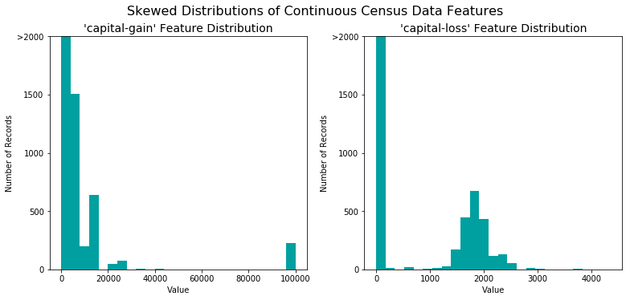
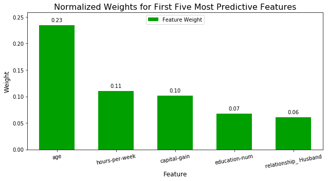

# 项目：为 *CharityML* 寻找捐赠者

在此项目中，将使用监督学习算法，并使用从 1994 年美国人口普查数据中摘取的数据准确地对个人收入进行建模。目标是构建一个准确预测公民收入是否超过 50,000 美元的模型。公益机构可能会面临此类任务，这些机构需要依赖捐赠。了解公民的收入可以帮助公益机构更好地判断应该请求多少捐赠款，或者是否有必要请求捐赠。虽然直接通过公开的数据判断个人的一般收入范围比较难，但是我们可以通过其他公开特征推断该值。


----
## 一 数据加载及探索数据
加载必要的 Python 库并加载人口普查数据。该数据集中的最后一列 `'income'` 将是目标标签（个人年收入是否超过 50,000 美元）。人口普查数据库中的所有其他列都是关于每个人的特征。


```python
# Import libraries necessary for this project
import numpy as np
import pandas as pd
from time import time

# Allows the use of display() for DataFrames
from IPython.display import display 

# Import supplementary visualization code visuals.py
import visuals as vs

# Pretty display for notebooks
%matplotlib inline

# Load the Census dataset
data = pd.read_csv("census.csv")

# Success - Display the first two record
display(data.head(n=2))
# 或者使用下面这个，得到一样的效果
#data.head(2)

data.info()
data.describe()

data.isnull().any()
```


<div>
<style>
    .dataframe thead tr:only-child th {
        text-align: right;
    }

    .dataframe thead th {
        text-align: left;
    }

    .dataframe tbody tr th {
        vertical-align: top;
    }
</style>
<table border="1" class="dataframe">
  <thead>
    <tr style="text-align: right;">
      <th></th>
      <th>age</th>
      <th>workclass</th>
      <th>education_level</th>
      <th>education-num</th>
      <th>marital-status</th>
      <th>occupation</th>
      <th>relationship</th>
      <th>race</th>
      <th>sex</th>
      <th>capital-gain</th>
      <th>capital-loss</th>
      <th>hours-per-week</th>
      <th>native-country</th>
      <th>income</th>
    </tr>
  </thead>
  <tbody>
    <tr>
      <th>0</th>
      <td>39</td>
      <td>State-gov</td>
      <td>Bachelors</td>
      <td>13.0</td>
      <td>Never-married</td>
      <td>Adm-clerical</td>
      <td>Not-in-family</td>
      <td>White</td>
      <td>Male</td>
      <td>2174.0</td>
      <td>0.0</td>
      <td>40.0</td>
      <td>United-States</td>
      <td>&lt;=50K</td>
    </tr>
    <tr>
      <th>1</th>
      <td>50</td>
      <td>Self-emp-not-inc</td>
      <td>Bachelors</td>
      <td>13.0</td>
      <td>Married-civ-spouse</td>
      <td>Exec-managerial</td>
      <td>Husband</td>
      <td>White</td>
      <td>Male</td>
      <td>0.0</td>
      <td>0.0</td>
      <td>13.0</td>
      <td>United-States</td>
      <td>&lt;=50K</td>
    </tr>
  </tbody>
</table>
</div>


    <class 'pandas.core.frame.DataFrame'>
    RangeIndex: 45222 entries, 0 to 45221
    Data columns (total 14 columns):
    age                45222 non-null int64
    workclass          45222 non-null object
    education_level    45222 non-null object
    education-num      45222 non-null float64
    marital-status     45222 non-null object
    occupation         45222 non-null object
    relationship       45222 non-null object
    race               45222 non-null object
    sex                45222 non-null object
    capital-gain       45222 non-null float64
    capital-loss       45222 non-null float64
    hours-per-week     45222 non-null float64
    native-country     45222 non-null object
    income             45222 non-null object
    dtypes: float64(4), int64(1), object(9)
    memory usage: 4.8+ MB


    age                False
    workclass          False
    education_level    False
    education-num      False
    marital-status     False
    occupation         False
    relationship       False
    race               False
    sex                False
    capital-gain       False
    capital-loss       False
    hours-per-week     False
    native-country     False
    income             False
    dtype: bool


** 观察 **

* 数据集中包括数字和非数字特征
* 各特征的数据格式符合要求
* 没有缺失值
* 通过观察数字特征的均值，方差，最大最小值和四分位，发现有偏斜分布的特征（‘capital-gain’和‘capital-loss’的一二三分位值都是0）。
* 各个数字特征值的范围大不相同


#### 进一步数据探索
求出捐款者人数占总人数的百分比，即年收入超过 50,000 美元的个人所占百分比。

** 结果： **
得到较低的比例说明是个偏态分布问题。


```python
# Total number of records
n_records = len(data)
# 或者使用以下方法，结果一样
# n_records = data.shape[0]

# Number of records where individual's income is more than $50,000
n_greater_50K = len(data[data['income']=='>50K'])

# Number of records where individual's income is at most $50,000
n_at_most_50K = len(data[data['income']=='<=50K'])

# Percentage of individuals whose income is more than $50,000
greater_percent = n_greater_50K / n_records

# Print the results
print("Total number of records: {}".format(n_records))
print("Individuals making more than $50,000: {}".format(n_greater_50K))
print("Individuals making at most $50,000: {}".format(n_at_most_50K))
print("Percentage of individuals making more than $50,000: {:.2%}".format(greater_percent))
```

    Total number of records: 45222
    Individuals making more than $50,000: 11208
    Individuals making at most $50,000: 34014
    Percentage of individuals making more than $50,000: 24.78%


** 特征集探索**

* **age**：连续值。
* **workclass**：Private、Self-emp-not-inc、Self-emp-inc、Federal-gov、Local-gov、State-gov、Without-pay、Never-worked。
* **education**：Bachelors、Some-college、11th、HS-grad、Prof-school、Assoc-acdm、Assoc-voc、9th、7th-8th、12th、Masters、1st-4th、10th、Doctorate、5th-6th、Preschool。
* **education-num**：连续值。
* **marital-status**：Married-civ-spouse、Divorced、Never-married、Separated、Widowed、Married-spouse-absent、Married-AF-spouse。
* **occupation**：Tech-support、Craft-repair、Other-service、Sales、Exec-managerial、Prof-specialty、Handlers-cleaners、Machine-op-inspct、Adm-clerical、Farming-fishing、Transport-moving、Priv-house-serv、Protective-serv、Armed-Forces。
* **relationship**：Wife、Own-child、Husband、Not-in-family、Other-relative、Unmarried。
* **race**：Black、White、Asian-Pac-Islander、Amer-Indian-Eskimo、Other。
* **sex**：Female、Male。 
* **capital-gain**：连续值。
* **capital-loss**：连续值。
* **hours-per-week**：连续值。
* **native-country**：United-States、Cambodia、England、Puerto-Rico、Canada、Germany、Outlying-US(Guam-USVI-etc)、India、Japan、Greece、South、China、Cuba、Iran、Honduras、Philippines、Italy、Poland、Jamaica、Vietnam、Mexico、Portugal、Ireland、France、Dominican-Republic、Laos、Ecuador、Taiwan、Haiti、Columbia、Hungary、Guatemala、Nicaragua、Scotland、Thailand、Yugoslavia、El-Salvador、Trinadad&Tobago、Peru、Hong、Holand-Netherlands。

## 二. 数据预处理
在将数据作为机器学习算法的输入之前，通常必须整理数据、调整数据格式和结构，这一流程通常称之为**预处理**。幸运的是，该数据集没有必须处理的无效或丢失条目，但是某些特征质量不高，必须加以调整。预处理流程可以大大改善几乎所有学习算法的输出结果和预测能力。


```python
# Split the data into features and target label
income_raw = data['income']
features_raw = data.drop('income', axis=1)

# Visualize skewed continuous features of original data
vs.distribution(data)

```





### 1. 对偏斜分部的特征进行转换
数据集可能通常至少包含一个具有以下特性的特征：值几乎都接近某个数字，但是也有极端值或比该数字大很多或小很多的值。算法会受到此类值分布的影响，如果值的范围没有正确标准化，算法的效果会大打折扣。对于人口普查数据集来说，有两个特征属于这种情况：'`capital-gain'` 和 `'capital-loss'`。

对于 `'capital-gain'` 和 `'capital-loss'` 等高度偏斜的特征分布，通常我们都会对数据应用<a href="https://en.wikipedia.org/wiki/Data_transformation_(statistics)">对数转换</a>，以便非常大和非常小的值不会对学习算法的性能带来负面影响。对数转换可以显著缩小离群值造成的值范围。但是在应用这种转换时必须谨慎：`0` 的对数未定义，因此我们必须让这些值加上一个比 `0` 大的很小的值，以便成功地应用对数算法。


```python
# Log-transform the skewed features
skewed = ['capital-gain', 'capital-loss']
features_log_transformed = pd.DataFrame(data = features_raw)
features_log_transformed[skewed] = features_raw[skewed].apply(lambda x: np.log(x + 1))

# Visualize the new log distributions
vs.distribution(features_log_transformed, transformed = True)
```


### 2.对数字特征进行标准化
除了需要对高度偏斜的特征进行转换之外，通常还需要对数字特征进行某种缩放。对数据进行缩放不会更改每个特征（例如上述 `'capital-gain'` 或 `'capital-loss'`）的分布形状；但是，标准化可以确保在应用监督式学习器时，能够平等地对待每个特征。但应用缩放之后，原始形式的数据将不再具有相同的原始含义。

主要是为了防止因各特征值的范围不同，算法无法平等对待每个特征，对结果造成不利影响。

这里使用了 [`sklearn.preprocessing.MinMaxScaler`](http://scikit-learn.org/stable/modules/generated/sklearn.preprocessing.MinMaxScaler.html)。


```python
# Import sklearn.preprocessing.StandardScaler
from sklearn.preprocessing import MinMaxScaler

# Initialize a scaler, then apply it to the features
scaler = MinMaxScaler() # default=(0, 1)
numerical = ['age', 'education-num', 'capital-gain', 'capital-loss', 'hours-per-week']

features_log_minmax_transform = pd.DataFrame(data = features_log_transformed)
features_log_minmax_transform[numerical] = scaler.fit_transform(features_log_transformed[numerical])

# Show an example of a record with scaling applied
display(features_log_minmax_transform.head(n = 5))
```


<div>
<style>
    .dataframe thead tr:only-child th {
        text-align: right;
    }

    .dataframe thead th {
        text-align: left;
    }

    .dataframe tbody tr th {
        vertical-align: top;
    }
</style>
<table border="1" class="dataframe">
  <thead>
    <tr style="text-align: right;">
      <th></th>
      <th>age</th>
      <th>workclass</th>
      <th>education_level</th>
      <th>education-num</th>
      <th>marital-status</th>
      <th>occupation</th>
      <th>relationship</th>
      <th>race</th>
      <th>sex</th>
      <th>capital-gain</th>
      <th>capital-loss</th>
      <th>hours-per-week</th>
      <th>native-country</th>
    </tr>
  </thead>
  <tbody>
    <tr>
      <th>0</th>
      <td>0.301370</td>
      <td>State-gov</td>
      <td>Bachelors</td>
      <td>0.800000</td>
      <td>Never-married</td>
      <td>Adm-clerical</td>
      <td>Not-in-family</td>
      <td>White</td>
      <td>Male</td>
      <td>0.667492</td>
      <td>0.0</td>
      <td>0.397959</td>
      <td>United-States</td>
    </tr>
    <tr>
      <th>1</th>
      <td>0.452055</td>
      <td>Self-emp-not-inc</td>
      <td>Bachelors</td>
      <td>0.800000</td>
      <td>Married-civ-spouse</td>
      <td>Exec-managerial</td>
      <td>Husband</td>
      <td>White</td>
      <td>Male</td>
      <td>0.000000</td>
      <td>0.0</td>
      <td>0.122449</td>
      <td>United-States</td>
    </tr>
    <tr>
      <th>2</th>
      <td>0.287671</td>
      <td>Private</td>
      <td>HS-grad</td>
      <td>0.533333</td>
      <td>Divorced</td>
      <td>Handlers-cleaners</td>
      <td>Not-in-family</td>
      <td>White</td>
      <td>Male</td>
      <td>0.000000</td>
      <td>0.0</td>
      <td>0.397959</td>
      <td>United-States</td>
    </tr>
    <tr>
      <th>3</th>
      <td>0.493151</td>
      <td>Private</td>
      <td>11th</td>
      <td>0.400000</td>
      <td>Married-civ-spouse</td>
      <td>Handlers-cleaners</td>
      <td>Husband</td>
      <td>Black</td>
      <td>Male</td>
      <td>0.000000</td>
      <td>0.0</td>
      <td>0.397959</td>
      <td>United-States</td>
    </tr>
    <tr>
      <th>4</th>
      <td>0.150685</td>
      <td>Private</td>
      <td>Bachelors</td>
      <td>0.800000</td>
      <td>Married-civ-spouse</td>
      <td>Prof-specialty</td>
      <td>Wife</td>
      <td>Black</td>
      <td>Female</td>
      <td>0.000000</td>
      <td>0.0</td>
      <td>0.397959</td>
      <td>Cuba</td>
    </tr>
  </tbody>
</table>
</div>


### 3. 转换非数字特征
通常，学习算法都预期输入是数字，这就需要转换非数字特征（称为*分类变量*）。一种转换分类变量的常见方式是**独热编码**方法。独热编码会为每个非数字特征的每个可能类别创建一个_“虚拟”_变量。例如，假设 `someFeature` 有三个潜在条目：`A`、`B` 或 `C`。我们将此特征编码为 `someFeature_A`、`someFeature_B` 和 `someFeature_C`。

|   | someFeature |                    | someFeature_A | someFeature_B | someFeature_C |
| :-: | :-: |                            | :-: | :-: | :-: |
| 0 |  B  |  | 0 | 1 | 0 |
| 1 |  C  | ----> one-hot encode ----> | 0 | 0 | 1 |
| 2 |  A  |  | 1 | 0 | 0 |


这里使用 pandas.get_dummies() 对 'features_log_minmax_transform' 数据进行独热编码。为每个非数字特征的每个可能类别创建一个虚拟变量。

### 4. 把labels中的类别转换为数字
此外，和非数字特征一样，我们需要将非数字目标标签 'income' 转换为数字值，以便学习算法能正常运行。因为此标签只有两个可能的类别（“<=50K”和“>50K”），我们可以直接将这两个类别分别编码为 0 和 1，而不用采用独热编码。

将目标标签 'income_raw' 转换为数字条目。


```python
# One-hot encode the 'features_log_minmax_transform' data using pandas.get_dummies()
features_final = pd.get_dummies(features_log_minmax_transform)

# Encode the 'income_raw' data to numerical values
#income = income_raw['income'].apply(lambda x:1 if x=='>50K' else 0)
# 或者
income = (income_raw == '>50K').astype(int) #返回series

# Print the number of features after one-hot encoding
encoded = list(features_final.columns)
print("{} total features after one-hot encoding.".format(len(encoded)))

# print the encoded feature names
print (encoded)
```

    103 total features after one-hot encoding.
    ['age', 'education-num', 'capital-gain', 'capital-loss', 'hours-per-week', 'workclass_ Federal-gov', 'workclass_ Local-gov', 'workclass_ Private', 'workclass_ Self-emp-inc', 'workclass_ Self-emp-not-inc', 'workclass_ State-gov', 'workclass_ Without-pay', 'education_level_ 10th', 'education_level_ 11th', 'education_level_ 12th', 'education_level_ 1st-4th', 'education_level_ 5th-6th', 'education_level_ 7th-8th', 'education_level_ 9th', 'education_level_ Assoc-acdm', 'education_level_ Assoc-voc', 'education_level_ Bachelors', 'education_level_ Doctorate', 'education_level_ HS-grad', 'education_level_ Masters', 'education_level_ Preschool', 'education_level_ Prof-school', 'education_level_ Some-college', 'marital-status_ Divorced', 'marital-status_ Married-AF-spouse', 'marital-status_ Married-civ-spouse', 'marital-status_ Married-spouse-absent', 'marital-status_ Never-married', 'marital-status_ Separated', 'marital-status_ Widowed', 'occupation_ Adm-clerical', 'occupation_ Armed-Forces', 'occupation_ Craft-repair', 'occupation_ Exec-managerial', 'occupation_ Farming-fishing', 'occupation_ Handlers-cleaners', 'occupation_ Machine-op-inspct', 'occupation_ Other-service', 'occupation_ Priv-house-serv', 'occupation_ Prof-specialty', 'occupation_ Protective-serv', 'occupation_ Sales', 'occupation_ Tech-support', 'occupation_ Transport-moving', 'relationship_ Husband', 'relationship_ Not-in-family', 'relationship_ Other-relative', 'relationship_ Own-child', 'relationship_ Unmarried', 'relationship_ Wife', 'race_ Amer-Indian-Eskimo', 'race_ Asian-Pac-Islander', 'race_ Black', 'race_ Other', 'race_ White', 'sex_ Female', 'sex_ Male', 'native-country_ Cambodia', 'native-country_ Canada', 'native-country_ China', 'native-country_ Columbia', 'native-country_ Cuba', 'native-country_ Dominican-Republic', 'native-country_ Ecuador', 'native-country_ El-Salvador', 'native-country_ England', 'native-country_ France', 'native-country_ Germany', 'native-country_ Greece', 'native-country_ Guatemala', 'native-country_ Haiti', 'native-country_ Holand-Netherlands', 'native-country_ Honduras', 'native-country_ Hong', 'native-country_ Hungary', 'native-country_ India', 'native-country_ Iran', 'native-country_ Ireland', 'native-country_ Italy', 'native-country_ Jamaica', 'native-country_ Japan', 'native-country_ Laos', 'native-country_ Mexico', 'native-country_ Nicaragua', 'native-country_ Outlying-US(Guam-USVI-etc)', 'native-country_ Peru', 'native-country_ Philippines', 'native-country_ Poland', 'native-country_ Portugal', 'native-country_ Puerto-Rico', 'native-country_ Scotland', 'native-country_ South', 'native-country_ Taiwan', 'native-country_ Thailand', 'native-country_ Trinadad&Tobago', 'native-country_ United-States', 'native-country_ Vietnam', 'native-country_ Yugoslavia']


## 三. 评估指标选择


*CharityML* 研究后发现，收入超过 50,000 美元的个人最有可能向他们的组织捐赠。因此，*CharityML* 非常希望准确地知道哪些人的收入超过了 50,000 美元。似乎使用**准确率**作为评估模型效果的指标比较合适。此外，将收入不到 50,000 美元的个人预测为收入超过 50,000 美元对 *CharityML* 有不利的影响，因为他们希望找到愿意捐赠的个人。因此，模型能够准确地预测收入超过 50,000 美元的个人比模型能够**召回**这些个人_更重要_。我们可以使用 **F-β 分数**作为同时考虑精确率和召回率的指标：

$$ F_{\beta} = (1 + \beta^2) \cdot \frac{precision \cdot recall}{\left( \beta^2 \cdot precision \right) + recall} $$

具体而言，当 $\beta = 0.5$ 时，我们更关注精确率。这称为 **F$_{0.5}$ 分数**（简称 F-分数）。


由于给预测错误的对象发邮件会对慈善机构带来不利影响，所以要确保预测的精确度比召回率更重要。

在使用准确率进行评估的同时，还使用了fbeta_score,通过更改beta的取值可以使预测结果偏向精确度。


## 构建朴素预测器作为模型基准

生成朴素预测器的目的是展示没有任何智能信息的基本模型是怎样的模型。在现实生活中，理想情况下，基本模型要么是以前模型的结果，要么基于你希望完善的研究论文。如果没有基准模型，获得比随机选择的模型结果更好的模型是一个不错的起点。

这里的朴素预测器是把所有结果都预测为会进行捐赠，即所有人的收入都大于50000美元。

这个没有使用任何智能算法的模型可以作为最终模型的基准。


```python
# 随机打乱并拆分数据，20%为测试集

# Import train_test_split
from sklearn.model_selection import train_test_split

# Split the 'features' and 'income' data into training and testing sets
X_train, X_test, y_train, y_test = train_test_split(features_final,
                                                    income,
                                                    test_size = 0.2,
                                                    random_state = 0)

# Show the results of the split
print("Training set has {} samples.".format(X_train.shape[0]))
print("Testing set has {} samples.".format(X_test.shape[0]))
```

    Training set has 36177 samples.
    Testing set has 9045 samples.


```python
'''
TP = np.sum(income) # Counting the ones as this is the naive case. Note that 'income' is the 'income_raw' data 
encoded to numerical values done in the data preprocessing step.
FP = income.count() - TP # Specific to the naive case

TN = 0 # No predicted negatives in the naive case
FN = 0 # No predicted negatives in the naive case
'''
# Calculate accuracy, precision and recall
TP = np.sum(income)
Total = len(income)
FP = Total - TP
TN = 0
FN = 0

accuracy = TP / Total
precision = TP / (TP + FP)
recall = TP / (TP + FN)

# Calculate F-score
beta = 0.5
fscore = (1+np.square(beta)) * precision * recall / (np.square(beta) * precision + recall)

# Print the results 
print("Naive Predictor: [Accuracy score: {:.4f}, F-score: {:.4f}]".format(accuracy, fscore))
```

    Naive Predictor: [Accuracy score: 0.2478, F-score: 0.2917]


## 四.模型比较及选择


* 根据经验，选择SVM，LR，和DT进行初始模型尝试。
* 分别比较他们在不同数量的样本中时间消耗以及准确度和fbeta_score。


```python
# mport two metrics from sklearn - fbeta_score and accuracy_score
from sklearn.metrics import fbeta_score, accuracy_score
def train_predict(learner, sample_size, X_train, y_train, X_test, y_test): 
    '''
    inputs:
       - learner: the learning algorithm to be trained and predicted on
       - sample_size: the size of samples (number) to be drawn from training set
       - X_train: features training set
       - y_train: income training set
       - X_test: features testing set
       - y_test: income testing set
    '''
    
    results = {}
    
    # Fit the learner to the training data using slicing with 'sample_size' using .fit(training_features[:], training_labels[:])
    start = time() # Get start time
    learner = learner.fit(X_train[:sample_size], y_train[:sample_size])
    end = time() # Get end time
    
    # Calculate the training time
    results['train_time'] = end - start
        
    # Get the predictions on the test set(X_test),
    # then get predictions on the first 300 training samples(X_train) using .predict()
    start = time() # Get start time
    predictions_test = learner.predict(X_test)
    predictions_train = learner.predict(X_train[:300])
    end = time() # Get end time
    
    # Calculate the total prediction time
    results['pred_time'] = end - start
            
    # Compute accuracy on the first 300 training samples which is y_train[:300]
    results['acc_train'] = accuracy_score(y_train[:300], predictions_train)
        
    # Compute accuracy on test set using accuracy_score()
    results['acc_test'] = accuracy_score(y_test, predictions_test)
    
    # Compute F-score on the the first 300 training samples using fbeta_score()
    results['f_train'] = fbeta_score(y_train[:300], predictions_train, beta=0.5)
        
    # Compute F-score on the test set which is y_test
    results['f_test'] = fbeta_score(y_test, predictions_test, beta=0.5)
       
    # Success
    print("{} trained on {} samples.".format(learner.__class__.__name__, sample_size))
    print('train time is: {}'.format(results['train_time']))
    print('predition time is: {}'.format(results['pred_time']))
    print('accuracy on training set is: {}'.format(results['acc_train']))
    print('accuracy on testing set is: {}'.format(results['acc_test']))
    print('fbeta score on training set is: {}'.format(results['f_train']))
    print('fbata score on testinig set is: {}'.format(results['f_test']))
    print('------------------------------------------------------')    
    # Return the results
    # print(results) 
 
```


```python
# Import the three supervised learning models from sklearn
from sklearn.svm import SVC
from sklearn.linear_model import LogisticRegression
from sklearn.tree import DecisionTreeClassifier    

# nitialize the three models
clf_A = SVC(random_state=42)
clf_B = LogisticRegression(random_state=42)
clf_C = DecisionTreeClassifier(random_state=42)

# Calculate the number of samples for 1%, 10%, and 100% of the training data
samples_100 = len(y_train)
samples_10 = int(samples_100 * 0.1)
samples_1 = int(samples_100 * 0.01)

# Collect results on the learners
results = {}
for clf in [clf_A, clf_B, clf_C]:
    clf_name = clf.__class__.__name__
    results[clf_name] = {}
    for i, samples in enumerate([samples_1, samples_10, samples_100]):
        train_predict(clf, samples, X_train, y_train, X_test, y_test)

```


    SVC trained on 361 samples.
    train time is: 0.012727022171020508
    predition time is: 0.20357894897460938
    accuracy on training set is: 0.76
    accuracy on testing set is: 0.7562189054726368
    fbeta score on training set is: 0.0
    fbata score on testinig set is: 0.0
    ------------------------------------------------------
    SVC trained on 3617 samples.
    train time is: 0.894277811050415
    predition time is: 1.6355040073394775
    accuracy on training set is: 0.8333333333333334
    accuracy on testing set is: 0.8326147042564953
    fbeta score on training set is: 0.6712962962962963
    fbata score on testinig set is: 0.6712564543889845
    ------------------------------------------------------
    SVC trained on 36177 samples.
    train time is: 92.58536291122437
    predition time is: 16.271105766296387
    accuracy on training set is: 0.8533333333333334
    accuracy on testing set is: 0.8371475953565506
    fbeta score on training set is: 0.7196969696969697
    fbata score on testinig set is: 0.6744771706996605
    ------------------------------------------------------
    LogisticRegression trained on 361 samples.
    train time is: 0.002810955047607422
    predition time is: 0.0041120052337646484
    accuracy on training set is: 0.86
    accuracy on testing set is: 0.8186843559977889
    fbeta score on training set is: 0.7386363636363635
    fbata score on testinig set is: 0.6288601909039865
    ------------------------------------------------------
    LogisticRegression trained on 3617 samples.
    train time is: 0.019251108169555664
    predition time is: 0.0038251876831054688
    accuracy on training set is: 0.8466666666666667
    accuracy on testing set is: 0.8385848535102266
    fbeta score on training set is: 0.703125
    fbata score on testinig set is: 0.6775067750677506
    ------------------------------------------------------
    LogisticRegression trained on 36177 samples.
    train time is: 0.31797194480895996
    predition time is: 0.0041391849517822266
    accuracy on training set is: 0.8466666666666667
    accuracy on testing set is: 0.841901603095633
    fbeta score on training set is: 0.6985294117647058
    fbata score on testinig set is: 0.6831652282416554
    ------------------------------------------------------
    DecisionTreeClassifier trained on 361 samples.
    train time is: 0.002446889877319336
    predition time is: 0.0064890384674072266
    accuracy on training set is: 1.0
    accuracy on testing set is: 0.755223880597015
    fbeta score on training set is: 1.0
    fbata score on testinig set is: 0.5095226317091269
    ------------------------------------------------------
    DecisionTreeClassifier trained on 3617 samples.
    train time is: 0.02900099754333496
    predition time is: 0.004914999008178711
    accuracy on training set is: 0.9966666666666667
    accuracy on testing set is: 0.8027639579878386
    fbeta score on training set is: 0.997191011235955
    fbata score on testinig set is: 0.5964789349216082
    ------------------------------------------------------
    DecisionTreeClassifier trained on 36177 samples.
    train time is: 0.4591810703277588
    predition time is: 0.006551027297973633
    accuracy on training set is: 0.97
    accuracy on testing set is: 0.8189054726368159
    fbeta score on training set is: 0.9638554216867471
    fbata score on testinig set is: 0.6286347272223761
    ------------------------------------------------------


** 结果分析及模型选择： **

* 从结果中可以看出，SVM支持向量机在时间上的消耗非常大，相对其他两个模型的几十倍上百倍，特别是随着样本数量增大，耗时增长速度相当快。因此首先排除SVM。
* 而逻辑回归是耗时最少的。
* 从评分结果来看逻辑回归和决策树的在测试集上的表现差不多。
不同之处就在于逻辑回归在训练集和测试集上的评分已经较为接近；而决策树在训练集的表现非常好，但在测试集的表现就差很多，同时随这样本数量增大，在训练集和测试集的分数越来越接近。

* 这是在未进行参数调整的情况下各模型的表现情况。这里决策树虽然出现了过拟合，但不意味着要放弃这种算法。相反此时逻辑回归已经接近于最优模型，再进行参数调整可能不会得到更优的模型。而决策树如果经过参数调整，很可能达到更优的效果。在此时两模型在测试集表现差不多的情况下优先选择决策树。
       

## 五.模型构建及优化
* 使用网格搜索交叉验证，为模型挑选最优参数
* 主要对最大深度和属性划分的评估方法进行参数调整。
* 优化后的模型分类准确度达到了85.23%, 比朴素基准器的24.89%提高了约61%。
* f-score也从29.29%提高到了72.24%。


```python
from sklearn.model_selection import GridSearchCV
from sklearn.metrics import make_scorer, fbeta_score, accuracy_score
from sklearn.tree import DecisionTreeClassifier

# Initialize the classifier
clf = DecisionTreeClassifier(random_state=0)

# Create the parameters list
parameters = {'max_depth': [2,3,4,5,6], 'criterion':['gini', 'entropy']}

# Make an fbeta_score scoring object using make_scorer()
scorer = make_scorer(fbeta_score, beta=0.5)

# Perform grid search on the classifier
grid_obj = GridSearchCV(clf, parameters, scoring=scorer)

# Fit the grid search object to the training data and find the optimal parameters using fit()
grid_fit = grid_obj.fit(X_train, y_train)

# Get the estimator
best_clf = grid_fit.best_estimator_

# Make predictions
predictions  = (clf.fit(X_train, y_train)).predict(X_test)
best_predictions = best_clf.predict(X_test)

# Report the before-and-afterscores
print("Unoptimized model\n------")
print("Accuracy score on testing data: {:.4f}".format(accuracy_score(y_test, predictions)))
print("F-score on testing data: {:.4f}".format(fbeta_score(y_test, predictions, beta = 0.5)))
print("\nOptimized Model\n------")
print("Final accuracy score on the testing data: {:.4f}".format(accuracy_score(y_test, best_predictions)))
print("Final F-score on the testing data: {:.4f}".format(fbeta_score(y_test, best_predictions, beta = 0.5)))
```

    Unoptimized model
    ------
    Accuracy score on testing data: 0.8186
    F-score on testing data: 0.6279
    
    Optimized Model
    ------
    Final accuracy score on the testing data: 0.8523
    Final F-score on the testing data: 0.7224


## 六.提取特征中重要信息

虽然可以对数据集进行很好的分类，找出潜在捐赠者，但除此之外我们还想知道哪些特征的预测能力更强，也就是说哪些因素对人们收入是否大于50000美元影响最大。

这里使用feature_importances_属性，该属性是一种根据所选分类器对特征重要性进行排序的函数。
但feature_importances_属性在决策树中是没有的，因此这里选择使用随机森林的feature_importances_属性，获取按相关重要性排序的特征。

找出特征相关性的方法很多。比如判断年龄与收入的关系：可以先把年龄以35岁为界线分为两类，再分别求出这两类收入大于50000美元的比例，如果大于35岁的年收入大于50000美元的比例比小于35岁年收入大于50000美元的比例更大，可以初步说明年龄越大收入越高。但这样的判断并不可靠。所以这里再次构建了随机森林模型。通过构建模型得出的结果更加可靠。


```python
# Import a supervised learning model that has 'feature_importances_'
from sklearn.ensemble import RandomForestClassifier

# Train the supervised model on the training set using .fit(X_train, y_train)
model = RandomForestClassifier().fit(X_train, y_train)

# Extract the feature importances using .feature_importances_ 
importances = model.feature_importances_
print(importances)
# Plot
vs.feature_plot(importances, X_train, y_train)
```

    [  2.34632619e-01   6.76842813e-02   1.01577400e-01   3.52478315e-02
       1.10491129e-01   5.07487580e-03   5.55281825e-03   1.07636714e-02
       6.53733718e-03   8.90472054e-03   5.27145924e-03   9.54278981e-05
       2.26022012e-03   2.28818632e-03   9.28250011e-04   4.88094504e-04
       6.92321234e-04   3.52788527e-03   1.45105735e-03   2.56636889e-03
       2.91109064e-03   1.12013120e-02   3.53913040e-03   9.02816290e-03
       1.12774187e-02   2.77173206e-05   5.13680087e-03   5.55195768e-03
       1.06221595e-02   3.80245234e-04   4.69463527e-02   9.81234630e-04
       3.53046288e-02   2.03006389e-03   1.44600709e-03   6.24790687e-03
       5.17572182e-05   6.68026930e-03   1.86492595e-02   4.79973309e-03
       3.21163992e-03   4.00062700e-03   6.71674786e-03   2.16851079e-04
       1.34928694e-02   3.29206706e-03   7.52351173e-03   4.60005804e-03
       4.55307080e-03   6.08047667e-02   1.13954870e-02   2.09311289e-03
       1.32821371e-02   5.27514404e-03   1.21550729e-02   1.55449270e-03
       3.24702870e-03   5.83819967e-03   8.62215071e-04   6.71186102e-03
       6.65907304e-03   9.84619766e-03   3.34386154e-04   1.74406081e-03
       4.58919263e-04   2.53983593e-04   9.77806144e-04   1.83569208e-04
       2.10657057e-04   2.61985764e-04   9.66969455e-04   3.13822100e-04
       1.02022423e-03   5.64879156e-04   1.18042207e-04   2.88873215e-04
       0.00000000e+00   2.94600618e-05   1.40487768e-04   2.89358759e-04
       8.47839237e-04   3.58574666e-04   2.93161768e-04   6.64020659e-04
       4.33224284e-04   5.24801466e-04   8.04627524e-05   1.77856473e-03
       1.26436048e-04   2.36196212e-05   2.71901817e-04   1.07709697e-03
       6.67973765e-04   4.18433014e-04   6.16022819e-04   1.06505545e-04
       7.18524049e-04   2.78043299e-04   1.13525732e-04   1.59442147e-04
       5.64875462e-03   3.14422421e-04   1.39768725e-04]





## 七. 总结及分析
1. 该模型获得了85%以上的准确率，说明大部分情况下能很好的预测出是否潜在捐款者；
2. 影响年收入是否大于50000美元的主要特征为：年龄，每周工作时间，资本增值，受教育年限，家庭婚姻情况
