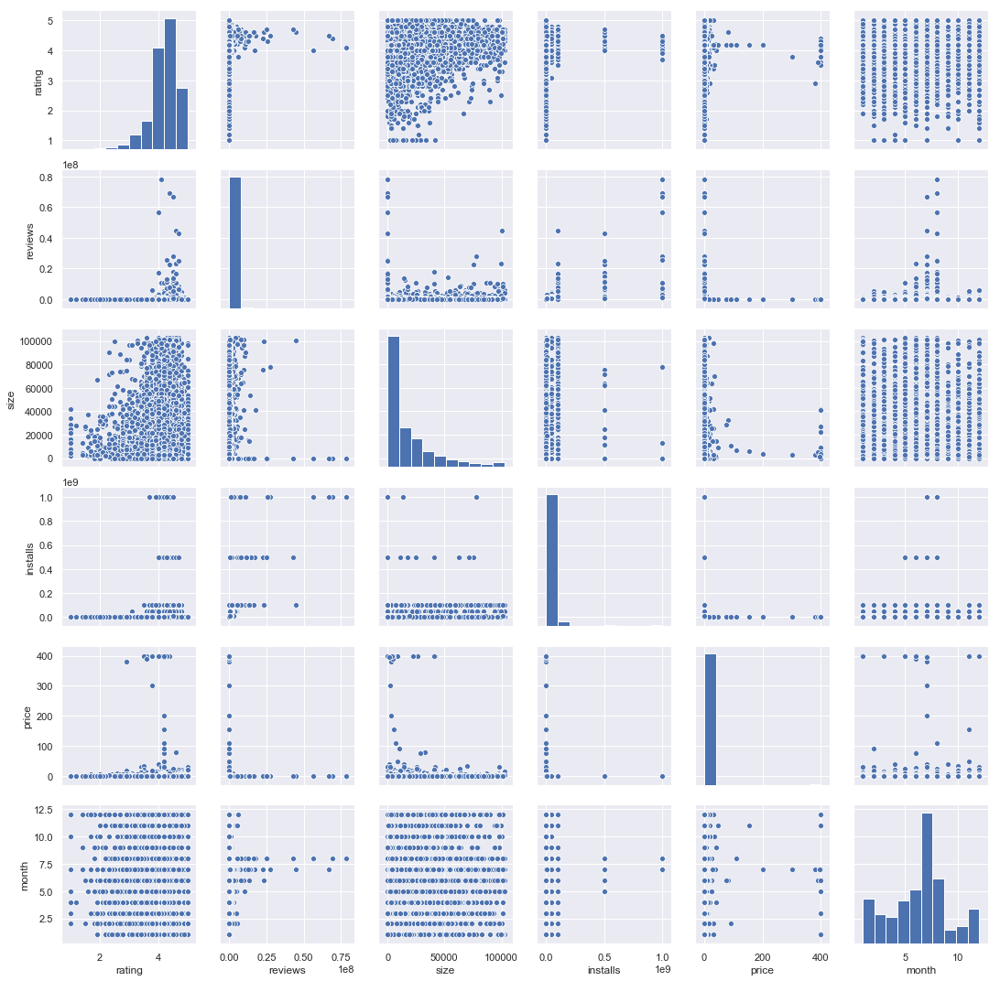
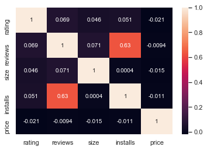
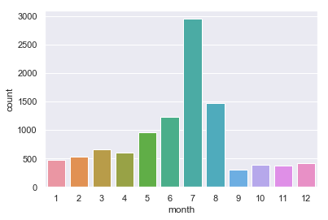
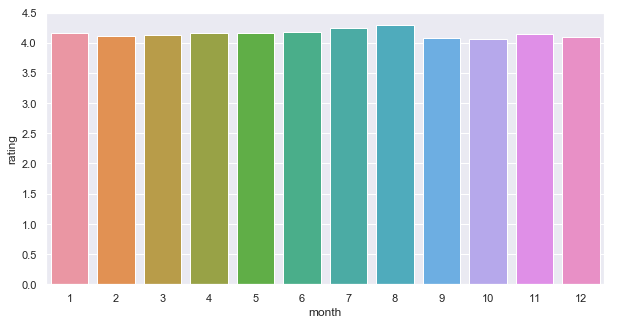
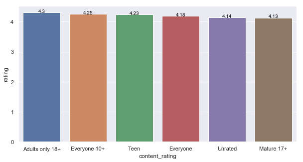
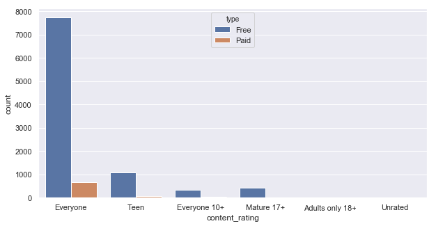

# Google Apps 商店的数据清洗及简单探索

## 简介

Google Play Store（Google Play商店）是谷歌官方的软件应用商店，拥有上架软件数十万款，为了手机用户提供了极为广泛的应用选择，很受大家的欢迎。

本数据集(googleplaystore.csv)包含了 Google Play 商店中 App 的数据。该数据是Kaggle中 [Google Play Store Apps](https://www.kaggle.com/lava18/google-play-store-apps) 的一部分，其中包含 Google Play 商店中 10k+ 应用软件的信息。

数据中的变量含义解释：
```
App: 应用的名称，字符变量。
Category: 应用所属的分类，字符变量。
Rating: 某应用的用户评分，数值变量。
Reviews: 某应用获得的用户评论数量，数值变量。
Size: 某应用的所占存储空间的大小，字符变量。
Installs: 用户安装和下载某应用的次数，字符变量。
Type: 付费或免费，分类变量。
Price: 价格，字符变量。
Content Rating: 应用商店针对内容给出的年龄评级组 - Children / Mature 21+ / Adult，分类变量。
Genres: 类型/流派，一个应用可以属于多个流派，比如音乐、游戏、家庭等，字符变量。
Last Updated: 应用最新更新的日期，字符变量。
Current Ver: 当前应用的版本，字符变量。
Android Ver: 安装该应用所需要的最低安卓版本，字符变量。

```

## 数据评估和清理


```python
import numpy as np
import pandas as pd
import matplotlib.pyplot as plt
import seaborn as sns
sns.set(style="darkgrid")
```


```python
df_gp = pd.read_csv("googleplaystore.csv")
df_gp.head()
```


<div>
<style scoped>
    .dataframe tbody tr th:only-of-type {
        vertical-align: middle;
    }

    .dataframe tbody tr th {
        vertical-align: top;
    }

    .dataframe thead th {
        text-align: right;
    }
</style>
<table border="1" class="dataframe">
  <thead>
    <tr style="text-align: right;">
      <th></th>
      <th>App</th>
      <th>Category</th>
      <th>Rating</th>
      <th>Reviews</th>
      <th>Size</th>
      <th>Installs</th>
      <th>Type</th>
      <th>Price</th>
      <th>Content Rating</th>
      <th>Genres</th>
      <th>Last Updated</th>
      <th>Current Ver</th>
      <th>Android Ver</th>
    </tr>
  </thead>
  <tbody>
    <tr>
      <th>0</th>
      <td>Photo Editor &amp; Candy Camera &amp; Grid &amp; ScrapBook</td>
      <td>ART_AND_DESIGN</td>
      <td>4.1</td>
      <td>159</td>
      <td>19M</td>
      <td>10,000+</td>
      <td>Free</td>
      <td>0</td>
      <td>Everyone</td>
      <td>Art &amp; Design</td>
      <td>January 7, 2018</td>
      <td>1.0.0</td>
      <td>4.0.3 and up</td>
    </tr>
    <tr>
      <th>1</th>
      <td>Coloring book moana</td>
      <td>ART_AND_DESIGN</td>
      <td>3.9</td>
      <td>967</td>
      <td>14M</td>
      <td>500,000+</td>
      <td>Free</td>
      <td>0</td>
      <td>Everyone</td>
      <td>Art &amp; Design;Pretend Play</td>
      <td>January 15, 2018</td>
      <td>2.0.0</td>
      <td>4.0.3 and up</td>
    </tr>
    <tr>
      <th>2</th>
      <td>U Launcher Lite – FREE Live Cool Themes, Hide ...</td>
      <td>ART_AND_DESIGN</td>
      <td>4.7</td>
      <td>87510</td>
      <td>8.7M</td>
      <td>5,000,000+</td>
      <td>Free</td>
      <td>0</td>
      <td>Everyone</td>
      <td>Art &amp; Design</td>
      <td>August 1, 2018</td>
      <td>1.2.4</td>
      <td>4.0.3 and up</td>
    </tr>
    <tr>
      <th>3</th>
      <td>Sketch - Draw &amp; Paint</td>
      <td>ART_AND_DESIGN</td>
      <td>4.5</td>
      <td>215644</td>
      <td>25M</td>
      <td>50,000,000+</td>
      <td>Free</td>
      <td>0</td>
      <td>Teen</td>
      <td>Art &amp; Design</td>
      <td>June 8, 2018</td>
      <td>Varies with device</td>
      <td>4.2 and up</td>
    </tr>
    <tr>
      <th>4</th>
      <td>Pixel Draw - Number Art Coloring Book</td>
      <td>ART_AND_DESIGN</td>
      <td>4.3</td>
      <td>967</td>
      <td>2.8M</td>
      <td>100,000+</td>
      <td>Free</td>
      <td>0</td>
      <td>Everyone</td>
      <td>Art &amp; Design;Creativity</td>
      <td>June 20, 2018</td>
      <td>1.1</td>
      <td>4.4 and up</td>
    </tr>
  </tbody>
</table>
</div>


```python
df_gp.info()
```

    <class 'pandas.core.frame.DataFrame'>
    RangeIndex: 10841 entries, 0 to 10840
    Data columns (total 13 columns):
    App               10841 non-null object
    Category          10841 non-null object
    Rating            9367 non-null float64
    Reviews           10841 non-null object
    Size              10841 non-null object
    Installs          10841 non-null object
    Type              10840 non-null object
    Price             10841 non-null object
    Content Rating    10840 non-null object
    Genres            10841 non-null object
    Last Updated      10841 non-null object
    Current Ver       10833 non-null object
    Android Ver       10838 non-null object
    dtypes: float64(1), object(12)
    memory usage: 1.1+ MB


```python
# 检查每一列里面的数据（由于通常只看前5行是无法观察到整体的数据情况）
for col in df_gp.columns:
    print("---",col,"---")
    print(df_gp[col].unique())
```

    --- App ---
    ['Photo Editor & Candy Camera & Grid & ScrapBook' 'Coloring book moana'
     'U Launcher Lite – FREE Live Cool Themes, Hide Apps' ...
     'Parkinson Exercices FR' 'The SCP Foundation DB fr nn5n'
     'iHoroscope - 2018 Daily Horoscope & Astrology']
    --- Category ---
    ['ART_AND_DESIGN' 'AUTO_AND_VEHICLES' 'BEAUTY' 'BOOKS_AND_REFERENCE'
     'BUSINESS' 'COMICS' 'COMMUNICATION' 'DATING' 'EDUCATION' 'ENTERTAINMENT'
     'EVENTS' 'FINANCE' 'FOOD_AND_DRINK' 'HEALTH_AND_FITNESS' 'HOUSE_AND_HOME'
     'LIBRARIES_AND_DEMO' 'LIFESTYLE' 'GAME' 'FAMILY' 'MEDICAL' 'SOCIAL'
     'SHOPPING' 'PHOTOGRAPHY' 'SPORTS' 'TRAVEL_AND_LOCAL' 'TOOLS'
     'PERSONALIZATION' 'PRODUCTIVITY' 'PARENTING' 'WEATHER' 'VIDEO_PLAYERS'
     'NEWS_AND_MAGAZINES' 'MAPS_AND_NAVIGATION' '1.9']
    --- Rating ---
    [ 4.1  3.9  4.7  4.5  4.3  4.4  3.8  4.2  4.6  3.2  4.   nan  4.8  4.9
      3.6  3.7  3.3  3.4  3.5  3.1  5.   2.6  3.   1.9  2.5  2.8  2.7  1.
      2.9  2.3  2.2  1.7  2.   1.8  2.4  1.6  2.1  1.4  1.5  1.2 19. ]
    --- Reviews ---
    ['159' '967' '87510' ... '603' '1195' '398307']
    --- Size ---
    ['19M' '14M' '8.7M' '25M' '2.8M' '5.6M' '29M' '33M' '3.1M' '28M' '12M'
     '20M' '21M' '37M' '2.7M' '5.5M' '17M' '39M' '31M' '4.2M' '7.0M' '23M'
     '6.0M' '6.1M' '4.6M' '9.2M' '5.2M' '11M' '24M' 'Varies with device'
     '9.4M' '15M' '10M' '1.2M' '26M' '8.0M' '7.9M' '56M' '57M' '35M' '54M'
     '201k' '3.6M' '5.7M' '8.6M' '2.4M' '27M' '2.5M' '16M' '3.4M' '8.9M'
     '3.9M' '2.9M' '38M' '32M' '5.4M' '18M' '1.1M' '2.2M' '4.5M' '9.8M' '52M'
     '9.0M' '6.7M' '30M' '2.6M' '7.1M' '3.7M' '22M' '7.4M' '6.4M' '3.2M'
     '8.2M' '9.9M' '4.9M' '9.5M' '5.0M' '5.9M' '13M' '73M' '6.8M' '3.5M'
     '4.0M' '2.3M' '7.2M' '2.1M' '42M' '7.3M' '9.1M' '55M' '23k' '6.5M' '1.5M'
     '7.5M' '51M' '41M' '48M' '8.5M' '46M' '8.3M' '4.3M' '4.7M' '3.3M' '40M'
     '7.8M' '8.8M' '6.6M' '5.1M' '61M' '66M' '79k' '8.4M' '118k' '44M' '695k'
     '1.6M' '6.2M' '18k' '53M' '1.4M' '3.0M' '5.8M' '3.8M' '9.6M' '45M' '63M'
     '49M' '77M' '4.4M' '4.8M' '70M' '6.9M' '9.3M' '10.0M' '8.1M' '36M' '84M'
     '97M' '2.0M' '1.9M' '1.8M' '5.3M' '47M' '556k' '526k' '76M' '7.6M' '59M'
     '9.7M' '78M' '72M' '43M' '7.7M' '6.3M' '334k' '34M' '93M' '65M' '79M'
     '100M' '58M' '50M' '68M' '64M' '67M' '60M' '94M' '232k' '99M' '624k'
     '95M' '8.5k' '41k' '292k' '11k' '80M' '1.7M' '74M' '62M' '69M' '75M'
     '98M' '85M' '82M' '96M' '87M' '71M' '86M' '91M' '81M' '92M' '83M' '88M'
     '704k' '862k' '899k' '378k' '266k' '375k' '1.3M' '975k' '980k' '4.1M'
     '89M' '696k' '544k' '525k' '920k' '779k' '853k' '720k' '713k' '772k'
     '318k' '58k' '241k' '196k' '857k' '51k' '953k' '865k' '251k' '930k'
     '540k' '313k' '746k' '203k' '26k' '314k' '239k' '371k' '220k' '730k'
     '756k' '91k' '293k' '17k' '74k' '14k' '317k' '78k' '924k' '902k' '818k'
     '81k' '939k' '169k' '45k' '475k' '965k' '90M' '545k' '61k' '283k' '655k'
     '714k' '93k' '872k' '121k' '322k' '1.0M' '976k' '172k' '238k' '549k'
     '206k' '954k' '444k' '717k' '210k' '609k' '308k' '705k' '306k' '904k'
     '473k' '175k' '350k' '383k' '454k' '421k' '70k' '812k' '442k' '842k'
     '417k' '412k' '459k' '478k' '335k' '782k' '721k' '430k' '429k' '192k'
     '200k' '460k' '728k' '496k' '816k' '414k' '506k' '887k' '613k' '243k'
     '569k' '778k' '683k' '592k' '319k' '186k' '840k' '647k' '191k' '373k'
     '437k' '598k' '716k' '585k' '982k' '222k' '219k' '55k' '948k' '323k'
     '691k' '511k' '951k' '963k' '25k' '554k' '351k' '27k' '82k' '208k' '913k'
     '514k' '551k' '29k' '103k' '898k' '743k' '116k' '153k' '209k' '353k'
     '499k' '173k' '597k' '809k' '122k' '411k' '400k' '801k' '787k' '237k'
     '50k' '643k' '986k' '97k' '516k' '837k' '780k' '961k' '269k' '20k' '498k'
     '600k' '749k' '642k' '881k' '72k' '656k' '601k' '221k' '228k' '108k'
     '940k' '176k' '33k' '663k' '34k' '942k' '259k' '164k' '458k' '245k'
     '629k' '28k' '288k' '775k' '785k' '636k' '916k' '994k' '309k' '485k'
     '914k' '903k' '608k' '500k' '54k' '562k' '847k' '957k' '688k' '811k'
     '270k' '48k' '329k' '523k' '921k' '874k' '981k' '784k' '280k' '24k'
     '518k' '754k' '892k' '154k' '860k' '364k' '387k' '626k' '161k' '879k'
     '39k' '970k' '170k' '141k' '160k' '144k' '143k' '190k' '376k' '193k'
     '246k' '73k' '658k' '992k' '253k' '420k' '404k' '1,000+' '470k' '226k'
     '240k' '89k' '234k' '257k' '861k' '467k' '157k' '44k' '676k' '67k' '552k'
     '885k' '1020k' '582k' '619k']
    --- Installs ---
    ['10,000+' '500,000+' '5,000,000+' '50,000,000+' '100,000+' '50,000+'
     '1,000,000+' '10,000,000+' '5,000+' '100,000,000+' '1,000,000,000+'
     '1,000+' '500,000,000+' '50+' '100+' '500+' '10+' '1+' '5+' '0+' '0'
     'Free']
    --- Type ---
    ['Free' 'Paid' nan '0']
    --- Price ---
    ['0' '$4.99' '$3.99' '$6.99' '$1.49' '$2.99' '$7.99' '$5.99' '$3.49'
     '$1.99' '$9.99' '$7.49' '$0.99' '$9.00' '$5.49' '$10.00' '$24.99'
     '$11.99' '$79.99' '$16.99' '$14.99' '$1.00' '$29.99' '$12.99' '$2.49'
     '$10.99' '$1.50' '$19.99' '$15.99' '$33.99' '$74.99' '$39.99' '$3.95'
     '$4.49' '$1.70' '$8.99' '$2.00' '$3.88' '$25.99' '$399.99' '$17.99'
     '$400.00' '$3.02' '$1.76' '$4.84' '$4.77' '$1.61' '$2.50' '$1.59' '$6.49'
     '$1.29' '$5.00' '$13.99' '$299.99' '$379.99' '$37.99' '$18.99' '$389.99'
     '$19.90' '$8.49' '$1.75' '$14.00' '$4.85' '$46.99' '$109.99' '$154.99'
     '$3.08' '$2.59' '$4.80' '$1.96' '$19.40' '$3.90' '$4.59' '$15.46' '$3.04'
     '$4.29' '$2.60' '$3.28' '$4.60' '$28.99' '$2.95' '$2.90' '$1.97'
     '$200.00' '$89.99' '$2.56' '$30.99' '$3.61' '$394.99' '$1.26' 'Everyone'
     '$1.20' '$1.04']
    --- Content Rating ---
    ['Everyone' 'Teen' 'Everyone 10+' 'Mature 17+' 'Adults only 18+' 'Unrated'
     nan]
    --- Genres ---
    ['Art & Design' 'Art & Design;Pretend Play' 'Art & Design;Creativity'
     'Art & Design;Action & Adventure' 'Auto & Vehicles' 'Beauty'
     'Books & Reference' 'Business' 'Comics' 'Comics;Creativity'
     'Communication' 'Dating' 'Education;Education' 'Education'
     'Education;Creativity' 'Education;Music & Video'
     'Education;Action & Adventure' 'Education;Pretend Play'
     'Education;Brain Games' 'Entertainment' 'Entertainment;Music & Video'
     'Entertainment;Brain Games' 'Entertainment;Creativity' 'Events' 'Finance'
     'Food & Drink' 'Health & Fitness' 'House & Home' 'Libraries & Demo'
     'Lifestyle' 'Lifestyle;Pretend Play' 'Adventure;Action & Adventure'
     'Arcade' 'Casual' 'Card' 'Casual;Pretend Play' 'Action' 'Strategy'
     'Puzzle' 'Sports' 'Music' 'Word' 'Racing' 'Casual;Creativity'
     'Casual;Action & Adventure' 'Simulation' 'Adventure' 'Board' 'Trivia'
     'Role Playing' 'Simulation;Education' 'Action;Action & Adventure'
     'Casual;Brain Games' 'Simulation;Action & Adventure'
     'Educational;Creativity' 'Puzzle;Brain Games' 'Educational;Education'
     'Card;Brain Games' 'Educational;Brain Games' 'Educational;Pretend Play'
     'Entertainment;Education' 'Casual;Education' 'Music;Music & Video'
     'Racing;Action & Adventure' 'Arcade;Pretend Play'
     'Role Playing;Action & Adventure' 'Simulation;Pretend Play'
     'Puzzle;Creativity' 'Sports;Action & Adventure'
     'Educational;Action & Adventure' 'Arcade;Action & Adventure'
     'Entertainment;Action & Adventure' 'Puzzle;Action & Adventure'
     'Strategy;Action & Adventure' 'Music & Audio;Music & Video'
     'Health & Fitness;Education' 'Adventure;Education' 'Board;Brain Games'
     'Board;Action & Adventure' 'Board;Pretend Play' 'Casual;Music & Video'
     'Role Playing;Pretend Play' 'Entertainment;Pretend Play'
     'Video Players & Editors;Creativity' 'Card;Action & Adventure' 'Medical'
     'Social' 'Shopping' 'Photography' 'Travel & Local'
     'Travel & Local;Action & Adventure' 'Tools' 'Tools;Education'
     'Personalization' 'Productivity' 'Parenting' 'Parenting;Music & Video'
     'Parenting;Education' 'Parenting;Brain Games' 'Weather'
     'Video Players & Editors' 'Video Players & Editors;Music & Video'
     'News & Magazines' 'Maps & Navigation'
     'Health & Fitness;Action & Adventure' 'Educational' 'Casino'
     'Adventure;Brain Games' 'Trivia;Education' 'Lifestyle;Education'
     'Books & Reference;Creativity' 'Books & Reference;Education'
     'Puzzle;Education' 'Role Playing;Education' 'Role Playing;Brain Games'
     'Strategy;Education' 'Racing;Pretend Play' 'Communication;Creativity'
     'February 11, 2018' 'Strategy;Creativity']
    --- Last Updated ---
    ['January 7, 2018' 'January 15, 2018' 'August 1, 2018' ...
     'January 20, 2014' 'February 16, 2014' 'March 23, 2014']
    --- Current Ver ---
    ['1.0.0' '2.0.0' '1.2.4' ... '1.0.612928' '0.3.4' '2.0.148.0']
    --- Android Ver ---
    ['4.0.3 and up' '4.2 and up' '4.4 and up' '2.3 and up' '3.0 and up'
     '4.1 and up' '4.0 and up' '2.3.3 and up' 'Varies with device'
     '2.2 and up' '5.0 and up' '6.0 and up' '1.6 and up' '1.5 and up'
     '2.1 and up' '7.0 and up' '5.1 and up' '4.3 and up' '4.0.3 - 7.1.1'
     '2.0 and up' '3.2 and up' '4.4W and up' '7.1 and up' '7.0 - 7.1.1'
     '8.0 and up' '5.0 - 8.0' '3.1 and up' '2.0.1 and up' '4.1 - 7.1.1' nan
     '5.0 - 6.0' '1.0 and up' '2.2 - 7.1.1' '5.0 - 7.1.1']


```python
#修改列名(使选择特定的某列更加方便)
df_gp = df_gp.rename(columns=lambda x:x.lower().replace(" ","_"))
```

### 1. 发现异常行并处理（对异常行先进行处理，再分别对每一列进行清洗）


```python
df_gp[df_gp['category']=='1.9']
```


<div>
<style scoped>
    .dataframe tbody tr th:only-of-type {
        vertical-align: middle;
    }

    .dataframe tbody tr th {
        vertical-align: top;
    }

    .dataframe thead th {
        text-align: right;
    }
</style>
<table border="1" class="dataframe">
  <thead>
    <tr style="text-align: right;">
      <th></th>
      <th>app</th>
      <th>category</th>
      <th>rating</th>
      <th>reviews</th>
      <th>size</th>
      <th>installs</th>
      <th>type</th>
      <th>price</th>
      <th>content_rating</th>
      <th>genres</th>
      <th>last_updated</th>
      <th>current_ver</th>
      <th>android_ver</th>
    </tr>
  </thead>
  <tbody>
    <tr>
      <th>10472</th>
      <td>Life Made WI-Fi Touchscreen Photo Frame</td>
      <td>1.9</td>
      <td>19.0</td>
      <td>3.0M</td>
      <td>1,000+</td>
      <td>Free</td>
      <td>0</td>
      <td>Everyone</td>
      <td>NaN</td>
      <td>February 11, 2018</td>
      <td>1.0.19</td>
      <td>4.0 and up</td>
      <td>NaN</td>
    </tr>
  </tbody>
</table>
</div>


```python
df_gp[df_gp['rating']>5]
```


<div>
<style scoped>
    .dataframe tbody tr th:only-of-type {
        vertical-align: middle;
    }

    .dataframe tbody tr th {
        vertical-align: top;
    }

    .dataframe thead th {
        text-align: right;
    }
</style>
<table border="1" class="dataframe">
  <thead>
    <tr style="text-align: right;">
      <th></th>
      <th>app</th>
      <th>category</th>
      <th>rating</th>
      <th>reviews</th>
      <th>size</th>
      <th>installs</th>
      <th>type</th>
      <th>price</th>
      <th>content_rating</th>
      <th>genres</th>
      <th>last_updated</th>
      <th>current_ver</th>
      <th>android_ver</th>
    </tr>
  </thead>
  <tbody>
    <tr>
      <th>10472</th>
      <td>Life Made WI-Fi Touchscreen Photo Frame</td>
      <td>1.9</td>
      <td>19.0</td>
      <td>3.0M</td>
      <td>1,000+</td>
      <td>Free</td>
      <td>0</td>
      <td>Everyone</td>
      <td>NaN</td>
      <td>February 11, 2018</td>
      <td>1.0.19</td>
      <td>4.0 and up</td>
      <td>NaN</td>
    </tr>
  </tbody>
</table>
</div>


```python
df_gp.loc[10472]=["Life Made WI-Fi Touchscreen Photo Frame","",1.9,"19.0","3.0M","1,000+","Free","0","Everyone","","February 11, 2018","1.0.19","4.0 and up"]
```

### 2. 重复值检测并处理


```python
df_gp.duplicated().sum()
```


    483


```python
df_gp.drop_duplicates(inplace=True)
```


```python
df_gp.duplicated().sum()
```


    0


### 3.分别对每一列进行处理


```python
## 1. category
# 格式转换
df_gp.category = df_gp.category.astype('category')
```


```python
## 2.rating
# 处理Rating中的空缺值
df_gp.rating.fillna(df_gp.rating.mean(),inplace=True)
```


```python
df_gp.rating.isnull().sum()
```


    0


```python
## 3.reviews
# 转化为数值类型
df_gp.reviews = df_gp.reviews.astype(np.float)
```


```python
## 4.size
# 统一为单位k,并转为数值
# 方法一：
'''
def trans_size(x):
    if x[-1]=='M':
        return eval(x[:-1])*1024
    elif x[-1]=='k':
        return eval(x[:-1])
    else:
        return 0
df['Size'] = df['Size'].apply(trans_size)
'''
# 方法二：
df_gp['size'] = df_gp['size'].apply(lambda x: float(x[:-1])*1024 if x[-1]=='M' else float(x[:-1]) if x=='k' else 0)

```


```python
## 5.installs
# 转换为数值
'''
#方法一：
df['Installs'] = df['Installs'].str.replace('+', '')
df['Installs'] = df['Installs'].str.replace(',', '')
df['Installs'] = df['Installs'].astype('i8')
'''
# 方法二：
df_gp.installs = df_gp.installs.str.rstrip('+').str.replace(',','').astype(int)
```


```python
## 6.type
df_gp.type.replace('0','Free',inplace=True)
df_gp.type = df_gp.type.astype('category')
```


```python
## 7.price
df_gp.price = df_gp.price.str.lstrip('$').astype(float)
```


```python
## 8.genres 
df_gp.genres = df_gp.genres.str.upper().str.replace('&','AND').str.replace(' ','_')

```


```python
## 9.Last Updated
df_gp.last_updated = pd.to_datetime(df_gp.last_updated)
# 对月份进行提取并转换类型
df_gp['month'] = df_gp.last_updated.dt.month.astype('category') 
```


```python
df_gp.info()
```

    <class 'pandas.core.frame.DataFrame'>
    Int64Index: 10358 entries, 0 to 10840
    Data columns (total 14 columns):
    app               10358 non-null object
    category          10358 non-null category
    rating            10358 non-null float64
    reviews           10358 non-null float64
    size              10358 non-null float64
    installs          10358 non-null int32
    type              10357 non-null category
    price             10358 non-null float64
    content_rating    10358 non-null object
    genres            10358 non-null object
    last_updated      10358 non-null datetime64[ns]
    current_ver       10350 non-null object
    android_ver       10356 non-null object
    month             10358 non-null category
    dtypes: category(3), datetime64[ns](1), float64(4), int32(1), object(5)
    memory usage: 1.3+ MB


```python
df_gp.head()
```


<div>
<style scoped>
    .dataframe tbody tr th:only-of-type {
        vertical-align: middle;
    }

    .dataframe tbody tr th {
        vertical-align: top;
    }

    .dataframe thead th {
        text-align: right;
    }
</style>
<table border="1" class="dataframe">
  <thead>
    <tr style="text-align: right;">
      <th></th>
      <th>app</th>
      <th>category</th>
      <th>rating</th>
      <th>reviews</th>
      <th>size</th>
      <th>installs</th>
      <th>type</th>
      <th>price</th>
      <th>content_rating</th>
      <th>genres</th>
      <th>last_updated</th>
      <th>current_ver</th>
      <th>android_ver</th>
      <th>month</th>
    </tr>
  </thead>
  <tbody>
    <tr>
      <th>0</th>
      <td>Photo Editor &amp; Candy Camera &amp; Grid &amp; ScrapBook</td>
      <td>ART_AND_DESIGN</td>
      <td>4.1</td>
      <td>159.0</td>
      <td>19456.0</td>
      <td>10000</td>
      <td>Free</td>
      <td>0.0</td>
      <td>Everyone</td>
      <td>ART_AND_DESIGN</td>
      <td>2018-01-07</td>
      <td>1.0.0</td>
      <td>4.0.3 and up</td>
      <td>1</td>
    </tr>
    <tr>
      <th>1</th>
      <td>Coloring book moana</td>
      <td>ART_AND_DESIGN</td>
      <td>3.9</td>
      <td>967.0</td>
      <td>14336.0</td>
      <td>500000</td>
      <td>Free</td>
      <td>0.0</td>
      <td>Everyone</td>
      <td>ART_AND_DESIGN;PRETEND_PLAY</td>
      <td>2018-01-15</td>
      <td>2.0.0</td>
      <td>4.0.3 and up</td>
      <td>1</td>
    </tr>
    <tr>
      <th>2</th>
      <td>U Launcher Lite – FREE Live Cool Themes, Hide ...</td>
      <td>ART_AND_DESIGN</td>
      <td>4.7</td>
      <td>87510.0</td>
      <td>8908.8</td>
      <td>5000000</td>
      <td>Free</td>
      <td>0.0</td>
      <td>Everyone</td>
      <td>ART_AND_DESIGN</td>
      <td>2018-08-01</td>
      <td>1.2.4</td>
      <td>4.0.3 and up</td>
      <td>8</td>
    </tr>
    <tr>
      <th>3</th>
      <td>Sketch - Draw &amp; Paint</td>
      <td>ART_AND_DESIGN</td>
      <td>4.5</td>
      <td>215644.0</td>
      <td>25600.0</td>
      <td>50000000</td>
      <td>Free</td>
      <td>0.0</td>
      <td>Teen</td>
      <td>ART_AND_DESIGN</td>
      <td>2018-06-08</td>
      <td>Varies with device</td>
      <td>4.2 and up</td>
      <td>6</td>
    </tr>
    <tr>
      <th>4</th>
      <td>Pixel Draw - Number Art Coloring Book</td>
      <td>ART_AND_DESIGN</td>
      <td>4.3</td>
      <td>967.0</td>
      <td>2867.2</td>
      <td>100000</td>
      <td>Free</td>
      <td>0.0</td>
      <td>Everyone</td>
      <td>ART_AND_DESIGN;CREATIVITY</td>
      <td>2018-06-20</td>
      <td>1.1</td>
      <td>4.4 and up</td>
      <td>6</td>
    </tr>
  </tbody>
</table>
</div>


```python
df_gp.describe()
```


<div>
<style>
    .dataframe thead tr:only-child th {
        text-align: right;
    }

    .dataframe thead th {
        text-align: left;
    }

    .dataframe tbody tr th {
        vertical-align: top;
    }
</style>
<table border="1" class="dataframe">
  <thead>
    <tr style="text-align: right;">
      <th></th>
      <th>rating</th>
      <th>reviews</th>
      <th>size</th>
      <th>installs</th>
      <th>price</th>
    </tr>
  </thead>
  <tbody>
    <tr>
      <th>count</th>
      <td>10358.000000</td>
      <td>1.035800e+04</td>
      <td>10358.000000</td>
      <td>1.035800e+04</td>
      <td>10358.000000</td>
    </tr>
    <tr>
      <th>mean</th>
      <td>4.187619</td>
      <td>4.058654e+05</td>
      <td>18571.403591</td>
      <td>1.415639e+07</td>
      <td>1.030701</td>
    </tr>
    <tr>
      <th>std</th>
      <td>0.484518</td>
      <td>2.696651e+06</td>
      <td>22680.996173</td>
      <td>8.023580e+07</td>
      <td>16.277843</td>
    </tr>
    <tr>
      <th>min</th>
      <td>1.000000</td>
      <td>0.000000e+00</td>
      <td>0.000000</td>
      <td>0.000000e+00</td>
      <td>0.000000</td>
    </tr>
    <tr>
      <th>25%</th>
      <td>4.100000</td>
      <td>3.200000e+01</td>
      <td>2764.800000</td>
      <td>1.000000e+03</td>
      <td>0.000000</td>
    </tr>
    <tr>
      <th>50%</th>
      <td>4.200000</td>
      <td>1.678500e+03</td>
      <td>9318.400000</td>
      <td>1.000000e+05</td>
      <td>0.000000</td>
    </tr>
    <tr>
      <th>75%</th>
      <td>4.500000</td>
      <td>4.640425e+04</td>
      <td>26624.000000</td>
      <td>1.000000e+06</td>
      <td>0.000000</td>
    </tr>
    <tr>
      <th>max</th>
      <td>5.000000</td>
      <td>7.815831e+07</td>
      <td>102400.000000</td>
      <td>1.000000e+09</td>
      <td>400.000000</td>
    </tr>
  </tbody>
</table>
</div>


## 数据探索
#### 1. 探索各属性分布情况
- 结果：rangting, reviews, size, installs 均呈偏态分布情况；


```python
sns.pairplot(df_gp);
```





#### 2. 探索相关性
结果：
- installs 和 reviews呈现一定的正相关性，符合常识；
- 其余属性没有表现出明显的相关性：
 1. 安装量不会受到App大小影响；
 2. 评分与安装量/评论量关系不大；
 3. 评分高低与评论多少相关性不大。


```python
sns.heatmap(df_gp.corr(), annot=True);
```





#### 3. (近期)更新最多的月份, 以及对评分的影响
结果：
- 7月份是App更新最多的月份。
- 7、8月份的评分略高于其他月份，但整体来看对评分影响不大。


```python
# 更新最多的月份
sns.countplot(x="month",data=df_gp);
```





```python
# 更新月份对评分影响
df_month = df_gp.groupby("month",as_index=False).rating.mean().sort_values(by="rating",ascending = False).reset_index(drop=True)
plt.figure(figsize=(10, 5))
sns.barplot(x="month", y="rating",data=df_month);
```





#### 4. 评分是否会受年龄组影响
结果：
- 年龄大于18岁的App平均评分最高，但年龄组对评分影响不大。


```python
df_content = df_gp.groupby("content_rating",as_index=False).rating.mean().sort_values(by="rating",ascending = False).reset_index(drop=True)
#df_content
plt.figure(figsize=(10, 5))
g = sns.barplot(x="content_rating", y="rating",data=df_content);
for index,row in df_content.iterrows():
    g.text(row.name,row.rating,round(row.rating,2),color="black",ha="center") 
```





#### 5. 不同类型App分布情况
结果：
- 适用于所有人的App数量最多；
- 免费App远远多于付费App。


```python
plt.figure(figsize=(10, 5))
sns.countplot(x="content_rating", hue="type", data=df_gp);
```




