# 广告点击分析及预测
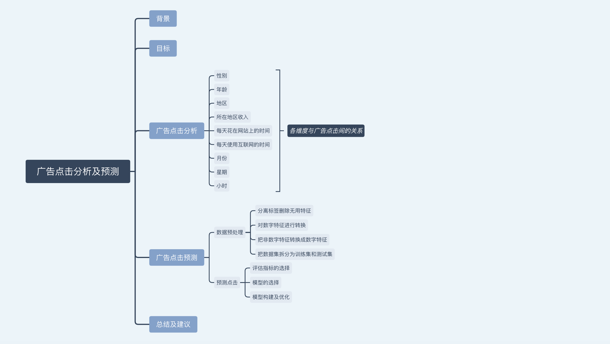

## 背景

广告能帮助企业表达、传递和散布它们所提供的产品或服务。

了解广告投放情况，从而进行优化，针对不同用户群体制定精准化广告营销策略，能帮助企业节约成本，获取更多广告价值。

这是一份关于某匿名网站的广告点击数据，所包含属性变量如下：

Variable：
- Daily Time Spent on Site： 
- Age
- Area Income
- Daily Internet Usage
- Ad Topic Line
- City
- Male
- Country	
- Timestamp	
- Clicked on Ad

数据来源：https://www.kaggle.com/tbyrnes/advertising


## 目标

1. 优化广告投放

从性别、年龄、区域、收入等多维度对广告用户点击进行分析


2. 预测广告点击

构造逻辑斯蒂回归模型对广告点击进行预测。

   
## 一. 广告点击分析


```python
import pandas as pd
import numpy as np
from time import time

import seaborn as sns
%matplotlib inline
from IPython.display import display 
```


```python
df = pd.read_csv('advertising.csv')
df.head()
```


<div>
<style>
    .dataframe thead tr:only-child th {
        text-align: right;
    }

    .dataframe thead th {
        text-align: left;
    }

    .dataframe tbody tr th {
        vertical-align: top;
    }
</style>
<table border="1" class="dataframe">
  <thead>
    <tr style="text-align: right;">
      <th></th>
      <th>Daily Time Spent on Site</th>
      <th>Age</th>
      <th>Area Income</th>
      <th>Daily Internet Usage</th>
      <th>Ad Topic Line</th>
      <th>City</th>
      <th>Male</th>
      <th>Country</th>
      <th>Timestamp</th>
      <th>Clicked on Ad</th>
    </tr>
  </thead>
  <tbody>
    <tr>
      <th>0</th>
      <td>68.95</td>
      <td>35</td>
      <td>61833.90</td>
      <td>256.09</td>
      <td>Cloned 5thgeneration orchestration</td>
      <td>Wrightburgh</td>
      <td>0</td>
      <td>Tunisia</td>
      <td>2016-03-27 00:53:11</td>
      <td>0</td>
    </tr>
    <tr>
      <th>1</th>
      <td>80.23</td>
      <td>31</td>
      <td>68441.85</td>
      <td>193.77</td>
      <td>Monitored national standardization</td>
      <td>West Jodi</td>
      <td>1</td>
      <td>Nauru</td>
      <td>2016-04-04 01:39:02</td>
      <td>0</td>
    </tr>
    <tr>
      <th>2</th>
      <td>69.47</td>
      <td>26</td>
      <td>59785.94</td>
      <td>236.50</td>
      <td>Organic bottom-line service-desk</td>
      <td>Davidton</td>
      <td>0</td>
      <td>San Marino</td>
      <td>2016-03-13 20:35:42</td>
      <td>0</td>
    </tr>
    <tr>
      <th>3</th>
      <td>74.15</td>
      <td>29</td>
      <td>54806.18</td>
      <td>245.89</td>
      <td>Triple-buffered reciprocal time-frame</td>
      <td>West Terrifurt</td>
      <td>1</td>
      <td>Italy</td>
      <td>2016-01-10 02:31:19</td>
      <td>0</td>
    </tr>
    <tr>
      <th>4</th>
      <td>68.37</td>
      <td>35</td>
      <td>73889.99</td>
      <td>225.58</td>
      <td>Robust logistical utilization</td>
      <td>South Manuel</td>
      <td>0</td>
      <td>Iceland</td>
      <td>2016-06-03 03:36:18</td>
      <td>0</td>
    </tr>
  </tbody>
</table>
</div>


```python
df.describe()
```


<div>
<style>
    .dataframe thead tr:only-child th {
        text-align: right;
    }

    .dataframe thead th {
        text-align: left;
    }

    .dataframe tbody tr th {
        vertical-align: top;
    }
</style>
<table border="1" class="dataframe">
  <thead>
    <tr style="text-align: right;">
      <th></th>
      <th>Daily Time Spent on Site</th>
      <th>Age</th>
      <th>Area Income</th>
      <th>Daily Internet Usage</th>
      <th>Male</th>
      <th>Clicked on Ad</th>
    </tr>
  </thead>
  <tbody>
    <tr>
      <th>count</th>
      <td>1000.000000</td>
      <td>1000.000000</td>
      <td>1000.000000</td>
      <td>1000.000000</td>
      <td>1000.000000</td>
      <td>1000.00000</td>
    </tr>
    <tr>
      <th>mean</th>
      <td>65.000200</td>
      <td>36.009000</td>
      <td>55000.000080</td>
      <td>180.000100</td>
      <td>0.481000</td>
      <td>0.50000</td>
    </tr>
    <tr>
      <th>std</th>
      <td>15.853615</td>
      <td>8.785562</td>
      <td>13414.634022</td>
      <td>43.902339</td>
      <td>0.499889</td>
      <td>0.50025</td>
    </tr>
    <tr>
      <th>min</th>
      <td>32.600000</td>
      <td>19.000000</td>
      <td>13996.500000</td>
      <td>104.780000</td>
      <td>0.000000</td>
      <td>0.00000</td>
    </tr>
    <tr>
      <th>25%</th>
      <td>51.360000</td>
      <td>29.000000</td>
      <td>47031.802500</td>
      <td>138.830000</td>
      <td>0.000000</td>
      <td>0.00000</td>
    </tr>
    <tr>
      <th>50%</th>
      <td>68.215000</td>
      <td>35.000000</td>
      <td>57012.300000</td>
      <td>183.130000</td>
      <td>0.000000</td>
      <td>0.50000</td>
    </tr>
    <tr>
      <th>75%</th>
      <td>78.547500</td>
      <td>42.000000</td>
      <td>65470.635000</td>
      <td>218.792500</td>
      <td>1.000000</td>
      <td>1.00000</td>
    </tr>
    <tr>
      <th>max</th>
      <td>91.430000</td>
      <td>61.000000</td>
      <td>79484.800000</td>
      <td>269.960000</td>
      <td>1.000000</td>
      <td>1.00000</td>
    </tr>
  </tbody>
</table>
</div>


```python
df.info()
```

    <class 'pandas.core.frame.DataFrame'>
    RangeIndex: 1000 entries, 0 to 999
    Data columns (total 10 columns):
    Daily Time Spent on Site    1000 non-null float64
    Age                         1000 non-null int64
    Area Income                 1000 non-null float64
    Daily Internet Usage        1000 non-null float64
    Ad Topic Line               1000 non-null object
    City                        1000 non-null object
    Male                        1000 non-null int64
    Country                     1000 non-null object
    Timestamp                   1000 non-null object
    Clicked on Ad               1000 non-null int64
    dtypes: float64(3), int64(3), object(4)
    memory usage: 78.2+ KB


```python
df.duplicated().sum()
```


    0


**观察分析**

初步观察这份数据没有异常值，也不存在缺失值和重复值。


####  1. 性别
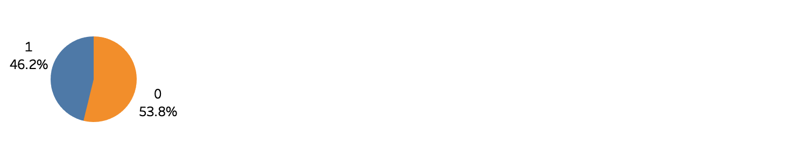

** 分析 **

上图中1代表男性，0代表女性。在点击广告的人群当中，男性占46.2%，而女性占53.8%，这说明女性比男性更容易受广告内容吸引。

#### 2. 年龄
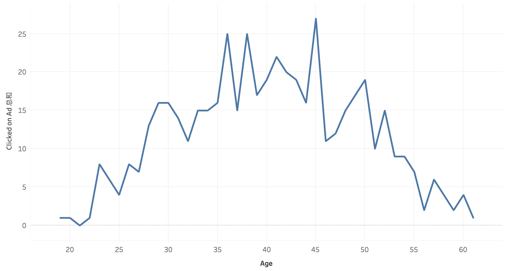

** 分析 **

35～45岁间的人群对广告的点击量最大，25岁以下以及55岁以上的人点击量最少。

#### 3. 地区
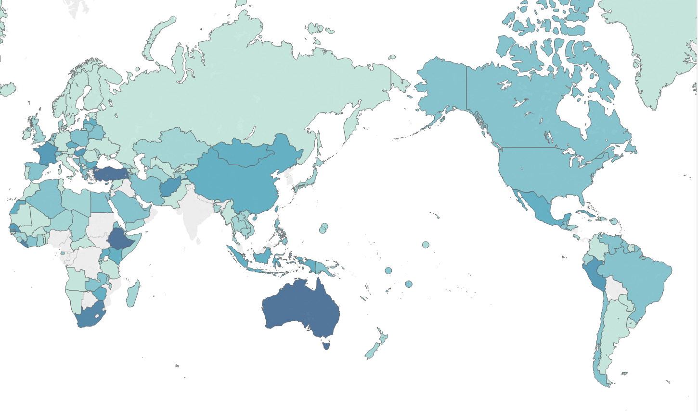
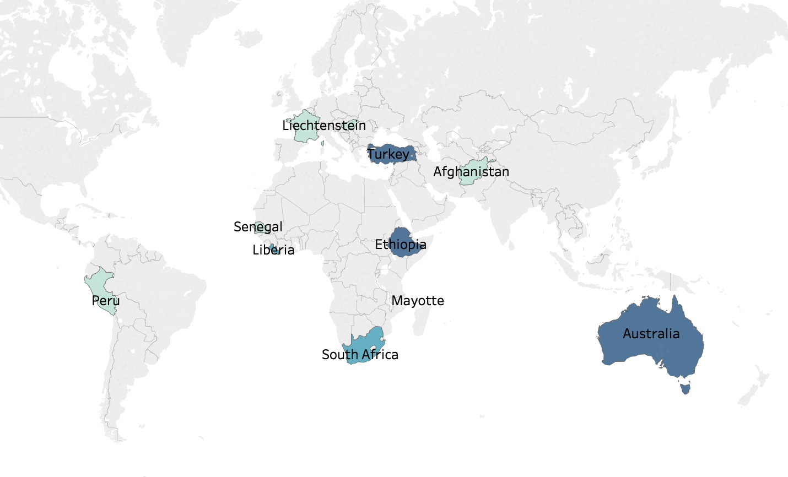

** 分析 **

上面一张图代表各国家的点击量，颜色越深，说明对广告点击的人数就越多。

下面一张图凸显了点击量最高的前10个国家，依次是Turkey, Ethiopia, Australia, South Africa, Liberia, Liechtenstein, Afghanistan, Senegal, Peru, Mayotte。

#### 4. 所在地区收入
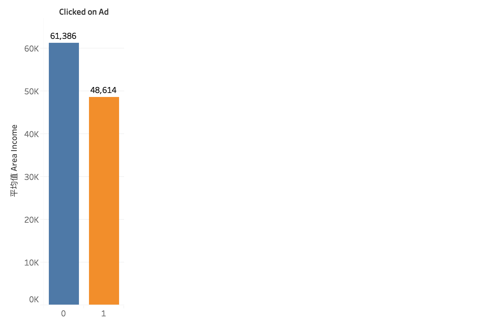
** 分析 **

人群所在地区平均收入更低的对广告的点击量比收入高的地区多。


####  5. 每天花在网站上的时间
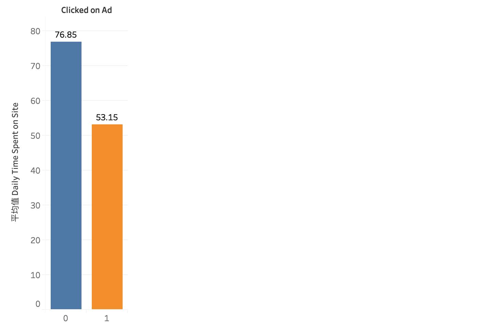

** 分析 **

并不是每天在网站上花费时间越多，对广告点击就越多，相反，对广告点击的人群每天在网站上花费的时间比不点击的人群少。

#### 6. 每天使用互联网的时间


** 分析 **

对广告进行点击的人群比不点击的人群平均上网时间要少。

#### 7. 时间


```python
# 转换成时间格式
df['Timestamp'] = pd.to_datetime(df.Timestamp)
# 构造月份，星期，小时属性变量
df['Month'] = df.Timestamp.apply(lambda time : time.month)
df['Week'] = df.Timestamp.apply(lambda time : time.dayofweek)
df['Hour'] = df.Timestamp.apply(lambda time : time.hour)
df.head()
```


<div>
<style>
    .dataframe thead tr:only-child th {
        text-align: right;
    }

    .dataframe thead th {
        text-align: left;
    }

    .dataframe tbody tr th {
        vertical-align: top;
    }
</style>
<table border="1" class="dataframe">
  <thead>
    <tr style="text-align: right;">
      <th></th>
      <th>Daily Time Spent on Site</th>
      <th>Age</th>
      <th>Area Income</th>
      <th>Daily Internet Usage</th>
      <th>Ad Topic Line</th>
      <th>City</th>
      <th>Male</th>
      <th>Country</th>
      <th>Timestamp</th>
      <th>Clicked on Ad</th>
      <th>Month</th>
      <th>Week</th>
      <th>Hour</th>
    </tr>
  </thead>
  <tbody>
    <tr>
      <th>0</th>
      <td>68.95</td>
      <td>35</td>
      <td>61833.90</td>
      <td>256.09</td>
      <td>Cloned 5thgeneration orchestration</td>
      <td>Wrightburgh</td>
      <td>0</td>
      <td>Tunisia</td>
      <td>2016-03-27 00:53:11</td>
      <td>0</td>
      <td>3</td>
      <td>6</td>
      <td>0</td>
    </tr>
    <tr>
      <th>1</th>
      <td>80.23</td>
      <td>31</td>
      <td>68441.85</td>
      <td>193.77</td>
      <td>Monitored national standardization</td>
      <td>West Jodi</td>
      <td>1</td>
      <td>Nauru</td>
      <td>2016-04-04 01:39:02</td>
      <td>0</td>
      <td>4</td>
      <td>0</td>
      <td>1</td>
    </tr>
    <tr>
      <th>2</th>
      <td>69.47</td>
      <td>26</td>
      <td>59785.94</td>
      <td>236.50</td>
      <td>Organic bottom-line service-desk</td>
      <td>Davidton</td>
      <td>0</td>
      <td>San Marino</td>
      <td>2016-03-13 20:35:42</td>
      <td>0</td>
      <td>3</td>
      <td>6</td>
      <td>20</td>
    </tr>
    <tr>
      <th>3</th>
      <td>74.15</td>
      <td>29</td>
      <td>54806.18</td>
      <td>245.89</td>
      <td>Triple-buffered reciprocal time-frame</td>
      <td>West Terrifurt</td>
      <td>1</td>
      <td>Italy</td>
      <td>2016-01-10 02:31:19</td>
      <td>0</td>
      <td>1</td>
      <td>6</td>
      <td>2</td>
    </tr>
    <tr>
      <th>4</th>
      <td>68.37</td>
      <td>35</td>
      <td>73889.99</td>
      <td>225.58</td>
      <td>Robust logistical utilization</td>
      <td>South Manuel</td>
      <td>0</td>
      <td>Iceland</td>
      <td>2016-06-03 03:36:18</td>
      <td>0</td>
      <td>6</td>
      <td>4</td>
      <td>3</td>
    </tr>
  </tbody>
</table>
</div>


```python
df.to_csv('data_time.csv', index=False)
```

接下来分析，不同性别在不同时间段的广告点击量。下面几张图片中，蓝色代表男性的点击量，橙色代表女性的点击量。

#### 7.1 月份
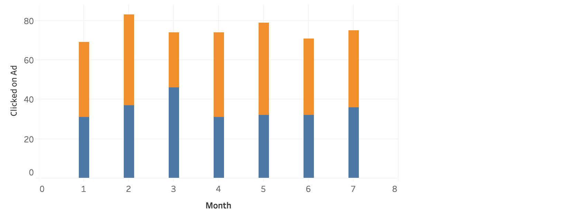
** 分析 **

二月份的广告点击量最高，比较特殊的是在3月份男性的点击量多于女性。

#### 7.2 星期
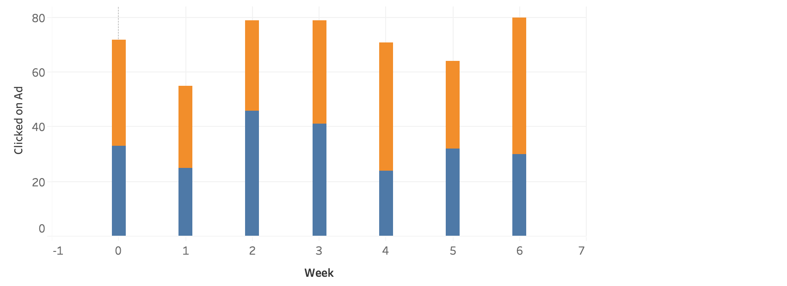
** 分析 **

周二、周三、周六的广告点击量最多，周一点击量最少。

#### 7.3 小时
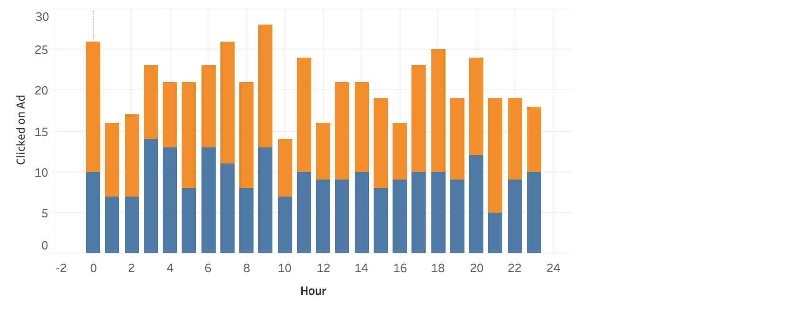
** 分析 **

一天当中，午夜0点，早上7点和9点时段是点击量最多的时候。数据收集的时间是当地时间，而带来广告流量的用户来自不同国家，因此还需要考虑不同国家因素。

#### 8.  点击与每天上网时长、登录网站时间的关系（多维分析）
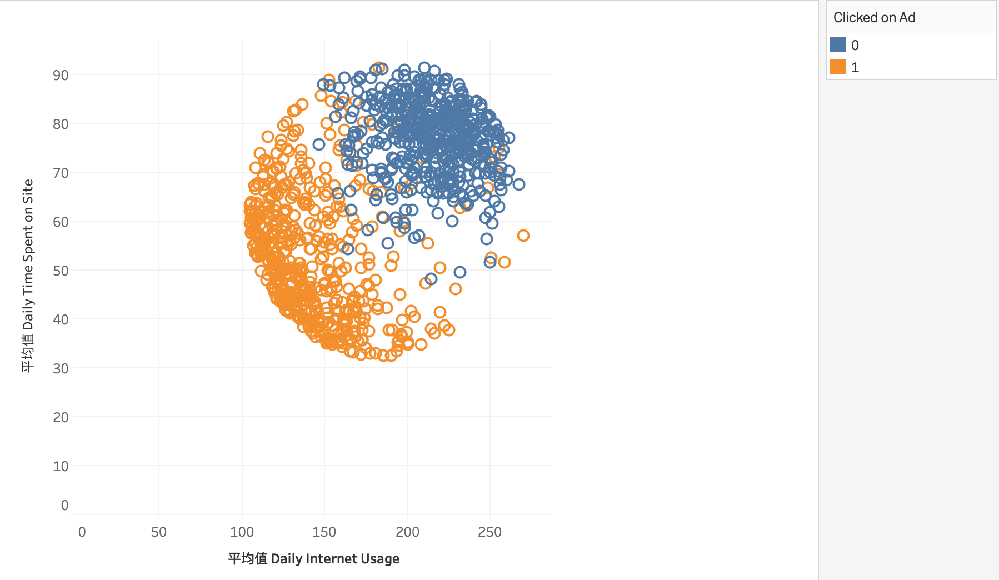
** 分析 **

图中橙色代表点击的用户，蓝色代表未点击的用户。Daily Time Spent on Site 大于70，同时Daily Internet Usage	大于200的的大部分用户会对广告进行点击。总体来说，平均花费时间越少对广告点击的可能性就越大，这也印证了之前得出的结论。

#### 9.  点击与年龄、收入、性别的关系（多维分析）
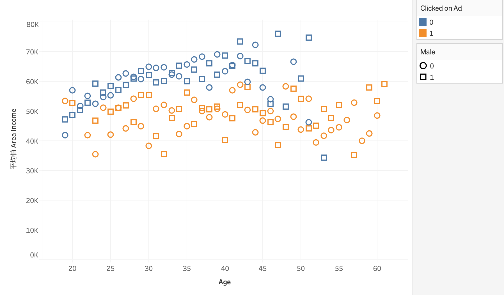
** 分析 **

图中橙色代表点击的用户，蓝色代表未点击的用户；正方形代表男性，圆形代表女性。通过比较可以发现，平均年收入对是否点击广告的影响最大，收入越高点击越少。

## 三. 点击预测

### 1. 数据预处理


```python
df.head()
```


<div>
<style>
    .dataframe thead tr:only-child th {
        text-align: right;
    }

    .dataframe thead th {
        text-align: left;
    }

    .dataframe tbody tr th {
        vertical-align: top;
    }
</style>
<table border="1" class="dataframe">
  <thead>
    <tr style="text-align: right;">
      <th></th>
      <th>Daily Time Spent on Site</th>
      <th>Age</th>
      <th>Area Income</th>
      <th>Daily Internet Usage</th>
      <th>Ad Topic Line</th>
      <th>City</th>
      <th>Male</th>
      <th>Country</th>
      <th>Timestamp</th>
      <th>Clicked on Ad</th>
      <th>Month</th>
      <th>Week</th>
      <th>Hour</th>
    </tr>
  </thead>
  <tbody>
    <tr>
      <th>0</th>
      <td>68.95</td>
      <td>35</td>
      <td>61833.90</td>
      <td>256.09</td>
      <td>Cloned 5thgeneration orchestration</td>
      <td>Wrightburgh</td>
      <td>0</td>
      <td>Tunisia</td>
      <td>2016-03-27 00:53:11</td>
      <td>0</td>
      <td>3</td>
      <td>6</td>
      <td>0</td>
    </tr>
    <tr>
      <th>1</th>
      <td>80.23</td>
      <td>31</td>
      <td>68441.85</td>
      <td>193.77</td>
      <td>Monitored national standardization</td>
      <td>West Jodi</td>
      <td>1</td>
      <td>Nauru</td>
      <td>2016-04-04 01:39:02</td>
      <td>0</td>
      <td>4</td>
      <td>0</td>
      <td>1</td>
    </tr>
    <tr>
      <th>2</th>
      <td>69.47</td>
      <td>26</td>
      <td>59785.94</td>
      <td>236.50</td>
      <td>Organic bottom-line service-desk</td>
      <td>Davidton</td>
      <td>0</td>
      <td>San Marino</td>
      <td>2016-03-13 20:35:42</td>
      <td>0</td>
      <td>3</td>
      <td>6</td>
      <td>20</td>
    </tr>
    <tr>
      <th>3</th>
      <td>74.15</td>
      <td>29</td>
      <td>54806.18</td>
      <td>245.89</td>
      <td>Triple-buffered reciprocal time-frame</td>
      <td>West Terrifurt</td>
      <td>1</td>
      <td>Italy</td>
      <td>2016-01-10 02:31:19</td>
      <td>0</td>
      <td>1</td>
      <td>6</td>
      <td>2</td>
    </tr>
    <tr>
      <th>4</th>
      <td>68.37</td>
      <td>35</td>
      <td>73889.99</td>
      <td>225.58</td>
      <td>Robust logistical utilization</td>
      <td>South Manuel</td>
      <td>0</td>
      <td>Iceland</td>
      <td>2016-06-03 03:36:18</td>
      <td>0</td>
      <td>6</td>
      <td>4</td>
      <td>3</td>
    </tr>
  </tbody>
</table>
</div>


```python
# 画出散布矩阵图来观察个特征变量的分布情况
sns.pairplot(df,hue='Clicked on Ad') 
```


    <seaborn.axisgrid.PairGrid at 0x1a44d52b00>


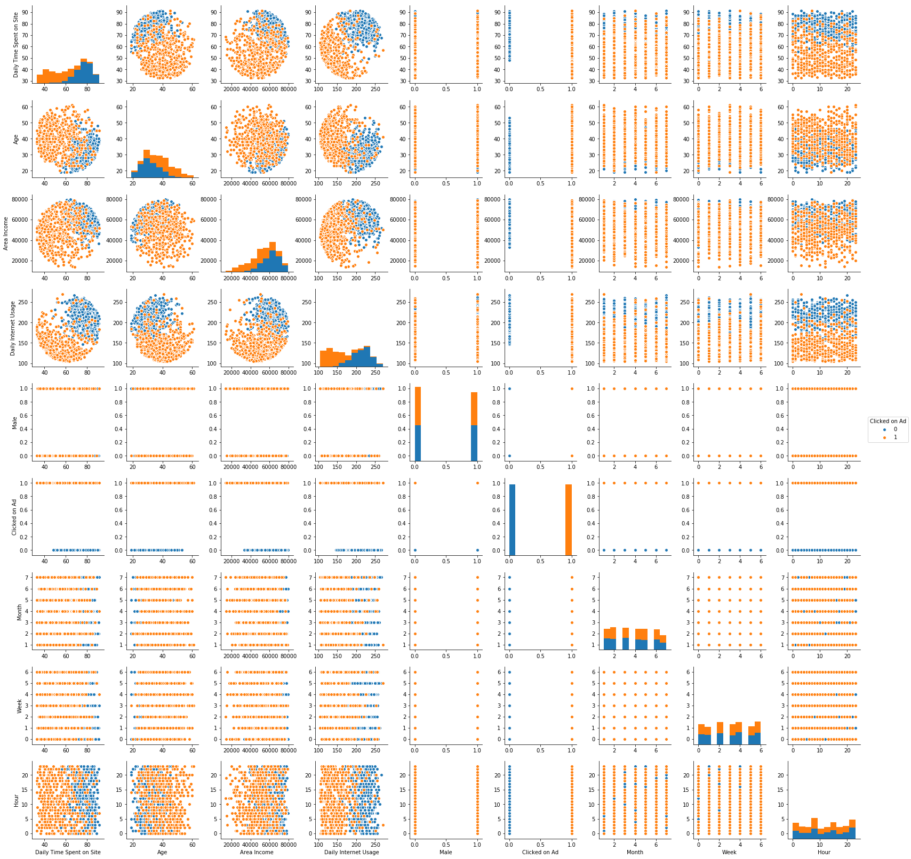


### 1.1 分离标签删除无用特征


```python
label = df['Clicked on Ad']

features = df.drop(['Ad Topic Line', 'Timestamp', 'Clicked on Ad'],axis=1)
features.head(1)
```


<div>
<style>
    .dataframe thead tr:only-child th {
        text-align: right;
    }

    .dataframe thead th {
        text-align: left;
    }

    .dataframe tbody tr th {
        vertical-align: top;
    }
</style>
<table border="1" class="dataframe">
  <thead>
    <tr style="text-align: right;">
      <th></th>
      <th>Daily Time Spent on Site</th>
      <th>Age</th>
      <th>Area Income</th>
      <th>Daily Internet Usage</th>
      <th>City</th>
      <th>Male</th>
      <th>Country</th>
      <th>Month</th>
      <th>Week</th>
      <th>Hour</th>
    </tr>
  </thead>
  <tbody>
    <tr>
      <th>0</th>
      <td>68.95</td>
      <td>35</td>
      <td>61833.9</td>
      <td>256.09</td>
      <td>Wrightburgh</td>
      <td>0</td>
      <td>Tunisia</td>
      <td>3</td>
      <td>6</td>
      <td>0</td>
    </tr>
  </tbody>
</table>
</div>


### 1.2 对数字特征进行转换

使特征间的差距缩小，同时在应用监督式学习器时，能够平等地对待每个特征。


```python
from sklearn.preprocessing import MinMaxScaler

scaler = MinMaxScaler() # default=(0, 1)

numerical = ['Daily Time Spent on Site','Age','Area Income','Daily Internet Usage','Month','Week','Hour']

features[numerical] = scaler.fit_transform(features[numerical])

display(features.head(n = 2))

```


<div>
<style>
    .dataframe thead tr:only-child th {
        text-align: right;
    }

    .dataframe thead th {
        text-align: left;
    }

    .dataframe tbody tr th {
        vertical-align: top;
    }
</style>
<table border="1" class="dataframe">
  <thead>
    <tr style="text-align: right;">
      <th></th>
      <th>Daily Time Spent on Site</th>
      <th>Age</th>
      <th>Area Income</th>
      <th>Daily Internet Usage</th>
      <th>City</th>
      <th>Male</th>
      <th>Country</th>
      <th>Month</th>
      <th>Week</th>
      <th>Hour</th>
    </tr>
  </thead>
  <tbody>
    <tr>
      <th>0</th>
      <td>0.617882</td>
      <td>0.380952</td>
      <td>0.730472</td>
      <td>0.916031</td>
      <td>Wrightburgh</td>
      <td>0</td>
      <td>Tunisia</td>
      <td>0.333333</td>
      <td>1.0</td>
      <td>0.000000</td>
    </tr>
    <tr>
      <th>1</th>
      <td>0.809621</td>
      <td>0.285714</td>
      <td>0.831375</td>
      <td>0.538746</td>
      <td>West Jodi</td>
      <td>1</td>
      <td>Nauru</td>
      <td>0.500000</td>
      <td>0.0</td>
      <td>0.043478</td>
    </tr>
  </tbody>
</table>
</div>


### 1.3 把非数字特征转换成数字特征

通常，学习算法都预期输入是数字，这就需要转换非数字特征（称为分类变量）。一种转换分类变量的常见方式是独热编码方法。独热编码会为每个非数字特征的每个可能类别创建一个_“虚拟”_变量。

这里使用 pandas.get_dummies() 对数据进行独热编码。为每个非数字特征的每个可能类别创建一个虚拟变量。


```python
features_final = pd.get_dummies(features)
```

### 1.4 把数据集拆分为训练集和测试集


```python
# 随机打乱并拆分数据，20%为测试集

from sklearn.model_selection import train_test_split

X_train, X_test, y_train, y_test = train_test_split(features_final,
                                                    label,
                                                    test_size = 0.2,
                                                    random_state = 0)
```

### 2. 预测点击

#### 2.1 评估指标的选择
预测广告的点击量，通常可以帮助我们帮助我们了解广告更受哪类人群的喜欢，适合在哪个时间段投放等等。还可以帮助预测CTR，进而预测ROAS、ROI等。

首先准确率是评估模型效果的一个有效指标， 同时我们还可以通过 F-β 分数考虑精确率和召回率。广告投放目标不对，很可能造成资源浪费，而收效甚微，为了通过低成本获取高利润，在这里精确率似乎更重要一些。

精确率：TP/（TP+FP），真正例占所有预测为正例的比例。关注是否找得准。

F-β = (1+β2)⋅precision⋅recall  /  [ (β2⋅precision)+recall ]，β值越小越倾向于精确率， 因此取beta = 0.5。

#### 2.2 模型的选择

根据经验，选择SVM，LR，和DT进行初始模型尝试。

分别比较他们在不同数量的样本中时间消耗以及准确度和fbeta_score。


```python
from sklearn.metrics import fbeta_score, accuracy_score
def train_predict(learner, sample_size, X_train, y_train, X_test, y_test): 
    
    results = {}
    
    start = time() # Get start time
    learner = learner.fit(X_train[:sample_size], y_train[:sample_size])
    end = time() # Get end time
    
    results['train_time'] = end - start
    
    # 计算预测训练集前200个数据所花的时间
    start = time() # Get start time
    predictions_test = learner.predict(X_test)
    predictions_train = learner.predict(X_train[:200])
    end = time() # Get end time
    
    # Calculate the total prediction time
    results['pred_time'] = end - start
    
    # Compute accuracy on the first 300 training samples which is y_train[:200]
    results['acc_train'] = accuracy_score(y_train[:200], predictions_train)
    
    # Compute accuracy on test set using accuracy_score()
    results['acc_test'] = accuracy_score(y_test, predictions_test)
    
    # Compute F-score on the the first 200 training samples using fbeta_score()
    results['f_train'] = fbeta_score(y_train[:200], predictions_train, beta=0.5)
        
    # Compute F-score on the test set which is y_test
    results['f_test'] = fbeta_score(y_test, predictions_test, beta=0.5)
       
    # Success
    print("{} trained on {} samples.".format(learner.__class__.__name__, sample_size))
    print('train time is: {}'.format(results['train_time']))
    print('predition time is: {}'.format(results['pred_time']))
    print('accuracy on training set is: {}'.format(results['acc_train']))
    print('accuracy on testing set is: {}'.format(results['acc_test']))
    print('fbeta score on training set is: {}'.format(results['f_train']))
    print('fbata score on testinig set is: {}'.format(results['f_test']))
    print('------------------------------------------------------')  
```


```python
from sklearn.svm import SVC
from sklearn.linear_model import LogisticRegression
from sklearn.tree import DecisionTreeClassifier    

# nitialize the three models
clf_A = SVC(random_state=42)
clf_B = LogisticRegression(random_state=42)
clf_C = DecisionTreeClassifier(random_state=42)

# Calculate the number of samples for 50% and 100% of the training data
samples_100 = len(y_train)
samples_50 = int(samples_100 * 0.5)

# Collect results on the learners
results = {}
for clf in [clf_A, clf_B, clf_C]:
    clf_name = clf.__class__.__name__
    results[clf_name] = {}
    for i, samples in enumerate([samples_50, samples_100]):
        train_predict(clf, samples, X_train, y_train, X_test, y_test)
```

    /Users/jia/anaconda3/lib/python3.6/site-packages/sklearn/metrics/classification.py:1135: UndefinedMetricWarning: F-score is ill-defined and being set to 0.0 due to no predicted samples.
      'precision', 'predicted', average, warn_for)


    SVC trained on 400 samples.
    train time is: 0.2330927848815918
    predition time is: 0.21967601776123047
    accuracy on training set is: 0.555
    accuracy on testing set is: 0.54
    fbeta score on training set is: 0.0
    fbata score on testinig set is: 0.0
    ------------------------------------------------------
    SVC trained on 800 samples.
    train time is: 0.884105920791626
    predition time is: 0.39893674850463867
    accuracy on training set is: 0.445
    accuracy on testing set is: 0.46
    fbeta score on training set is: 0.500562429696288
    fbata score on testinig set is: 0.515695067264574
    ------------------------------------------------------
    LogisticRegression trained on 400 samples.
    train time is: 0.010602951049804688
    predition time is: 0.002855062484741211
    accuracy on training set is: 0.99
    accuracy on testing set is: 0.96
    fbeta score on training set is: 0.9954233409610983
    fbata score on testinig set is: 0.9747706422018347
    ------------------------------------------------------
    LogisticRegression trained on 800 samples.
    train time is: 0.017788171768188477
    predition time is: 0.0018062591552734375
    accuracy on training set is: 0.99
    accuracy on testing set is: 0.96
    fbeta score on training set is: 0.9954233409610983
    fbata score on testinig set is: 0.9747706422018347
    ------------------------------------------------------
    DecisionTreeClassifier trained on 400 samples.
    train time is: 0.01020503044128418
    predition time is: 0.002260923385620117
    accuracy on training set is: 1.0
    accuracy on testing set is: 0.955
    fbeta score on training set is: 1.0
    fbata score on testinig set is: 0.9539473684210525
    ------------------------------------------------------
    DecisionTreeClassifier trained on 800 samples.
    train time is: 0.019710302352905273
    predition time is: 0.002189159393310547
    accuracy on training set is: 1.0
    accuracy on testing set is: 0.94
    fbeta score on training set is: 1.0
    fbata score on testinig set is: 0.9347826086956522
    ------------------------------------------------------


通过比较三个模型的在不同样本数量下的训练、预测时间，精确度和fbeta分数。可知：
1. LogisticRegression所花费的训练时间和预测时间最少；

2. 支持向量机的精确度和fbeta分数都最低；在测试集上的精确度和fbeta分数是逻辑斯蒂回归最高；

3. 随着样本数的增加支持向量机和逻辑斯蒂回归的精确度和fbeta分数都在上升，但决策树的却在下降。

综合考虑，选择逻辑斯蒂回归作为最终预测模型。


#### 2. 模型构建及优化
使用网格搜索交叉验证，为模型挑选最优参数。


```python
from sklearn.model_selection import GridSearchCV
from sklearn.metrics import make_scorer, fbeta_score, accuracy_score
from sklearn.linear_model import LogisticRegression

clf = LogisticRegression(random_state=42)

parameters = { 'penalty':['l1','l2'],'C':[0.5,1,1.5]}

scorer = make_scorer(fbeta_score, beta=0.5)

grid_obj = GridSearchCV(clf, parameters, scoring=scorer)

grid_fit = grid_obj.fit(X_train, y_train)

best_clf = grid_fit.best_estimator_

predictions  = (clf.fit(X_train, y_train)).predict(X_test)

best_predictions = best_clf.predict(X_test)

print("Unoptimized model\n------")
print("Accuracy score on testing data: {:.4f}".format(accuracy_score(y_test, predictions)))
print("F-score on testing data: {:.4f}".format(fbeta_score(y_test, predictions, beta = 0.5)))
print("\nOptimized Model\n------")
print("Final accuracy score on the testing data: {:.4f}".format(accuracy_score(y_test, best_predictions)))
print("Final F-score on the testing data: {:.4f}".format(fbeta_score(y_test, best_predictions, beta = 0.5)))
```

    Unoptimized model
    ------
    Accuracy score on testing data: 0.9600
    F-score on testing data: 0.9748
    
    Optimized Model
    ------
    Final accuracy score on the testing data: 0.9700
    Final F-score on the testing data: 0.9797


## 三. 总结及建议

1. 女性比男性更容易受广告内容吸引，因此广告投放目标人群可更倾向于女性
2. 35～45岁间的人群对广告的点击量最大，可考虑主要针对此人群进行投放
3. Turkey, Ethiopia, Australia是点击最多的三个国家
4. 平均收入更低的地区点击量比收入高的地区多
5. 上网时长越短的人更容易对广告进行点击
6. 二月份的点击量最高；星期六的点击量也最高
7. 相比性别和年龄，平均收入对点击量的影响最大
8. 可通过构建逻辑斯蒂回归来预测点击量，最终测试集的准确度可达到97%，F分数可达到97.97%

不足：

没有相关数据能对广告的CTR、ROI等多指标进行分析，更深层次了解广告实际效果。
